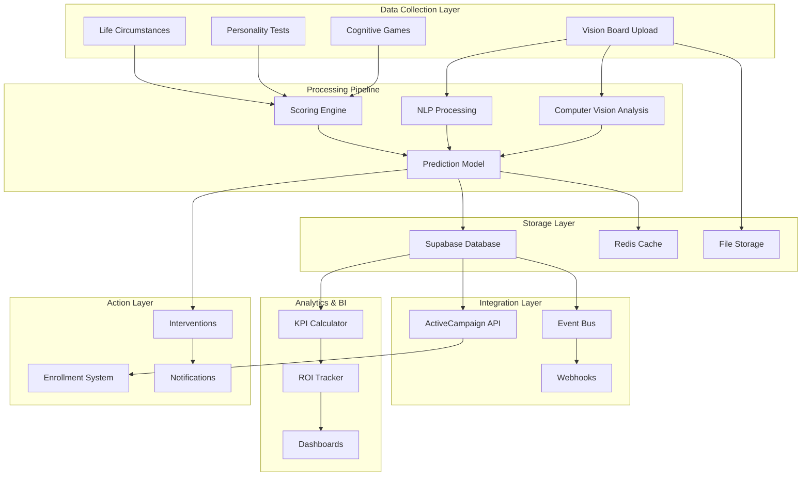

# SenseiiWyze Unified Integration Architecture

## Executive Summary

This document outlines the comprehensive integration strategy for combining the SenseiiWyze Training Readiness Prediction System with existing database infrastructure, ActiveCampaign CRM, and the Profitability Flow KPI Tree. The integrated system will provide end-to-end workforce development analytics from initial assessment through business impact measurement.

## System Components Overview

### 1. Core Data Infrastructure
- **Existing Supabase Schema**: Learning management, assessments, gamification
- **New Prediction Tables**: Vision board analysis, cognitive scoring, readiness predictions
- **KPI Integration Tables**: Employee scores, business outcomes, ROI tracking

### 2. External Integrations
- **ActiveCampaign API**: Lead nurturing, enrollment automation, engagement tracking
- **Computer Vision Services**: AWS Rekognition/Google Vision for vision board analysis
- **NLP Services**: OpenAI/Claude for text extraction and sentiment analysis
- **Analytics Pipeline**: Real-time scoring and prediction models

### 3. Business Intelligence Layer
- **Profitability Flow Mapping**: Connect training outcomes to business KPIs
- **ROI Dashboards**: Track program effectiveness and financial impact
- **Predictive Analytics**: Early warning systems for dropout risk

## Detailed Integration Architecture

### Data Flow Diagram



## Database Schema Integration

### Extended Schema for Prediction System

```sql
-- =====================================================
-- INTEGRATION WITH EXISTING SUPABASE SCHEMA
-- =====================================================

-- Link vision boards to existing profiles
ALTER TABLE vision_boards 
ADD COLUMN IF NOT EXISTS training_program_interest TEXT[],
ADD COLUMN IF NOT EXISTS career_timeline TEXT,
ADD COLUMN IF NOT EXISTS motivation_type TEXT CHECK (motivation_type IN ('internal', 'external'));

-- Extend profiles for comprehensive tracking
ALTER TABLE profiles
ADD COLUMN IF NOT EXISTS activecampaign_contact_id TEXT,
ADD COLUMN IF NOT EXISTS enrollment_status TEXT,
ADD COLUMN IF NOT EXISTS risk_category TEXT,
ADD COLUMN IF NOT EXISTS last_engagement_date TIMESTAMP WITH TIME ZONE;

-- =====================================================
-- BRIDGE TABLES FOR INTEGRATION
-- =====================================================

-- Connect predictions to business outcomes
CREATE TABLE prediction_outcome_tracking (
    id UUID PRIMARY KEY DEFAULT gen_random_uuid(),
    prediction_id UUID REFERENCES training_readiness_predictions(id),
    profile_id UUID REFERENCES profiles(id),
    
    -- Enrollment Tracking
    enrolled BOOLEAN DEFAULT false,
    enrollment_date DATE,
    program_id UUID REFERENCES training_programs(id),
    
    -- Outcome Metrics
    completed BOOLEAN,
    completion_date DATE,
    time_to_complete_weeks INTEGER,
    
    -- Business Impact
    job_placement_date DATE,
    starting_salary DECIMAL(10,2),
    salary_increase_percentage DECIMAL(5,2),
    employer_satisfaction_score DECIMAL(3,2),
    
    -- Prediction Accuracy
    prediction_accuracy_score DECIMAL(5,2),
    
    created_at TIMESTAMP WITH TIME ZONE DEFAULT NOW(),
    updated_at TIMESTAMP WITH TIME ZONE DEFAULT NOW()
);

-- ActiveCampaign Integration Tracking
CREATE TABLE activecampaign_sync (
    id UUID PRIMARY KEY DEFAULT gen_random_uuid(),
    profile_id UUID REFERENCES profiles(id),
    
    -- Sync Details
    contact_id TEXT NOT NULL,
    last_sync_date TIMESTAMP WITH TIME ZONE,
    sync_status TEXT,
    
    -- Campaign Tracking
    current_automation TEXT,
    current_list TEXT[],
    tags TEXT[],
    
    -- Engagement Metrics
    email_engagement_score DECIMAL(5,2),
    last_email_opened TIMESTAMP WITH TIME ZONE,
    last_link_clicked TIMESTAMP WITH TIME ZONE,
    
    -- Custom Fields Mapping
    custom_fields JSONB,
    
    CONSTRAINT unique_profile_contact UNIQUE(profile_id, contact_id)
);

-- =====================================================
-- KPI TREE INTEGRATION
-- =====================================================

-- Map training outcomes to profitability metrics
CREATE TABLE training_profitability_impact (
    id UUID PRIMARY KEY DEFAULT gen_random_uuid(),
    profile_id UUID REFERENCES profiles(id),
    training_program_id UUID REFERENCES training_programs(id),
    
    -- Pre-Training Baseline
    baseline_productivity_index DECIMAL(5,2) DEFAULT 100,
    baseline_engagement_score DECIMAL(5,2),
    baseline_skill_level TEXT,
    
    -- Post-Training Metrics
    current_productivity_index DECIMAL(5,2),
    current_engagement_score DECIMAL(5,2),
    current_skill_level TEXT,
    
    -- Business Impact Calculation
    productivity_improvement_percentage DECIMAL(5,2),
    estimated_revenue_impact DECIMAL(12,2),
    cost_savings_achieved DECIMAL(12,2),
    
    -- ROI Metrics
    training_cost DECIMAL(10,2),
    total_value_generated DECIMAL(12,2),
    roi_percentage DECIMAL(8,2),
    
    -- Timestamps
    measurement_date DATE,
    created_at TIMESTAMP WITH TIME ZONE DEFAULT NOW()
);

-- Employee lifecycle tracking for KPI tree
CREATE TABLE employee_lifecycle_events (
    id UUID PRIMARY KEY DEFAULT gen_random_uuid(),
    profile_id UUID REFERENCES profiles(id),
    
    event_type TEXT CHECK (event_type IN (
        'assessment_completed',
        'enrolled_in_training',
        'training_completed',
        'job_placed',
        'promotion_received',
        'retention_risk_identified',
        'intervention_applied',
        'churned',
        'high_performer_identified'
    )),
    
    event_date TIMESTAMP WITH TIME ZONE DEFAULT NOW(),
    event_details JSONB,
    business_impact DECIMAL(12,2),
    
    -- Link to interventions
    intervention_id UUID REFERENCES user_interventions(id),
    training_program_id UUID REFERENCES training_programs(id)
);
```

## ActiveCampaign Integration Strategy

### 1. Contact Synchronization

```javascript
// Webhook endpoint for profile updates
app.post('/webhook/profile-update', async (req, res) => {
  const { profile_id, vision_score, grit_score, logic_score, algorithm_score, prediction_category } = req.body;
  
  // Sync to ActiveCampaign
  const contactData = {
    email: profile.email,
    firstName: profile.name.split(' ')[0],
    lastName: profile.name.split(' ').slice(1).join(' '),
    fieldValues: [
      { field: 'VISION_SCORE', value: vision_score },
      { field: 'GRIT_SCORE', value: grit_score },
      { field: 'LOGIC_SCORE', value: logic_score },
      { field: 'ALGORITHM_SCORE', value: algorithm_score },
      { field: 'READINESS_CATEGORY', value: prediction_category },
      { field: 'RECOMMENDED_PROGRAM', value: recommended_program }
    ]
  };
  
  await activeCampaignAPI.syncContact(contactData);
});
```

### 2. Automation Triggers

| Trigger Event | ActiveCampaign Action | Follow-up |
|--------------|----------------------|-----------|
| Vision Board Completed | Add to "Assessment Started" list | Send welcome sequence |
| Ready to Enroll (85%+) | Move to "Hot Leads" automation | Enrollment specialist notification |
| Ready with Support (75-84%) | Add to "Nurture" campaign | Weekly coaching emails |
| Almost Ready (65-74%) | Add to "Preparation" sequence | Skill-building resources |
| Not Ready (<65%) | Add to "Long-term Nurture" | Monthly check-ins |

### 3. Lead Scoring Integration

```yaml
Lead Scoring Formula:
  Base Score: 0
  Vision Score > 80: +20 points
  Grit Score > 75: +20 points
  Logic Score > 80: +15 points
  Algorithm Score > 75: +15 points
  Life Circumstances > 80: +10 points
  Internal Motivation: +10 points
  Engagement Actions:
    - Opened 3+ emails: +5 points
    - Clicked enrollment link: +10 points
    - Attended webinar: +15 points
  
  Score Thresholds:
    - 90+: Sales Qualified Lead (SQL)
    - 70-89: Marketing Qualified Lead (MQL)
    - 50-69: Nurture Lead
    - <50: Long-term Nurture
```

## Profitability Flow Integration

### Mapping Training Outcomes to Business KPIs

```sql
-- View connecting training completion to profitability metrics
CREATE VIEW training_to_profitability_kpi AS
SELECT 
    tp.program_name,
    tp.program_code,
    
    -- Training Metrics
    COUNT(DISTINCT pe.profile_id) as total_enrolled,
    COUNT(CASE WHEN pe.enrollment_status = 'completed' THEN 1 END) as completed,
    AVG(EXTRACT(EPOCH FROM (pe.actual_completion_date - pe.enrollment_date))/86400/7) as avg_weeks_to_complete,
    
    -- Readiness Correlation
    AVG(trp.readiness_score) as avg_readiness_score,
    AVG(trp.predicted_completion_weeks) as avg_predicted_weeks,
    
    -- Business Impact
    AVG(tpi.productivity_improvement_percentage) as avg_productivity_gain,
    SUM(tpi.estimated_revenue_impact) as total_revenue_impact,
    SUM(tpi.cost_savings_achieved) as total_cost_savings,
    AVG(tpi.roi_percentage) as avg_roi,
    
    -- KPI Tree Metrics
    COUNT(CASE WHEN eks.turnover_risk_score < 50 THEN 1 END) as retained_employees,
    AVG(eks.engagement_score) as avg_engagement,
    COUNT(CASE WHEN eks.high_potential_score > 80 THEN 1 END) as high_performers_created
    
FROM training_programs tp
LEFT JOIN program_enrollments pe ON tp.id = pe.training_program_id
LEFT JOIN training_readiness_predictions trp ON pe.original_prediction_id = trp.id
LEFT JOIN training_profitability_impact tpi ON pe.profile_id = tpi.profile_id AND tp.id = tpi.training_program_id
LEFT JOIN employee_kpi_scores eks ON pe.profile_id = eks.profile_id
WHERE pe.enrollment_date >= CURRENT_DATE - INTERVAL '1 year'
GROUP BY tp.id, tp.program_name, tp.program_code;
```

### KPI Calculation Pipeline

```python
class KPICalculator:
    def calculate_training_impact(self, profile_id, training_program_id):
        # Get pre and post training metrics
        baseline = self.get_baseline_metrics(profile_id)
        current = self.get_current_metrics(profile_id)
        
        # Calculate improvements
        productivity_gain = (current.productivity - baseline.productivity) / baseline.productivity
        engagement_lift = current.engagement - baseline.engagement
        
        # Map to financial impact
        revenue_impact = self.calculate_revenue_impact(productivity_gain, profile_id)
        cost_savings = self.calculate_cost_savings(engagement_lift, profile_id)
        
        # Calculate ROI
        training_cost = self.get_training_cost(training_program_id)
        total_value = revenue_impact + cost_savings
        roi = ((total_value - training_cost) / training_cost) * 100
        
        return {
            'productivity_improvement': productivity_gain,
            'engagement_improvement': engagement_lift,
            'revenue_impact': revenue_impact,
            'cost_savings': cost_savings,
            'roi_percentage': roi
        }
```

## Real-time Event Architecture

### Event Bus Configuration

```yaml
events:
  # Assessment Events
  - vision_board_uploaded
  - vision_board_analyzed
  - cognitive_assessment_completed
  - personality_test_completed
  - life_circumstances_updated
  
  # Prediction Events
  - readiness_score_calculated
  - prediction_category_assigned
  - intervention_recommended
  
  # Enrollment Events
  - user_enrolled
  - payment_processed
  - training_started
  
  # Progress Events
  - milestone_completed
  - at_risk_identified
  - intervention_applied
  
  # Outcome Events
  - training_completed
  - job_placed
  - performance_measured
```

### Webhook Handlers

```javascript
// Redis Pub/Sub for real-time updates
const eventHandlers = {
  'vision_board_analyzed': async (data) => {
    // Update Supabase
    await supabase.from('vision_board_analysis').insert(data);
    
    // Sync to ActiveCampaign
    await syncToActiveCampaign(data.profile_id, { vision_score: data.vision_score });
    
    // Check if all assessments complete
    if (await allAssessmentsComplete(data.profile_id)) {
      await calculateReadinessScore(data.profile_id);
    }
  },
  
  'readiness_score_calculated': async (data) => {
    // Store prediction
    await supabase.from('training_readiness_predictions').insert(data);
    
    // Trigger appropriate automation
    await triggerActiveCampaignAutomation(data.profile_id, data.prediction_category);
    
    // Notify admissions team if ready
    if (data.readiness_score >= 85) {
      await notifyAdmissions(data);
    }
  },
  
  'training_completed': async (data) => {
    // Calculate business impact
    const impact = await calculateTrainingImpact(data.profile_id, data.training_program_id);
    
    // Update KPI metrics
    await updateKPIMetrics(data.profile_id, impact);
    
    // Trigger success automation
    await triggerSuccessAutomation(data.profile_id);
  }
};
```

## Dashboard Architecture

### Admin Dashboard Components

```typescript
interface DashboardComponents {
  // Real-time Metrics
  readinessOverview: {
    totalAssessed: number;
    readyToEnroll: number;
    needsSupport: number;
    averageReadinessScore: number;
  };
  
  // Enrollment Pipeline
  enrollmentFunnel: {
    assessed: number;
    qualified: number;
    enrolled: number;
    inProgress: number;
    completed: number;
  };
  
  // Business Impact
  profitabilityMetrics: {
    totalRevenue: number;
    costSavings: number;
    averageROI: number;
    productivityGains: number;
  };
  
  // Predictive Analytics
  riskAlerts: {
    dropoutRisk: Profile[];
    interventionNeeded: Profile[];
    highPotentialIdentified: Profile[];
  };
}
```

### User Dashboard Features

1. **Personal Readiness Score**: Visual representation of all assessment scores
2. **Recommended Programs**: Ranked list with match percentages
3. **Improvement Suggestions**: Specific actions to increase readiness
4. **Progress Tracking**: Real-time updates during training
5. **Career Impact Projection**: Expected outcomes post-completion

## Security & Compliance

### Data Protection Measures

1. **Encryption**
   - All vision boards encrypted at rest (AES-256)
   - TLS 1.3 for data in transit
   - Encrypted Redis cache

2. **Access Control**
   - Row Level Security (RLS) on all Supabase tables
   - Role-based permissions for admin functions
   - API key rotation every 90 days

3. **Compliance**
   - GDPR compliant data handling
   - Right to deletion implementation
   - Audit logs for all data access

### Privacy Considerations

```sql
-- Anonymization view for analytics
CREATE VIEW anonymized_analytics AS
SELECT 
    md5(profile_id::text) as hashed_id,
    DATE_TRUNC('week', created_at) as week,
    prediction_category,
    readiness_score,
    training_program_id,
    enrollment_status,
    completion_status
FROM training_readiness_predictions
JOIN program_enrollments USING (profile_id);
```

## Implementation Roadmap

### Phase 1: Foundation (Weeks 1-4)
- [ ] Deploy enhanced database schema
- [ ] Set up Redis cache infrastructure
- [ ] Configure S3 for vision board storage
- [ ] Implement basic API endpoints

### Phase 2: Integration (Weeks 5-8)
- [ ] Connect computer vision APIs
- [ ] Implement scoring algorithms
- [ ] Set up ActiveCampaign webhooks
- [ ] Build prediction models

### Phase 3: Automation (Weeks 9-12)
- [ ] Deploy event bus architecture
- [ ] Configure enrollment automations
- [ ] Implement intervention workflows
- [ ] Set up notification systems

### Phase 4: Analytics (Weeks 13-16)
- [ ] Build admin dashboards
- [ ] Implement KPI calculations
- [ ] Create ROI tracking
- [ ] Deploy predictive models

### Phase 5: Optimization (Weeks 17-20)
- [ ] A/B testing framework
- [ ] Model refinement pipeline
- [ ] Performance optimization
- [ ] Scale testing

## Monitoring & Maintenance

### Key Metrics to Track

```yaml
System Health:
  - API response time < 200ms
  - Prediction calculation time < 5s
  - Dashboard load time < 2s
  - Error rate < 0.1%

Business Metrics:
  - Assessment completion rate > 80%
  - Enrollment conversion > 40%
  - Training completion rate > 75%
  - Job placement rate > 85%

Model Performance:
  - Prediction accuracy > 87%
  - False positive rate < 10%
  - Model drift detection
  - Retraining triggers
```

### Maintenance Schedule

- **Daily**: Cache cleanup, error log review
- **Weekly**: Model performance check, dashboard updates
- **Monthly**: Full model retraining, security audit
- **Quarterly**: Architecture review, scalability assessment

## Conclusion

This unified integration architecture brings together the SenseiiWyze Training Readiness Prediction System with existing infrastructure to create a comprehensive workforce development platform. By connecting assessment data, predictive analytics, CRM automation, and business impact measurement, organizations can optimize their training investments and demonstrate clear ROI.

The system's modular design allows for phased implementation while maintaining the flexibility to adapt to changing business needs and technological advances.