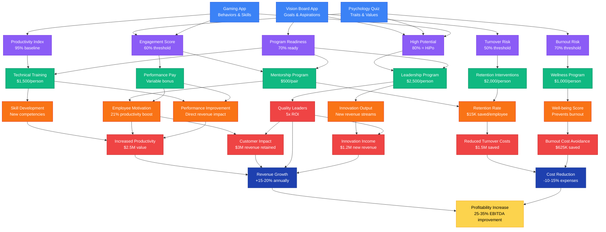

# Profitability Flow KPI Tree Visualization

## Interactive KPI Tree Structure



## Key Value Flows

### 1. **Predictive Analytics Flow**
```
Data Collection → Risk/Opportunity Identification → Targeted Intervention → Measurable Outcome
```

### 2. **ROI Calculation Examples**

#### Leadership Program ROI
- **Investment**: $2,500 per participant
- **Return**: 5x ROI = $12,500 value created per leader
- **Mechanism**: Better decisions, team performance, innovation

#### Retention Intervention ROI
- **Investment**: $2,000 per at-risk employee
- **Return**: $15,000 saved (avoided replacement cost)
- **ROI**: 650% return on investment

#### Wellness Program ROI
- **Investment**: $1,000 per participant
- **Return**: $125,000 saved per prevented burnout
- **ROI**: 12,400% for prevented cases

### 3. **Compound Effects**

The system creates multiplicative effects:
- **Engaged employees** → Higher productivity → Better customer service → Revenue growth
- **Prevented turnover** → Retained knowledge → Team stability → Innovation capacity
- **Leadership development** → Better decisions → Strategic initiatives → Market advantages

### 4. **Early Warning System**

The KPI thresholds act as triggers:
- **>50% turnover risk** → Immediate retention intervention
- **>70% burnout risk** → Wellness program enrollment
- **<60% engagement** → Performance incentive review
- **>80% high potential** → Leadership track placement

### 5. **Feedback Loops**

The system continuously improves:
```
Measure → Predict → Intervene → Outcome → Learn → Optimize → Measure
```

## Implementation Phases

### Phase 1: Foundation (Months 1-3)
- Deploy data collection apps (VB, PQ, GA)
- Establish baseline metrics
- Train algorithms on historical data

### Phase 2: Predictive (Months 4-6)
- Activate risk scoring algorithms
- Begin targeted interventions
- Track early outcomes

### Phase 3: Optimization (Months 7-12)
- Refine prediction models
- Scale successful programs
- Measure financial impact

### Phase 4: Expansion (Year 2+)
- Add new data sources
- Develop custom interventions
- Create industry benchmarks

## Success Metrics Dashboard

| Metric | Baseline | Target | Current | Trend |
|--------|----------|--------|---------|-------|
| Turnover Rate | 18% | 10% | 14% | ↓ |
| Engagement Score | 65% | 80% | 72% | ↑ |
| Productivity Index | 100 | 125 | 115 | ↑ |
| Burnout Cases | 8/year | 2/year | 4/year | ↓ |
| Leadership Pipeline | 5% | 15% | 11% | ↑ |
| EBITDA Impact | $0 | +$5M | +$3.2M | ↑ |

## Cost-Benefit Analysis

### Total Investment (100 employees)
- Data Infrastructure: $250,000
- Programs & Interventions: $500,000
- Analytics Team: $300,000
- **Total Year 1**: $1,050,000

### Total Return (100 employees)
- Turnover Savings: $1,500,000
- Productivity Gains: $2,500,000
- Customer Retention: $3,000,000
- Innovation Revenue: $1,200,000
- **Total Year 1**: $8,200,000

### Net ROI: 681% ($7.15M profit)