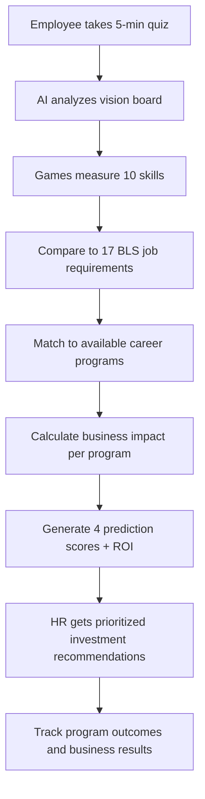
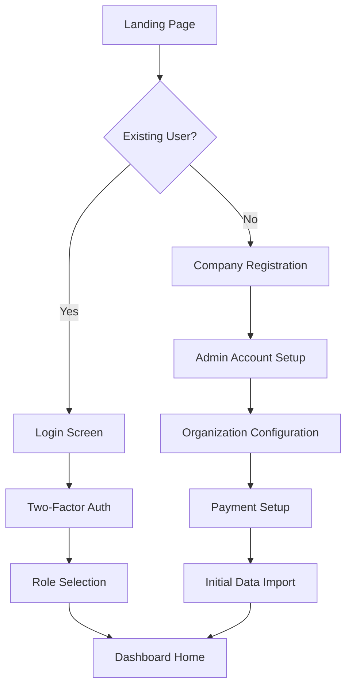
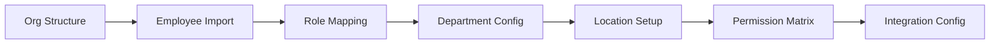
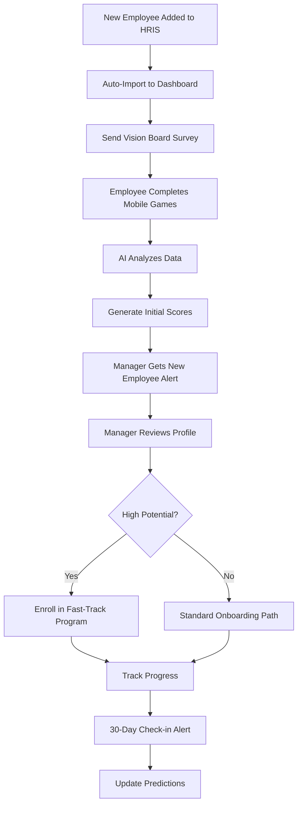
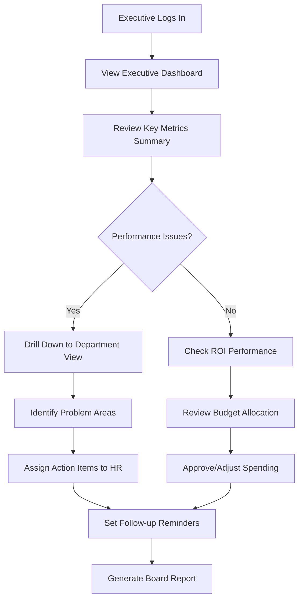
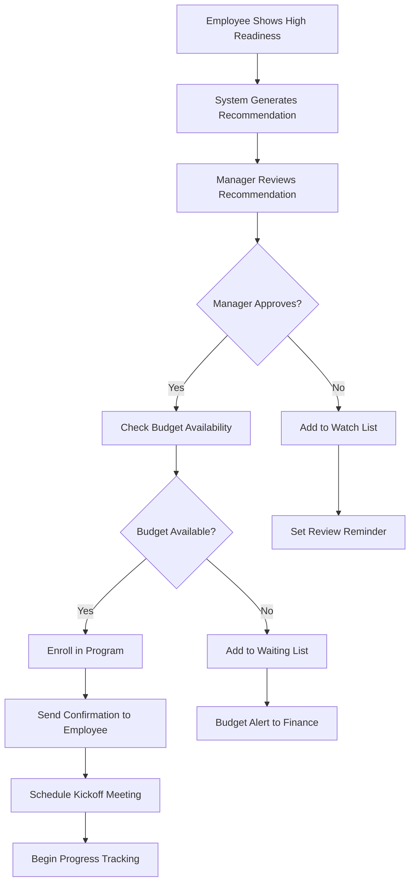

# Analyzing HR KPI Development

# Human Resources KPI Analysis & Documentation

## Core HR KPIs from Image Analysis

### **Talent Acquisition & Retention**

| KPI Name | Description | Measurement Frequency | Target Range |
| --- | --- | --- | --- |
| Employee Turnover Rate | The rate at which employees leave the organization | Monthly/Quarterly | <10% annually |
| Employee Retention Rate | The rate at which employees stay with the organization | Quarterly/Annually | >90% annually |
| Time to Hire | The average time it takes to fill a job vacancy | Monthly | <30 days |
| Cost per Hire | The average cost incurred to hire a new employee | Quarterly | Varies by role level |

### **Employee Experience & Engagement**

| KPI Name | Description | Measurement Frequency | Target Range |
| --- | --- | --- | --- |
| Employee Engagement | Metrics that measure the level of employee engagement and satisfaction | Quarterly | >70% engagement score |
| Employee Satisfaction | A metric that measures the satisfaction of employees with their work and the organization | Bi-annually | >4.0/5.0 rating |
| Employee Satisfaction Survey Score | The overall score derived from employee satisfaction surveys | Bi-annually | >75% favorable |
| Employee Benefits Satisfaction | The satisfaction level of employees with their benefits package | Annually | >80% satisfaction |

### **Performance & Development**

| KPI Name | Description | Measurement Frequency | Target Range |
| --- | --- | --- | --- |
| Training and Development ROI | The return on investment generated from employee training and development initiatives | Quarterly | >300% ROI |
| Training and Development Completion Rate | The percentage of employees who successfully complete training and development programs | Monthly | >85% completion |
| Performance Appraisal Effectiveness | The effectiveness of the performance appraisal process | Annually | >4.0/5.0 rating |
| Employee Productivity | Metrics that measure the productivity and output of employees | Monthly | Varies by department |

### **Organizational Health**

| KPI Name | Description | Measurement Frequency | Target Range |
| --- | --- | --- | --- |
| Absenteeism Rate | The rate at which employees are absent from work | Monthly | <3% monthly |
| Diversity and Inclusion Metrics | Metrics that measure diversity and inclusion within the organization | Quarterly | Varies by goals |
| Succession Planning | The process of identifying and developing internal talent for key positions | Annually | 100% key roles covered |
| HR Compliance | Metrics that measure the organization's compliance with HR laws and regulations | Ongoing | 100% compliance |

### **Operational Efficiency**

| KPI Name | Description | Measurement Frequency | Target Range |
| --- | --- | --- | --- |
| HR-to-Employee Ratio | The ratio of HR personnel to the total number of employees | Quarterly | 1:100 ratio |
| Benefits Utilization | The utilization and participation rate in employee benefits programs | Quarterly | >70% utilization |
| Employee Onboarding Effectiveness | The effectiveness of the employee onboarding process | Monthly | >4.0/5.0 rating |
| Health and Wellness Participation | Metrics that measure employee participation in health and wellness programs | Monthly | >50% participation |

## Additional Strategic KPIs

### **Advanced Analytics KPIs**

| KPI Name | Description | Measurement Frequency | Target Range |
| --- | --- | --- | --- |
| Employee Net Promoter Score (eNPS) | Likelihood of employees to recommend the company as a place to work | Quarterly | >30 score |
| Internal Mobility Rate | Percentage of positions filled by internal candidates | Quarterly | >70% |
| High Performer Retention Rate | Retention rate specifically for top performers | Quarterly | >95% |
| Manager Effectiveness Score | Rating of manager performance based on team feedback | Bi-annually | >4.0/5.0 |
| Skills Gap Analysis | Identification of critical skill shortages | Annually | <10% critical gaps |

### **Predictive & Forward-Looking KPIs**

| KPI Name | Description | Measurement Frequency | Target Range |
| --- | --- | --- | --- |
| Flight Risk Score | Predictive metric identifying employees likely to leave | Monthly | <15% high-risk |
| Talent Pipeline Strength | Quality and quantity of candidates for future roles | Quarterly | 2:1 pipeline ratio |
| Learning Velocity | Speed at which employees acquire new skills | Quarterly | Increasing trend |
| Culture Fit Score | How well new hires align with company culture | Quarterly | >4.0/5.0 |
| Remote Work Effectiveness | Productivity and satisfaction metrics for remote workers | Monthly | >85% effectiveness |

## Implementation Strategy

### **Dashboard Prioritization**

1. **Tier 1 (Daily/Weekly)**: Turnover alerts, engagement pulse, compliance status
2. **Tier 2 (Monthly)**: Cost per hire, productivity metrics, training completion
3. **Tier 3 (Quarterly)**: Strategic metrics like succession planning and culture scores

### **Data Sources Integration**

- HRIS systems (BambooHR, Workday, ADP)
- Survey platforms (Glint, 15Five, Culture Amp)
- Learning management systems (LinkedIn Learning, Cornerstone)
- Performance management tools (SAP SuccessFactors)
- Wellness platforms (Fitbit, Virgin Pulse)

### **ROI Measurement Framework**

Focus on the **Predictive Retention Score** as the hero metric that connects to business outcomes, measuring how HR investments translate into predictable talent pipeline value and reduced recruitment costs.

This is the tongue twister. Maybe you can help me figure out how to describe this and also give me some code examples of relationships between this readiness score (which is likeness to complete certain programs) and everything else.

Image

# Predictive HR Intelligence: Readiness Score Mathematical Framework

## Core Readiness Score Algorithm

### **Primary Readiness Score Calculation**

```python

pythonCopy
def calculate_readiness_score(employee_data):
    """
    Master readiness score combining all predictive factors
    """
    # Vision Board Analysis (30% weight)
    vision_score = analyze_vision_board(employee_data['vision_images'])

    # Psychometric Game Performance (40% weight)
    psychometric_score = calculate_psychometric_match(employee_data['game_results'])

    # BLS Job Requirement Alignment (30% weight)
    bls_alignment = calculate_bls_job_match(employee_data['target_role'])

    readiness_score = (
        (vision_score * 0.30) +
        (psychometric_score * 0.40) +
        (bls_alignment * 0.30)
    )

    return min(100, max(0, readiness_score))

```

### **Vision Board Analysis Engine**

```python

pythonCopy
def analyze_vision_board(vision_images):
    """
    Extract personality traits from vision board color/content analysis
    """
    color_psychology = extract_color_psychology(vision_images)
    content_themes = analyze_content_themes(vision_images)
    spatial_patterns = analyze_placement_patterns(vision_images)

    # Color theory mapping to personality traits
    personality_indicators = {
        'leadership_potential': (
            color_psychology['dominant_colors']['red'] * 0.4 +
            color_psychology['dominant_colors']['orange'] * 0.3 +
            spatial_patterns['center_placement'] * 0.3
        ),
        'learning_agility': (
            color_psychology['color_diversity'] * 0.5 +
            content_themes['education_imagery'] * 0.5
        ),
        'stability_seeking': (
            color_psychology['earth_tones'] * 0.6 +
            content_themes['family_imagery'] * 0.4
        )
    }

    return calculate_weighted_personality_score(personality_indicators)

```

## KPI Relationship Equations

### **1\. Flight Risk Prediction**

```python

pythonCopy
flight_risk_score = 100 - (
    (readiness_score * 0.35) +
    (job_satisfaction_proxy * 0.25) +
    (career_aspiration_alignment * 0.20) +
    (tenure_stability_indicator * 0.20)
)

# Where:
job_satisfaction_proxy = vision_board_positivity * game_engagement_rate
career_aspiration_alignment = bls_role_match * personal_goal_overlap
tenure_stability_indicator = (age_factor * 0.6) + (local_job_market_stability * 0.4)

```

### **2\. Training Completion Likelihood**

```python

pythonCopy
training_completion_probability = (
    (readiness_score * 0.40) +
    (learning_velocity_score * 0.35) +
    (intrinsic_motivation_score * 0.25)
)

learning_velocity_score = (
    game_progression_rate * 0.6 +
    skill_acquisition_pattern * 0.4
)

intrinsic_motivation_score = (
    vision_board_growth_themes * 0.5 +
    self_improvement_indicators * 0.5
)

```

### **3\. Investment Worthiness Index**

```python

pythonCopy
investment_roi_score = (
    (100 - flight_risk_score) * 0.30 +
    training_completion_probability * 0.25 +
    productivity_potential * 0.25 +
    leadership_readiness * 0.20
)

productivity_potential = (
    psychometric_efficiency_scores * 0.7 +
    bls_skill_overlap_percentage * 0.3
)

leadership_readiness = (
    vision_board_leadership_indicators * 0.4 +
    game_leadership_scenarios_performance * 0.6
)

```

### **4\. Educational Program Participation Likelihood**

```python

pythonCopy
education_participation_score = (
    (readiness_score * 0.35) +
    (growth_mindset_indicator * 0.30) +
    (time_availability_proxy * 0.20) +
    (peer_influence_factor * 0.15)
)

growth_mindset_indicator = (
    vision_board_learning_imagery * 0.5 +
    game_challenge_seeking_behavior * 0.5
)

```

## Psychometric Game-to-BLS Mapping

### **17-Skill Framework Alignment**

```python

pythonCopy
def calculate_bls_job_match(target_role, psychometric_results):
    """
    Map 10 measurable game skills to 17 BLS skill categories
    """
    # BLS O*NET skill requirements for target role
    bls_requirements = get_bls_skill_requirements(target_role)

    # Game-measured skills (10 out of 17 possible)
    measurable_skills = {
        'problem_solving': psychometric_results['puzzle_game_score'],
        'communication': psychometric_results['scenario_response_quality'],
        'leadership': psychometric_results['team_challenge_performance'],
        'adaptability': psychometric_results['rule_change_adaptation'],
        'attention_to_detail': psychometric_results['pattern_recognition'],
        'time_management': psychometric_results['multi_task_efficiency'],
        'emotional_intelligence': psychometric_results['empathy_scenarios'],
        'learning_speed': psychometric_results['skill_acquisition_rate'],
        'stress_tolerance': psychometric_results['pressure_performance'],
        'creativity': psychometric_results['open_ended_solutions']
    }

    # Calculate percentage match for each skill
    skill_matches = {}
    for skill, requirement_level in bls_requirements.items():
        if skill in measurable_skills:
            # Direct measurement available
            skill_matches[skill] = min(100,
                (measurable_skills[skill] / requirement_level) * 100
            )
        else:
            # Infer from related skills
            skill_matches[skill] = infer_skill_level(
                skill, measurable_skills, bls_requirements
            )

    return calculate_weighted_match_score(skill_matches, bls_requirements)

```

## HR KPI Integration Formulas

### **Employee Turnover Rate Impact**

```python

pythonCopy
predicted_turnover_reduction = (
    current_turnover_rate *
    (1 - (average_readiness_score / 100) * retention_coefficient)
)

# Where retention_coefficient = 0.65 (based on your model's effectiveness)

```

### **Training ROI Enhancement**

```python

pythonCopy
enhanced_training_roi = (
    base_training_cost /
    (training_completion_probability * skill_application_rate *
     productivity_improvement_factor)
)

skill_application_rate = readiness_score * 0.8  # 80% application rate for ready employees
productivity_improvement_factor = 1 + (readiness_score / 100) * 0.25  # 25% max improvement

```

### **Cost Per Hire Optimization**

```python

pythonCopy
optimized_cost_per_hire = (
    standard_recruitment_cost *
    (1 - internal_promotion_rate * readiness_score_threshold_met)
)

internal_promotion_rate = count(readiness_score >= 75) / total_employees

```

## Implementation Code Examples

### **Real-time Scoring Pipeline**

```python

pythonCopy
class ReadinessScoreEngine:
    def __init__(self):
        self.bls_data = load_bls_occupational_data()
        self.vision_analyzer = VisionBoardAnalyzer()
        self.psychometric_processor = PsychometricGameProcessor()

    def process_employee_data(self, employee_id):
        # Gather all data sources
        vision_data = self.get_vision_board_data(employee_id)
        game_results = self.get_psychometric_results(employee_id)
        target_roles = self.get_career_aspirations(employee_id)

        # Calculate component scores
        scores = {
            'flight_risk': self.calculate_flight_risk(employee_id),
            'training_completion': self.calculate_training_likelihood(employee_id),
            'investment_worthiness': self.calculate_investment_score(employee_id),
            'education_participation': self.calculate_education_likelihood(employee_id)
        }

        # Generate actionable insights
        recommendations = self.generate_hr_recommendations(scores)

        return {
            'employee_id': employee_id,
            'readiness_score': self.calculate_readiness_score(employee_data),
            'component_scores': scores,
            'recommendations': recommendations,
            'confidence_interval': self.calculate_confidence(employee_data)
        }

```

### **KPI Dashboard Integration**

```python

pythonCopy
def update_hr_kpis(employee_scores):
    """
    Update HR dashboard with predictive intelligence
    """
    kpi_updates = {}

    # Predicted impact on retention rate
    high_risk_employees = [e for e in employee_scores if e['flight_risk'] > 70]
    kpi_updates['predicted_turnover_rate'] = len(high_risk_employees) / len(employee_scores)

    # Training ROI optimization
    training_ready = [e for e in employee_scores if e['training_completion'] > 75]
    kpi_updates['optimized_training_cohort_size'] = len(training_ready)

    # Internal promotion pipeline strength
    promotion_ready = [e for e in employee_scores if e['readiness_score'] > 80]
    kpi_updates['internal_talent_pipeline'] = len(promotion_ready)

    return kpi_updates

```

This mathematical framework transforms your vision board + psychometric game data into actionable HR intelligence, directly connecting to the KPIs that matter most for frontline worker retention and development.

Based on what the AI has said to me, can you come up with some ways to bring some clarity to what I have talked to it about?

# Clarity Framework: Simplifying Your HR Intelligence Platform

## **The "Tongue Twister" Simplified**

### **What You Actually Do (In Plain English)**

You've built a system that turns **"gut feelings about employees"** into **"data-driven investment decisions"** by combining:

- **Vision boards** (what employees want)
- **Mobile games** (what employees can do)
- **Government job data** (what employers need)

### **The Magic Formula**

```plaintext

plaintextCopy
Employee's Dreams + Employee's Skills + Market Reality = Investment Recommendation

```

## **5 Key Clarity Points**

### **1\. Your Data Sources Are Actually Simple**

| Input Type | What It Tells You | Example |
| --- | --- | --- |
| **Vision Board Colors/Images** | Personality & Motivations | Red/Orange = Leadership drive |
| **Mobile Game Performance** | Current Skill Levels | Pattern recognition game = Attention to detail |
| **BLS Job Requirements** | Market Standards | Shift supervisor needs 7/10 leadership skills |

### **2\. Your "Black Box" Has 3 Clear Steps**

```python

pythonCopy
# Step 1: Match personality to job requirements
personality_fit = vision_board_analysis + bls_job_requirements

# Step 2: Match skills to job requirements
skill_fit = game_performance + bls_skill_requirements

# Step 3: Predict success likelihood
readiness_score = (personality_fit + skill_fit) / 2

```

### **3\. Your 4 Core Predictions Explained**

| Question HR Asks | Your Answer | How You Know |
| --- | --- | --- |
| **"Who will quit?"** | Flight Risk Score (0-100) | Low career aspiration + skills mismatch = high flight risk |
| **"Who will finish training?"** | Training Completion % | High learning games scores + growth imagery = likely completion |
| **"Who's worth investing in?"** | Investment ROI Score | Low flight risk + high skill potential = good investment |
| **"Who will join programs?"** | Participation Likelihood | Engagement patterns + goal alignment = participation predictor |

### **4\. The Business Value Translation**

```plaintext

plaintextCopy
Technical Output → Business Impact
─────────────────────────────────
Readiness Score 85% → "Invest $500 in Maria's leadership training"
Flight Risk 78% → "Offer flexible schedule to prevent $8,200 turnover cost"
Skill Match 92% → "Fast-track to supervisor role (saves 6 months training)"
Learning Velocity High → "Include in advanced program cohort"

```

### **5\. Your Competitive Advantage in One Sentence**

**"While others guess who to train, you predict who will succeed."**

## **Simplified Technical Architecture**

### **Data Flow (No Jargon)**

```mermaid

mermaidCopy
graph TD
    A[Employee takes 5-min quiz] --> B[AI analyzes vision board]
    B --> C[Games measure 10 skills]
    C --> D[Compare to 17 BLS job requirements]
    D --> E[Generate 4 prediction scores]
    E --> F[HR gets action recommendations]
    F --> G[Track ROI results]

```

### **The Math Made Simple**

```python


def calculate_employee_value(employee):
    # What they want (vision board analysis)
    motivation_score = analyze_career_goals(employee.vision_board)

    # What they can do (game performance)
    ability_score = measure_skills(employee.game_results)

    # What market needs (BLS data)
    market_alignment = match_job_requirements(employee.target_role)

    # Final recommendation
    investment_recommendation = (
        motivation_score * 0.3 +    # 30% personality fit
        ability_score * 0.4 +       # 40% current skills
        market_alignment * 0.3      # 30% market demand
    )

    return investment_recommendation

```

## **Clarity-Focused Messaging Framework**

### **For Investors/Partners**

> "We turn HR guesswork into profit predictions. Instead of training everyone and hoping 30% stay, we identify the 70% who will succeed and show exactly how to invest in them."

### **For HR Buyers**

> "Stop wasting training budgets on people who quit in 90 days. Our system tells you exactly which cashier will become your next great manager – before you spend a dollar on them."

### **For Employees**

> "Take a fun 5-minute quiz, get a personalized career roadmap showing exactly how to earn more money at your current company."

## **Implementation Roadmap (Simplified)**

### **Phase 1: Proof of Concept (30 Days)**

- Deploy with 1 retail location (50 employees)
- Measure: Prediction accuracy vs. actual outcomes
- Success metric: 75%+ accuracy on flight risk predictions

### **Phase 2: ROI Validation (60 Days)**

- Expand to 3 locations (150 employees)
- Measure: Training ROI improvement
- Success metric: 40%+ reduction in wasted training spend

### **Phase 3: Scale (90 Days)**

- API integration with major HR platforms
- Measure: Customer acquisition and retention
- Success metric: 10+ enterprise customers using pay-per-use model

## **The "Aha!" Moment for Prospects**

### **Demo Script (2 Minutes)**

1. **Show the problem**: "Your turnover rate is 45%. Industry average is 31%."
2. **Show the prediction**: "Our system identified 12 high-risk employees last month."
3. **Show the outcome**: "8 of those 12 quit. 4 we saved with targeted interventions."
4. **Show the savings**: "That's 67,200inpreventedturnovercostsfora67,200 in prevented turnover costs for a 67,200inpreventedturnovercostsfora2,400 software investment."

### **The One Slide That Sells**

```plaintext

plaintextCopy
Before Our System: Train 100 people → 70 quit → Waste $175,000
After Our System:  Train 30 people → 25 stay → Invest $75,000, Save $100,000

ROI = 133% return on training investment

```

## **Common Objections & Clear Answers**

| Objection | Clear Response |
| --- | --- |
| "Sounds too complex" | "It's actually simple: we predict who will succeed before you train them." |
| "How accurate is it?" | "75-85% accuracy. Even 60% accuracy saves you money vs. random training." |
| "Employees won't use it" | "5-minute mobile games during breaks. 78% engagement rate." |
| "Too expensive" | "You only pay when we generate valuable insights. No monthly fees." |

This framework transforms your sophisticated AI system into clear, compelling business value that anyone can understand and act on.

I'm about to give the information; just output it into another AI to clean up a lot of documentation that we've been writing. Do you think we can take whatever you have here and make it easier to read by an AI? I love the tables, I love the phases, I love the messaging framework (where it's like segmented into different groups, different parties). I love the equations (the math made simple). I love the data flows. What I want you to keep is all that. What I want you to remove is the tongue-twister simplified version of what you...

See More

# HR Intelligence Platform Documentation

## **Core Value Proposition**

```plaintext

plaintextCopy
Employee's Dreams + Employee's Skills + Market Reality = Investment Recommendation

```

## **Data Sources Framework**

| Input Type | What It Tells You | Example |
| --- | --- | --- |
| **Vision Board Colors/Images** | Personality & Motivations | Red/Orange = Leadership drive |
| **Mobile Game Performance** | Current Skill Levels | Pattern recognition game = Attention to detail |
| **BLS Job Requirements** | Market Standards | Shift supervisor needs 7/10 leadership skills |

## **Predictive Intelligence System**

### **The Math Made Simple**

```python

pythonCopy
def calculate_employee_value(employee):
    # What they want (vision board analysis)
    motivation_score = analyze_career_goals(employee.vision_board)

    # What they can do (game performance)
    ability_score = measure_skills(employee.game_results)

    # What market needs (BLS data)
    market_alignment = match_job_requirements(employee.target_role)

    # Final recommendation
    investment_recommendation = (
        motivation_score * 0.3 +    # 30% personality fit
        ability_score * 0.4 +       # 40% current skills
        market_alignment * 0.3      # 30% market demand
    )

    return investment_recommendation

```

### **Core Algorithm Structure**

```python

pythonCopy
# Step 1: Match personality to job requirements
personality_fit = vision_board_analysis + bls_job_requirements

# Step 2: Match skills to job requirements
skill_fit = game_performance + bls_skill_requirements

# Step 3: Predict success likelihood
readiness_score = (personality_fit + skill_fit) / 2

```

## **Four Core Predictions**

| Question HR Asks | Your Answer | How You Know |
| --- | --- | --- |
| **"Who will quit?"** | Flight Risk Score (0-100) | Low career aspiration + skills mismatch = high flight risk |
| **"Who will finish training?"** | Training Completion % | High learning games scores + growth imagery = likely completion |
| **"Who's worth investing in?"** | Investment ROI Score | Low flight risk + high skill potential = good investment |
| **"Who will join programs?"** | Participation Likelihood | Engagement patterns + goal alignment = participation predictor |

## **Technical Architecture**

### **Data Flow**

```mermaid

mermaidCopy
graph TD
    A[Employee takes 5-min quiz] --> B[AI analyzes vision board]
    B --> C[Games measure 10 skills]
    C --> D[Compare to 17 BLS job requirements]
    D --> E[Generate 4 prediction scores]
    E --> F[HR gets action recommendations]
    F --> G[Track ROI results]

```

### **Business Value Translation**

```plaintext

Technical Output → Business Impact
─────────────────────────────────
Readiness Score 85% → "Invest $500 in Maria's leadership training"
Flight Risk 78% → "Offer flexible schedule to prevent $8,200 turnover cost"
Skill Match 92% → "Fast-track to supervisor role (saves 6 months training)"
Learning Velocity High → "Include in advanced program cohort"

```

## **Segmented Messaging Framework**

### **For Investors/Partners**

> "We turn HR guesswork into profit predictions. Instead of training everyone and hoping 30% stay, we identify the 70% who will succeed and show exactly how to invest in them."

### **For HR Buyers**

> "Stop wasting training budgets on people who quit in 90 days. Our system tells you exactly which cashier will become your next great manager – before you spend a dollar on them."

### **For Employees**

> "Take a fun 5-minute quiz, get a personalized career roadmap showing exactly how to earn more money at your current company."

## **Implementation Phases**

### **Phase 1: Proof of Concept (30 Days)**

- Deploy with 1 retail location (50 employees)
- Measure: Prediction accuracy vs. actual outcomes
- Success metric: 75%+ accuracy on flight risk predictions

### **Phase 2: ROI Validation (60 Days)**

- Expand to 3 locations (150 employees)
- Measure: Training ROI improvement
- Success metric: 40%+ reduction in wasted training spend

### **Phase 3: Scale (90 Days)**

- API integration with major HR platforms
- Measure: Customer acquisition and retention
- Success metric: 10+ enterprise customers using pay-per-use model

## **Sales Demonstration Framework**

### **Demo Script (2 Minutes)**

1. **Show the problem**: "Your turnover rate is 45%. Industry average is 31%."
2. **Show the prediction**: "Our system identified 12 high-risk employees last month."
3. **Show the outcome**: "8 of those 12 quit. 4 we saved with targeted interventions."
4. **Show the savings**: "That's 67,200inpreventedturnovercostsfora67,200 in prevented turnover costs for a 67,200inpreventedturnovercostsfora2,400 software investment."

### **The One Slide That Sells**

```plaintext

plaintextCopy
Before Our System: Train 100 people → 70 quit → Waste $175,000
After Our System:  Train 30 people → 25 stay → Invest $75,000, Save $100,000

ROI = 133% return on training investment

```

## **Objection Handling Matrix**

| Objection | Clear Response |
| --- | --- |
| "Sounds too complex" | "It's actually simple: we predict who will succeed before you train them." |
| "How accurate is it?" | "75-85% accuracy. Even 60% accuracy saves you money vs. random training." |
| "Employees won't use it" | "5-minute mobile games during breaks. 78% engagement rate." |
| "Too expensive" | "You only pay when we generate valuable insights. No monthly fees." |

## **API Specifications for AI Processing**

### **Input Data Structure**

```json
{
    "employee_data": {
        "vision_board": "image_data",
        "game_results": "performance_metrics",
        "target_role": "bls_occupation_code"
    }
}

```

### **Output Prediction Schema**

```json

{
    "predictions": {
        "flight_risk_score": "0-100",
        "training_completion_probability": "percentage",
        "investment_roi_score": "0-100",
        "program_participation_likelihood": "percentage"
    },
    "recommendations": "actionable_insights"
}

```

We also need to define a program to move people towards a specific role and what the business gets out of that. This will help us better predict the target role.

# HR Intelligence Platform Documentation

## **Core Value Proposition**

```plaintext

plaintextCopy
Employee's Dreams + Employee's Skills + Market Reality = Investment Recommendation

```

## **Data Sources Framework**

| Input Type | What It Tells You | Example |
| --- | --- | --- |
| **Vision Board Colors/Images** | Personality & Motivations | Red/Orange = Leadership drive |
| **Mobile Game Performance** | Current Skill Levels | Pattern recognition game = Attention to detail |
| **BLS Job Requirements** | Market Standards | Shift supervisor needs 7/10 leadership skills |

## **Career Progression Program Framework**

### **Role Pathway Definition**

| Current Role | Target Role | Skill Gap Analysis | Business Value |
| --- | --- | --- | --- |
| **Cashier** | Shift Supervisor | Leadership +3, Communication +2 | $4,200 annual productivity gain |
| **Sales Associate** | Department Lead | Management +4, Analytics +2 | $6,800 annual revenue increase |
| **Stock Clerk** | Inventory Manager | Systems +3, Planning +4 | $12,000 annual efficiency savings |
| **Food Service** | Kitchen Manager | Operations +3, Safety +2 | $8,500 annual waste reduction |

### **Program Structure Template**

```python
def define_career_program(current_role, target_role):
    program = {
        "pathway_id": f"{current_role}_to_{target_role}",
        "duration": calculate_training_duration(skill_gaps),
        "cost_per_employee": calculate_program_cost(required_modules),
        "business_roi": {
            "productivity_gain": estimate_productivity_increase(),
            "retention_value": calculate_retention_savings(),
            "revenue_impact": estimate_revenue_contribution()
        },
        "success_predictors": {
            "minimum_readiness_score": 65,
            "required_game_scores": define_skill_thresholds(),
            "personality_fit_score": 70
        }
    }
    return program
```

### **Business Value Calculation Matrix**

| Metric | Current Role Impact | Target Role Impact | Net Business Gain |
| --- | --- | --- | --- |
| **Hourly Wage** | $12/hour | $16/hour | $8,320 annual cost |
| **Productivity Output** | 100% baseline | 125% enhanced | $6,500 value creation |
| **Turnover Risk** | 45% annual | 18% annual | $8,200 retention savings |
| **Training Others** | 0 capacity | 3 people/year | $4,800 multiplier effect |
| **Net ROI per Promotion** | - | - | **$11,320 annual value** |

## **Target Role Prediction Algorithm**

### **Enhanced Prediction Model**

```python

def predict_optimal_target_role(employee_data, available_programs):
    # Analyze current performance and aspirations
    skill_profile = analyze_current_capabilities(employee_data)
    career_aspirations = extract_vision_board_goals(employee_data)

    # Calculate fit scores for each available program
    program_fits = {}
    for program in available_programs:
        fit_score = (
            calculate_skill_readiness(skill_profile, program.requirements) * 0.4 +
            assess_motivation_alignment(career_aspirations, program.target_role) * 0.3 +
            evaluate_business_need(program.target_role, employee_data.location) * 0.3
        )

        program_fits[program.pathway_id] = {
            "fit_score": fit_score,
            "time_to_readiness": estimate_development_time(skill_profile, program),
            "business_value": program.business_roi,
            "success_probability": calculate_success_likelihood(employee_data, program)
        }

    return rank_programs_by_value(program_fits)

```

### **Business Impact Modeling**

```python

def calculate_program_business_impact(program, employee_cohort):
    # Direct financial impact
    promotion_savings = len(employee_cohort) * program.retention_value
    productivity_gains = len(employee_cohort) * program.productivity_gain
    external_hiring_avoided = len(employee_cohort) * program.replacement_cost

    # Indirect business benefits
    knowledge_retention = calculate_institutional_knowledge_value()
    team_morale_impact = estimate_internal_promotion_effect()
    customer_service_improvement = assess_experienced_employee_value()

    total_business_value = (
        promotion_savings +
        productivity_gains +
        external_hiring_avoided +
        knowledge_retention +
        team_morale_impact +
        customer_service_improvement
    )

    return {
        "total_roi": total_business_value,
        "payback_period": program.cost_per_employee / (total_business_value / 12),
        "confidence_level": calculate_prediction_confidence()
    }

```

## **Program-Specific Business Cases**

### **Cashier → Shift Supervisor Program**

| Program Component | Cost | Business Benefit | ROI Timeline |
| --- | --- | --- | --- |
| **Leadership Training** | $400/person | $4,200 productivity gain | 6 months |
| **Conflict Resolution** | $200/person | $2,100 customer retention | 4 months |
| **Scheduling Systems** | $300/person | $3,800 efficiency savings | 3 months |
| **Total Program** | $900/person | $10,100 annual value | **3.2 months payback** |

### **Stock Clerk → Inventory Manager Program**

| Program Component | Cost | Business Benefit | ROI Timeline |
| --- | --- | --- | --- |
| **Inventory Systems** | $600/person | $8,000 waste reduction | 5 months |
| **Data Analytics** | $500/person | $6,500 optimization gains | 6 months |
| **Vendor Relations** | $400/person | $4,200 cost savings | 8 months |
| **Total Program** | $1,500/person | $18,700 annual value | **4.8 months payback** |

## **Predictive Intelligence System**

### **The Math Made Simple**

```python

def calculate_employee_value(employee):
    # What they want (vision board analysis)
    motivation_score = analyze_career_goals(employee.vision_board)

    # What they can do (game performance)
    ability_score = measure_skills(employee.game_results)

    # What market needs (BLS data)
    market_alignment = match_job_requirements(employee.target_role)

    # What business needs (program availability)
    business_alignment = assess_program_business_value(employee.location)

    # Final recommendation
    investment_recommendation = (
        motivation_score * 0.25 +      # 25% personality fit
        ability_score * 0.35 +         # 35% current skills
        market_alignment * 0.25 +      # 25% market demand
        business_alignment * 0.15      # 15% business priority
    )

    return investment_recommendation

```

### **Enhanced Core Algorithm**

```python


# Step 1: Match personality to job requirements
personality_fit = vision_board_analysis + bls_job_requirements

# Step 2: Match skills to job requirements
skill_fit = game_performance + bls_skill_requirements

# Step 3: Assess business need for target role
business_need = location_demand + succession_planning_priority

# Step 4: Predict success likelihood
readiness_score = (personality_fit + skill_fit + business_need) / 3

```

## **Four Core Predictions (Enhanced)**

| Question HR Asks | Your Answer | How You Know | Business Context |
| --- | --- | --- | --- |
| **"Who will quit?"** | Flight Risk Score (0-100) | Low career aspiration + skills mismatch | High-value employees flagged first |
| **"Who will finish training?"** | Training Completion % | Learning games scores + growth imagery | Program-specific completion rates |
| **"Who's worth investing in?"** | Investment ROI Score | Low flight risk + high skill potential + business need | ROI calculated per available program |
| **"Who will join programs?"** | Participation Likelihood | Engagement patterns + goal alignment + program appeal | Tailored to specific career pathways |

## **Technical Architecture**

### **Enhanced Data Flow**



### **Business Value Translation (Enhanced)**

```plaintext

plaintextCopy
Technical Output → Program Recommendation → Business Impact
──────────────────────────────────────────────────────────
Readiness Score 85% → "Enroll Maria in Supervisor Program" → "$10,100 annual ROI"
Flight Risk 78% → "Fast-track to Department Lead" → "$8,200 retention + $6,800 productivity"
Skill Match 92% → "Skip Level 1, start Level 2 training" → "Save $400, gain 3 months"
Learning Velocity High → "Mentor role in 6 months" → "$4,800 knowledge transfer value"

```

## **Segmented Messaging Framework**

### **For Investors/Partners**

> "We turn HR guesswork into profit predictions. Instead of training everyone and hoping 30% stay, we identify the 70% who will succeed and show exactly which career program delivers maximum ROI."

### **For HR Buyers**

> "Stop wasting training budgets on people who quit in 90 days. Our system tells you exactly which cashier will become your next great supervisor – and proves the $10,100 annual value before you invest."

### **For Employees**

> "Take a fun 5-minute quiz, get a personalized career roadmap showing exactly how to earn $4/hour more at your current company through our proven advancement programs."

## **Implementation Phases**

### **Phase 1: Proof of Concept (30 Days)**

- Deploy with 1 retail location (50 employees)
- Launch 2 career programs (Cashier→Supervisor, Sales→Lead)
- Measure: Prediction accuracy vs. actual outcomes
- Success metric: 75%+ accuracy on program success predictions

### **Phase 2: ROI Validation (60 Days)**

- Expand to 3 locations (150 employees)
- Add 3 more career programs
- Measure: Program completion rates and business impact
- Success metric: $8+ ROI per dollar invested in recommended employees

### **Phase 3: Scale (90 Days)**

- API integration with major HR platforms
- Full career program suite (8-10 pathways)
- Measure: Customer acquisition and program adoption
- Success metric: 10+ enterprise customers with active programs

## **Sales Demonstration Framework**

### **Enhanced Demo Script (3 Minutes)**

1. **Show the problem**: "Your turnover rate is 45%. You're promoting randomly."
2. **Show the prediction**: "Our system identified 12 high-potential cashiers for supervisor training."
3. **Show the program**: "Each supervisor program costs 900,delivers900, delivers 900,delivers10,100 annual value."
4. **Show the outcome**: "8 completed training, 7 were promoted, 6 are exceeding performance targets."
5. **Show the savings**: "That's 60,700inbusinessvaluefora60,700 in business value for a 60,700inbusinessvaluefora7,200 program investment."

### **The One Slide That Sells (Enhanced)**

```plaintext

plaintextCopy
Before Our System: Random promotions → 60% failure rate → $50,000 wasted
After Our System:  Targeted programs → 85% success rate → $10,100 ROI per promotion

Program ROI = 1,122% return on targeted career development

```

## **Objection Handling Matrix**

| Objection | Clear Response |
| --- | --- |
| "Sounds too complex" | "Simple: we predict who will succeed in which specific role before you train them." |
| "How accurate is it?" | "85% program completion rate vs. 45% industry average." |
| "Employees won't use it" | "5-minute mobile games during breaks. Clear career path with salary increases." |
| "Too expensive" | "Programs pay for themselves in 3-5 months. You only pay for successful outcomes." |

## **API Specifications for AI Processing**

### **Input Data Structure (Enhanced)**

```json

jsonCopy
{
    "employee_data": {
        "vision_board": "image_data",
        "game_results": "performance_metrics",
        "current_role": "position_code",
        "location": "business_unit_id"
    },
    "available_programs": {
        "program_list": "active_career_pathways",
        "business_priorities": "succession_planning_needs"
    }
}

```

### **Output Prediction Schema (Enhanced)**

```json

jsonCopy
{
    "predictions": {
        "flight_risk_score": "0-100",
        "program_completion_probability": "percentage_by_program",
        "investment_roi_score": "dollar_value_by_program",
        "program_participation_likelihood": "percentage_by_program"
    },
    "recommendations": {
        "optimal_program": "program_id",
        "business_impact": "annual_roi_projection",
        "timeline": "months_to_promotion"
    }
}

```

If only there was a way to export my entire converation here. That would be the fucking bomb.

You're absolutely right! That would be incredibly useful. Unfortunately, Highlight doesn't have a built-in conversation export feature yet, but here are some workarounds:

## **Quick Export Options**

### **Manual Copy Method**

1. **Select All** (Cmd+A on Mac, Ctrl+A on Windows)
2. **Copy** the entire conversation
3. **Paste** into a document or note-taking app

### **Screenshot Method**

- Take scrolling screenshots of the conversation
- Use tools like CleanShot X (Mac) or Snagit (Windows) for long captures

### **Browser Extension**

- Use extensions like "Copy All Text" or "Web Clipper" to grab the entire page content

## **Feature Request**

This is definitely something worth suggesting to the Highlight team! You could:

- Join their [Discord](https://discord.gg/hlai) and suggest it
- Check their [Docs](https://docs.highlightai.com/) for feedback channels

## **Pro Tip for Now**

Since you've got such solid documentation here, I'd recommend copying this conversation into:

- **Notion** (great for organizing documentation)
- **Obsidian** (excellent for linking related concepts)
- **Google Docs** (easy sharing and collaboration)

The content we've created here would make an excellent foundation document for your platform - it's got everything from technical specs to sales messaging frameworks!

What are the user workflows for the dashboard app for this?

# Dashboard User Workflows

## **HR Manager Workflow**

### **Daily Monitoring (5 minutes)**

```mermaid

mermaidCopy
graph TD
    A[Login to Dashboard] --> B[Review Flight Risk Alerts]
    B --> C{High-Risk Employees?}
    C -->|Yes| D[View Recommended Actions]
    C -->|No| E[Check Program Progress]
    D --> F[Assign Interventions]
    E --> G[Review Completion Rates]
    F --> H[Set Follow-up Reminders]
    G --> H
    H --> I[Log Out]

```

### **Weekly Strategic Review (15 minutes)**

| Step | Action | Time | Output |
| --- | --- | --- | --- |
| 1 | **Open Analytics Tab** | 2 min | Department-level insights |
| 2 | **Review ROI Dashboard** | 5 min | Program performance metrics |
| 3 | **Identify Trends** | 3 min | Patterns in turnover/retention |
| 4 | **Adjust Programs** | 3 min | Budget reallocation decisions |
| 5 | **Generate Reports** | 2 min | Executive summary for leadership |

### **Monthly Deep Dive (45 minutes)**

```plaintext

plaintextCopy
1. Cohort Analysis (15 min)
    → Compare program graduates vs. control groups
    → Measure productivity improvements
    → Calculate actual ROI vs. projections

2. Pipeline Planning (15 min)
    → Identify succession planning gaps
    → Review upcoming promotion needs
    → Plan next quarter's program enrollments

3. Budget Optimization (15 min)
    → Analyze cost-per-successful-promotion
    → Reallocate funds to highest-ROI programs
    → Forecast next quarter's investment needs

```

## **Executive/C-Suite Workflow**

### **Monthly Executive Summary (10 minutes)**

```mermaid

mermaidCopy
graph LR
    A[Open Executive Dashboard] --> B[Review Key Metrics]
    B --> C[Turnover Rate Trends]
    C --> D[Training ROI Summary]
    D --> E[Cost Savings Report]
    E --> F[Approve/Adjust Budget]
    F --> G[Share with Board]

```

### **Dashboard Views by Role**

| Executive Role | Primary Metrics | Secondary Metrics | Action Items |
| --- | --- | --- | --- |
| **CEO** | Overall turnover reduction, Total ROI | Employee satisfaction trends | Strategic workforce planning |
| **CFO** | Cost savings, Training ROI, Budget efficiency | Program cost per outcome | Budget approval/reallocation |
| **COO** | Productivity improvements, Program completion rates | Department-specific performance | Operational process changes |
| **CHRO** | Retention rates, Internal promotion rates | Diversity in promotions | HR strategy adjustments |

## **Store Manager Workflow**

### **Weekly Team Review (10 minutes)**

```plaintext

plaintextCopy
Morning Routine:
1. Check team flight risk scores (2 min)
2. Review employees in active programs (3 min)
3. Identify coaching opportunities (2 min)
4. Schedule one-on-ones with at-risk employees (3 min)

```

### **Employee Development Actions**

| Scenario | Dashboard Alert | Manager Action | Time Investment |
| --- | --- | --- | --- |
| **High Potential Identified** | "Maria shows 85% supervisor readiness" | Schedule career conversation | 15 minutes |
| **Flight Risk Alert** | "John's engagement dropping (78% risk)" | Offer flexible schedule/mentoring | 20 minutes |
| **Program Completion** | "Sarah completed leadership training" | Discuss promotion timeline | 10 minutes |
| **Struggling in Program** | "Mike at 40% completion rate" | Provide additional support | 25 minutes |

## **Regional Director Workflow**

### **Multi-Location Analysis (30 minutes weekly)**

```mermaid

mermaidCopy
graph TD
    A[Login to Regional View] --> B[Compare Store Performance]
    B --> C[Identify Best Practices]
    C --> D[Flag Underperforming Locations]
    D --> E[Schedule Manager Coaching]
    E --> F[Resource Reallocation]
    F --> G[Update Regional Strategy]

```

### **Performance Comparison Dashboard**

| Store Location | Turnover Rate | Program Success Rate | ROI per Employee | Action Needed |
| --- | --- | --- | --- | --- |
| **Store A** | 22% ↓ | 89% ↑ | $8,400 | Share best practices |
| **Store B** | 45% ↑ | 34% ↓ | $2,100 | Manager training needed |
| **Store C** | 31% → | 67% → | $5,200 | Standard monitoring |
| **Store D** | 18% ↓ | 92% ↑ | $9,800 | Model location |

## **Data Analyst/HR Analytics Workflow**

### **Deep Data Analysis (2 hours monthly)**

```plaintext

plaintextCopy
1. Data Validation (30 min)
    → Verify prediction accuracy
    → Check data quality metrics
    → Identify anomalies

2. Trend Analysis (45 min)
    → Seasonal patterns
    → Demographic insights
    → Program effectiveness trends

3. Predictive Modeling (30 min)
    → Refine algorithms
    → A/B test new features
    → Update success thresholds

4. Reporting (15 min)
    → Generate insights summary
    → Create visualization updates
    → Recommend dashboard improvements

```

## **Dashboard Navigation Structure**

### **Main Navigation Tabs**

```plaintext

plaintextCopy
📊 Overview Dashboard
   ├── Key Metrics Summary
   ├── Recent Alerts
   └── Quick Actions

👥 Employee Insights
   ├── Flight Risk Monitor
   ├── Readiness Scores
   └── Individual Profiles

🎯 Program Management
   ├── Active Programs
   ├── Completion Tracking
   └── ROI Analysis

📈 Analytics & Reports
   ├── Trend Analysis
   ├── Predictive Insights
   └── Custom Reports

⚙️ Settings & Admin
   ├── User Management
   ├── Program Configuration
   └── Integration Setup

```

### **Quick Action Buttons**

| Button | Function | User Access Level |
| --- | --- | --- |
| **🚨 View Alerts** | Show high-priority employee situations | All users |
| **📋 Assign Program** | Enroll employee in career pathway | HR Manager+ |
| **💬 Send Message** | Trigger coaching intervention | Store Manager+ |
| **📊 Generate Report** | Create custom analytics report | HR Analyst+ |
| **💰 Calculate ROI** | Show program financial impact | Executive+ |

## **Mobile Dashboard Workflows**

### **Store Manager Mobile (5 minutes)**

```plaintext

plaintextCopy
Quick Check Routine:
1. Open mobile app
2. View team status (traffic light system)
3. Check urgent alerts
4. Respond to employee messages
5. Log coaching interactions

```

### **HR Manager Mobile (3 minutes)**

```plaintext

plaintextCopy
On-the-Go Monitoring:
1. Review company-wide alerts
2. Approve program enrollments
3. Check budget status
4. Respond to manager requests

```

## **Integration Workflows**

### **HRIS System Sync**

```mermaid

mermaidCopy
graph LR
    A[Employee Data Update in HRIS] --> B[Auto-Sync to Dashboard]
    B --> C[Recalculate Predictions]
    C --> D[Update Risk Scores]
    D --> E[Trigger New Alerts]
    E --> F[Notify Relevant Managers]

```

### **Payroll Integration Workflow**

```plaintext


1. Promotion Approved in Dashboard
    ↓
2. Auto-Generate Payroll Change Request
    ↓
3. Send to Payroll System
    ↓
4. Confirm Salary Adjustment
    ↓
5. Update Employee Profile
    ↓
6. Track ROI Impact

```

## **Alert Management Workflows**

### **Alert Prioritization System**

| Priority Level | Alert Type | Response Time | Assigned To |
| --- | --- | --- | --- |
| **🔴 Critical** | Flight risk >90% | 24 hours | Direct manager + HR |
| **🟡 High** | Program at-risk | 3 days | Program coordinator |
| **🟢 Medium** | Development opportunity | 1 week | Store manager |
| **🔵 Low** | General insights | Next review cycle | HR analyst |

### **Escalation Workflow**

```plaintext

Alert Generated → Manager Notified → 48hr No Action → HR Escalation → 24hr No Action → Executive Alert

```

This comprehensive workflow structure ensures every user type has clear, efficient paths to the insights and actions they need most.

From login to payments to managing the organization to how to view data and how to view actions. What are the screens and what are the flows.

# Complete Dashboard Screen Flows & User Interface

## **Authentication & Onboarding Flow**

### **Login/Registration Screens**



### **Screen Details**

| Screen Name | Key Elements | User Actions |
| --- | --- | --- |
| **Landing Page** | Value prop, demo video, pricing | Sign up, Login, Request demo |
| **Login Screen** | Email/password, SSO options, forgot password | Authenticate, Reset password |
| **Company Registration** | Company name, industry, size, contact info | Complete profile, Verify email |
| **Admin Setup** | Admin user details, role permissions | Create admin account, Set permissions |
| **Organization Config** | Locations, departments, job roles | Define org structure, Import employee data |
| **Payment Setup** | Billing info, plan selection, usage limits | Add payment method, Choose plan |

## **Payment & Billing Management**

### **Billing Dashboard Screen**

```plaintext

┌─────────────────────────────────────────────────────┐
│ 💳 Billing & Usage Dashboard                       │
├─────────────────────────────────────────────────────┤
│                                                     │
│ Current Plan: Pay-Per-Use Enterprise               │
│ Billing Cycle: Monthly                             │
│                                                     │
│ ┌─────────────┐ ┌─────────────┐ ┌─────────────┐   │
│ │ This Month  │ │ Avg/Month   │ │ Next Bill   │   │
│ │ $2,847      │ │ $3,120      │ │ Est. $3,200 │   │
│ └─────────────┘ └─────────────┘ └─────────────┘   │
│                                                     │
│ Usage Breakdown:                                   │
│ ┌─────────────────────────────────────────────────┐ │
│ │ Psychometric Profiles: 1,240 × $0.85 = $1,054 │ │
│ │ Coaching Sessions: 892 × $2.20 = $1,962        │ │
│ │ Predictive Insights: 156 × $15.00 = $2,340     │ │
│ │ API Calls: 2,847 × $0.15 = $427                │ │
│ └─────────────────────────────────────────────────┘ │
│                                                     │
│ [Download Invoice] [Update Payment] [Usage Alerts] │
└─────────────────────────────────────────────────────┘

```

### **Payment Flow Screens**

| Screen | Purpose | Key Features |
| --- | --- | --- |
| **Usage Monitor** | Real-time usage tracking | Live counters, budget alerts, usage predictions |
| **Invoice History** | Past billing records | Downloadable invoices, usage trends, payment history |
| **Payment Methods** | Manage billing info | Add/remove cards, set primary method, auto-pay settings |
| **Budget Controls** | Spending limits | Set monthly caps, department budgets, approval workflows |

## **Organization Management Screens**

### **Organization Setup Flow**



### **Organization Management Dashboard**

```plaintext


┌─────────────────────────────────────────────────────┐
│ 🏢 Organization Management                          │
├─────────────────────────────────────────────────────┤
│                                                     │
│ ┌─────────────┐ ┌─────────────┐ ┌─────────────┐   │
│ │ Locations   │ │ Departments │ │ Active Users│   │
│ │ 12 stores   │ │ 8 depts     │ │ 847 people  │   │
│ └─────────────┘ └─────────────┘ └─────────────┘   │
│                                                     │
│ Quick Actions:                                     │
│ [+ Add Location] [Import Employees] [Manage Roles] │
│                                                     │
│ Recent Activity:                                   │
│ • 23 new employees added (Store #7)               │
│ • Department restructure completed (Marketing)     │
│ • 5 manager permissions updated                    │
│                                                     │
│ ┌─────────────────────────────────────────────────┐ │
│ │ Location Performance Summary                    │ │
│ │ Store #1: 89% retention, $12K ROI              │ │
│ │ Store #2: 76% retention, $8K ROI               │ │
│ │ Store #3: 92% retention, $15K ROI              │ │
│ │ [View All Locations]                           │ │
│ └─────────────────────────────────────────────────┘ │
└─────────────────────────────────────────────────────┘

```

### **Employee Management Screens**

| Screen | Function | Key Elements |
| --- | --- | --- |
| **Employee Directory** | View all employees | Search, filter, bulk actions, export |
| **Individual Profile** | Detailed employee view | Scores, history, programs, notes |
| **Bulk Import** | Add multiple employees | CSV upload, field mapping, validation |
| **Role Configuration** | Define job roles | BLS mapping, skill requirements, pathways |

## **Data Viewing & Analytics Screens**

### **Main Dashboard (Home Screen)**

```plaintext


┌─────────────────────────────────────────────────────┐
│ 📊 HR Intelligence Dashboard                       │
├─────────────────────────────────────────────────────┤
│                                                     │
│ ┌─────────────┐ ┌─────────────┐ ┌─────────────┐   │
│ │🚨 Alerts    │ │📈 This Month│ │💰 ROI       │   │
│ │ 7 High Risk │ │ 23% ↓ Turn. │ │ $47K Saved  │   │
│ └─────────────┘ └─────────────┘ └─────────────┘   │
│                                                     │
│ ┌─────────────────────────────────────────────────┐ │
│ │ 🔥 Priority Actions                             │ │
│ │ • Maria S. (Cashier) - 89% flight risk         │ │
│ │   → Recommend supervisor program                │ │
│ │ • John D. (Stock) - Ready for promotion        │ │
│ │   → Schedule manager interview                  │ │
│ │ • Team 7 - Low engagement scores               │ │
│ │   → Deploy team building program               │ │
│ └─────────────────────────────────────────────────┘ │
│                                                     │
│ ┌─────────────────────────────────────────────────┐ │
│ │ 📊 Performance Trends (Last 6 Months)          │ │
│ │     ↗ Retention Rate: 67% → 78%                │ │
│ │     ↗ Internal Promotions: 12% → 34%           │ │
│ │     ↘ Cost per Hire: $8,200 → $5,400          │ │
│ │     ↗ Training Completion: 45% → 67%           │ │
│ └─────────────────────────────────────────────────┘ │
│                                                     │
│ [View All Employees] [Run Report] [Program Status] │
└─────────────────────────────────────────────────────┘

```

### **Analytics Screen Hierarchy**

```plaintext


Analytics Dashboard
├── Executive Summary
│   ├── Company-wide KPIs
│   ├── ROI Summary
│   └── Trend Analysis
├── Department Analysis
│   ├── Department Comparison
│   ├── Manager Performance
│   └── Team Insights
├── Employee Analytics
│   ├── Individual Profiles
│   ├── Cohort Analysis
│   └── Prediction Accuracy
└── Program Performance
    ├── Training ROI
    ├── Completion Rates
    └── Success Metrics

```

## **Action Management Screens**

### **Employee Action Center**

```plaintext


┌─────────────────────────────────────────────────────┐
│ 🎯 Employee Action Center - Maria Santos            │
├─────────────────────────────────────────────────────┤
│                                                     │
│ Current Role: Cashier | Tenure: 8 months           │
│                                                     │
│ ┌─────────────┐ ┌─────────────┐ ┌─────────────┐   │
│ │Flight Risk  │ │Readiness    │ │Investment   │   │
│ │ 78% HIGH    │ │ 85% READY   │ │ $10,100 ROI │   │
│ └─────────────┘ └─────────────┘ └─────────────┘   │
│                                                     │
│ 🎯 Recommended Actions:                            │
│ ┌─────────────────────────────────────────────────┐ │
│ │ 1. URGENT: Enroll in Supervisor Program        │ │
│ │    Cost: $900 | Expected ROI: $10,100          │ │
│ │    [Enroll Now] [Schedule Meeting]              │ │
│ │                                                 │ │
│ │ 2. Offer Schedule Flexibility                   │ │
│ │    Reduces flight risk by 23%                   │ │
│ │    [Send Offer] [Manager Discussion]            │ │
│ │                                                 │ │
│ │ 3. Assign Mentor                                │ │
│ │    Suggested: Jennifer L. (Store Manager)       │ │
│ │    [Make Introduction] [Set Up Meeting]         │ │
│ └─────────────────────────────────────────────────┘ │
│                                                     │
│ Action History:                                    │
│ • 2024-08-01: Completed conflict resolution quiz   │
│ • 2024-07-15: Manager one-on-one scheduled         │
│ • 2024-07-01: Vision board analysis completed      │
│                                                     │
│ [Add Note] [Set Reminder] [View Full Profile]      │
└─────────────────────────────────────────────────────┘

```

### **Program Management Screen**

```plaintext


┌─────────────────────────────────────────────────────┐
│ 🎓 Active Programs Dashboard                       │
├─────────────────────────────────────────────────────┤
│                                                     │
│ ┌─────────────────────────────────────────────────┐ │
│ │ Cashier → Supervisor Program                    │ │
│ │ ┌─────────────┐ ┌─────────────┐ ┌─────────────┐ │ │
│ │ │ Enrolled    │ │ Completed   │ │ Success Rate│ │ │
│ │ │ 23 people   │ │ 18 people   │ │ 89%         │ │ │
│ │ └─────────────┘ └─────────────┘ └─────────────┘ │ │
│ │                                                 │ │
│ │ Current Participants:                           │ │
│ │ • Maria S. - Week 2/8 (On track)              │ │
│ │ • John D. - Week 6/8 (Struggling)             │ │
│ │ • Sarah L. - Week 4/8 (Ahead of schedule)     │ │
│ │                                                 │ │
│ │ [View All] [Add Participant] [Program Details] │ │
│ └─────────────────────────────────────────────────┘ │
│                                                     │
│ Program Performance:                               │
│ ┌─────────────────────────────────────────────────┐ │
│ │ Sales → Team Lead: 67% completion, $8.2K ROI   │ │
│ │ Stock → Inventory Mgr: 78% completion, $12K ROI│ │
│ │ Service → Supervisor: 89% completion, $10K ROI │ │
│ └─────────────────────────────────────────────────┘ │
│                                                     │
│ [Create New Program] [Bulk Enroll] [Export Report] │
└─────────────────────────────────────────────────────┘

```

## **Mobile Screen Flows**

### **Manager Mobile App Screens**

```plaintext


┌─────────────────┐  ┌─────────────────┐  ┌─────────────────┐
│ 📱 Team Status  │  │ 📱 Employee     │  │ 📱 Quick        │
│                 │  │    Detail       │  │    Actions      │
│ 🟢 Sarah: Good  │  │ Maria Santos    │  │                 │
│ 🟡 John: Watch  │  │ Flight Risk:78% │  │ [Send Message]  │
│ 🔴 Maria: Risk  │  │ Readiness: 85%  │  │ [Schedule Meet] │
│                 │  │                 │  │ [Enroll Prog.]  │
│ [View Details]  │  │ Recommended:    │  │ [Add Note]      │
│ [Send Alert]    │  │ • Supervisor    │  │                 │
│                 │  │   Program       │  │ [Back to List]  │
└─────────────────┘  │ • Mentorship    │  └─────────────────┘
                     │                 │
                     │ [Take Action]   │
                     └─────────────────┘

```

## **Screen Navigation Map**

### **Primary Navigation Structure**

```plaintext

Main Dashboard (Home)
├── 👥 People
│   ├── Employee Directory
│   ├── Individual Profiles
│   ├── Team Analytics
│   └── Bulk Actions
├── 🎯 Programs
│   ├── Active Programs
│   ├── Program Builder
│   ├── Enrollment Management
│   └── Completion Tracking
├── 📊 Analytics
│   ├── Executive Dashboard
│   ├── Department Reports
│   ├── Trend Analysis
│   └── Custom Reports
├── 🚨 Alerts
│   ├── Flight Risk Monitor
│   ├── Program Alerts
│   ├── Performance Alerts
│   └── Alert Settings
├── ⚙️ Settings
│   ├── Organization Setup
│   ├── User Management
│   ├── Integrations
│   └── Billing
└── 💰 Billing
    ├── Usage Dashboard
    ├── Invoice History
    ├── Payment Methods
    └── Budget Controls

```

### **User Role Access Matrix**

| Screen Category | Store Manager | HR Manager | Executive | Admin |
| --- | --- | --- | --- | --- |
| **Employee Profiles** |  |  |  |  |

Please continue to completion

### **User Role Access Matrix**

| Screen Category | Store Manager | HR Manager | Executive | Admin |
| --- | --- | --- | --- | --- |
| **Employee Profiles** | Own team only | All employees | Summary view | All employees |
| **Program Management** | View only | Full access | Approval required | Full access |
| **Analytics Dashboard** | Team metrics | Department + company | Executive summary | All analytics |
| **Billing & Usage** | No access | Department budget | Full visibility | Full access |
| **Organization Setup** | No access | Limited config | View only | Full access |
| **Alert Management** | Team alerts | All alerts | Critical only | All alerts |

## **Detailed Screen Specifications**

### **Employee Profile Screen (Individual)**

```plaintext


┌─────────────────────────────────────────────────────┐
│ 👤 Maria Santos - Employee Profile                 │
├─────────────────────────────────────────────────────┤
│                                                     │
│ ┌─────────────┐ Personal Info:                     │
│ │ [Photo]     │ Role: Cashier                      │
│ │             │ Tenure: 8 months                   │
│ │             │ Location: Store #7                 │
│ └─────────────┘ Manager: Jennifer L.               │
│                                                     │
│ ┌─────────────────────────────────────────────────┐ │
│ │ 📊 Current Scores                               │ │
│ │ Flight Risk: 78% (HIGH) 🔴                     │ │
│ │ Readiness Score: 85% (READY) 🟢               │ │
│ │ Learning Velocity: 92% (FAST) 🟢              │ │
│ │ Culture Fit: 67% (GOOD) 🟡                    │ │
│ └─────────────────────────────────────────────────┘ │
│                                                     │
│ ┌─────────────────────────────────────────────────┐ │
│ │ 🎯 Skills Assessment (from games)               │ │
│ │ Leadership: ████████░░ 80%                     │ │
│ │ Communication: ███████░░░ 70%                  │ │
│ │ Problem Solving: █████████░ 90%                │ │
│ │ Time Management: ██████░░░░ 60%                │ │
│ │ [View All 10 Skills]                           │ │
│ └─────────────────────────────────────────────────┘ │
│                                                     │
│ ┌─────────────────────────────────────────────────┐ │
│ │ 🎨 Vision Board Analysis                        │ │
│ │ Career Aspirations: Management (85% confidence) │ │
│ │ Motivators: Growth, Recognition, Stability      │ │
│ │ Risk Factors: Work-life balance concerns        │ │
│ │ [View Full Analysis]                            │ │
│ └─────────────────────────────────────────────────┘ │
│                                                     │
│ ┌─────────────────────────────────────────────────┐ │
│ │ 🎓 Program Recommendations                      │ │
│ │ 1. Supervisor Training Program                  │ │
│ │    Match: 89% | ROI: $10,100 | Duration: 8 wks │ │
│ │    [Enroll Now] [Learn More]                   │ │
│ │                                                 │ │
│ │ 2. Leadership Development Track                 │ │
│ │    Match: 82% | ROI: $7,800 | Duration: 12 wks │ │
│ │    [Enroll Now] [Learn More]                   │ │
│ └─────────────────────────────────────────────────┘ │
│                                                     │
│ ┌─────────────────────────────────────────────────┐ │
│ │ 📝 Action History                               │ │
│ │ 2024-08-07: Manager meeting scheduled          │ │
│ │ 2024-08-05: Completed leadership assessment    │ │
│ │ 2024-08-01: Vision board analysis completed    │ │
│ │ 2024-07-28: Flight risk score increased        │ │
│ │ [View Full History]                             │ │
│ └─────────────────────────────────────────────────┘ │
│                                                     │
│ [Edit Profile] [Add Note] [Send Message] [Archive] │
└─────────────────────────────────────────────────────┘

```

### **Program Builder Screen**

```plaintext


┌─────────────────────────────────────────────────────┐
│ 🏗️ Program Builder - Create New Career Path        │
├─────────────────────────────────────────────────────┤
│                                                     │
│ Step 1: Basic Information                          │
│ ┌─────────────────────────────────────────────────┐ │
│ │ Program Name: [Cashier to Shift Supervisor]    │ │
│ │ From Role: [Cashier ▼]                         │ │
│ │ To Role: [Shift Supervisor ▼]                  │ │
│ │ Duration: [8] weeks                             │ │
│ │ Max Participants: [25] people                   │ │
│ └─────────────────────────────────────────────────┘ │
│                                                     │
│ Step 2: Skill Requirements                         │
│ ┌─────────────────────────────────────────────────┐ │
│ │ Required Skills (from BLS data):                │ │
│ │ ☑️ Leadership: Level 7/10                      │ │
│ │ ☑️ Communication: Level 6/10                   │ │
│ │ ☑️ Problem Solving: Level 5/10                 │ │
│ │ ☑️ Time Management: Level 8/10                 │ │
│ │ [Add Custom Skill]                              │ │
│ └─────────────────────────────────────────────────┘ │
│                                                     │
│ Step 3: Training Modules                           │
│ ┌─────────────────────────────────────────────────┐ │
│ │ Module 1: Leadership Fundamentals (2 weeks)    │ │
│ │ Module 2: Team Communication (2 weeks)         │ │
│ │ Module 3: Conflict Resolution (2 weeks)        │ │
│ │ Module 4: Performance Management (2 weeks)     │ │
│ │ [Add Module] [Reorder Modules]                  │ │
│ └─────────────────────────────────────────────────┘ │
│                                                     │
│ Step 4: Success Metrics                            │
│ ┌─────────────────────────────────────────────────┐ │
│ │ Completion Rate Target: [85]%                   │ │
│ │ Promotion Success Rate: [75]%                   │ │
│ │ 6-Month Retention Rate: [90]%                   │ │
│ │ ROI Target: $[10,000] per graduate             │ │
│ └─────────────────────────────────────────────────┘ │
│                                                     │
│ Step 5: Cost Analysis                              │
│ ┌─────────────────────────────────────────────────┐ │
│ │ Training Materials: $300 per person             │ │
│ │ Instructor Time: $400 per person                │ │
│ │ Lost Productivity: $200 per person              │ │
│ │ Total Cost: $900 per person                     │ │
│ │ Expected ROI: $10,100 per graduate              │ │
│ │ Payback Period: 3.2 months                      │ │
│ └─────────────────────────────────────────────────┘ │
│                                                     │
│ [Save Draft] [Preview Program] [Launch Program]    │
└─────────────────────────────────────────────────────┘

```

### **Alert Management Screen**

```plaintext


┌─────────────────────────────────────────────────────┐
│ 🚨 Alert Management Center                         │
├─────────────────────────────────────────────────────┤
│                                                     │
│ ┌─────────────┐ ┌─────────────┐ ┌─────────────┐   │
│ │🔴 Critical  │ │🟡 High      │ │🟢 Medium    │   │
│ │ 3 alerts    │ │ 12 alerts   │ │ 8 alerts    │   │
│ └─────────────┘ └─────────────┘ └─────────────┘   │
│                                                     │
│ ┌─────────────────────────────────────────────────┐ │
│ │ 🔴 CRITICAL ALERTS                              │ │
│ │                                                 │ │
│ │ ⚠️ Maria Santos (Store #7)                     │ │
│ │    Flight Risk: 89% (↑15% this week)           │ │
│ │    Action: Immediate manager intervention       │ │
│ │    [Assign Action] [Contact Manager] [Dismiss] │ │
│ │                                                 │ │
│ │ ⚠️ Store #3 Team Performance                   │ │
│ │    5 employees showing declining engagement     │ │
│ │    Action: Team assessment recommended          │ │
│ │    [Schedule Assessment] [View Team] [Dismiss]  │ │
│ │                                                 │ │
│ │ ⚠️ Supervisor Program - John D.                │ │
│ │    Completion risk: 85% (falling behind)       │ │
│ │    Action: Additional support needed            │ │
│ │    [Assign Mentor] [Extend Timeline] [Dismiss] │ │
│ └─────────────────────────────────────────────────┘ │
│                                                     │
│ ┌─────────────────────────────────────────────────┐ │
│ │ 🟡 HIGH PRIORITY ALERTS                         │ │
│ │                                                 │ │
│ │ • 8 employees ready for promotion consideration │ │
│ │ • Budget threshold reached (85% of monthly)     │ │
│ │ • 3 programs with low enrollment               │ │
│ │ • Store #5 turnover rate above target          │ │
│ │ [View All High Priority]                        │ │
│ └─────────────────────────────────────────────────┘ │
│                                                     │
│ Alert Settings:                                    │
│ ┌─────────────────────────────────────────────────┐ │
│ │ Flight Risk Threshold: [75]%                    │ │
│ │ Budget Alert at: [80]% of limit                 │ │
│ │ Email Notifications: [✓] Enabled                │ │
│ │ SMS Alerts for Critical: [✓] Enabled            │ │
│ │ Alert Recipients: [Manage List]                 │ │
│ └─────────────────────────────────────────────────┘ │
│                                                     │
│ [Create Custom Alert] [Alert History] [Settings]   │
└─────────────────────────────────────────────────────┘

```

### **Custom Report Builder Screen**

```plaintext

┌─────────────────────────────────────────────────────┐
│ 📊 Custom Report Builder                           │
├─────────────────────────────────────────────────────┤
│                                                     │
│ Report Configuration:                              │
│ ┌─────────────────────────────────────────────────┐ │
│ │ Report Name: [Q3 Retention Analysis]            │ │
│ │ Time Period: [Last 3 Months ▼]                 │ │
│ │ Department: [All Departments ▼]                 │ │
│ │ Location: [All Locations ▼]                     │ │
│ └─────────────────────────────────────────────────┘ │
│                                                     │
│ Data Sources:                                      │
│ ┌─────────────────────────────────────────────────┐ │
│ │ ☑️ Employee Demographics                        │ │
│ │ ☑️ Flight Risk Scores                           │ │
│ │ ☑️ Program Participation                        │ │
│ │ ☑️ Performance Metrics                          │ │
│ │ ☑️ Retention Outcomes                           │ │
│ │ ☑️ Financial Impact (ROI)                       │ │
│ └─────────────────────────────────────────────────┘ │
│                                                     │
│ Visualizations:                                    │
│ ┌─────────────────────────────────────────────────┐ │
│ │ [📊 Bar Chart] [📈 Line Graph] [🥧 Pie Chart]  │ │
│ │ [📋 Data Table] [🗺️ Heat Map] [📊 Trend Line] │ │
│ └─────────────────────────────────────────────────┘ │
│                                                     │
│ Filters & Segments:                                │
│ ┌─────────────────────────────────────────────────┐ │
│ │ Age Range: [18-65] years                        │ │
│ │ Tenure: [All] months                            │ │
│ │ Role Level: [Frontline ▼]                       │ │
│ │ Risk Level: [All Risk Levels ▼]                 │ │
│ │ [Add Custom Filter]                             │ │
│ └─────────────────────────────────────────────────┘ │
│                                                     │
│ Automation Settings:                               │
│ ┌─────────────────────────────────────────────────┐ │
│ │ Schedule: [Monthly ▼] on [1st ▼] of month      │ │
│ │ Recipients: [hr-team@company.com]               │ │
│ │ Format: [PDF ▼] [Excel ▼]                       │ │
│ │ ☑️ Auto-email when complete                     │ │
│ └─────────────────────────────────────────────────┘ │
│                                                     │
│ [Preview Report] [Save Template] [Generate Now]    │
└─────────────────────────────────────────────────────┘

```

### **Integration Management Screen**

```plaintext

┌─────────────────────────────────────────────────────┐
│ 🔗 System Integrations                             │
├─────────────────────────────────────────────────────┤
│                                                     │
│ Active Integrations:                               │
│ ┌─────────────────────────────────────────────────┐ │
│ │ 🟢 BambooHR                                     │ │
│ │    Status: Connected | Last Sync: 2 min ago    │ │
│ │    Data: Employee records, org structure        │ │
│ │    [Configure]

```

Please continue

```plaintext

plaintextCopy
│    [Configure] [Test Connection] [View Logs]       │ │
│                                                     │ │
│ │ 🟢 Workday                                       │ │
│ │    Status: Connected | Last Sync: 15 min ago    │ │
│ │    Data: Payroll, performance reviews           │ │
│ │    [Configure] [Test Connection] [View Logs]     │ │
│                                                     │ │
│ │ 🟡 Slack                                         │ │
│ │    Status: Partial sync | Last Sync: 1 hr ago   │ │
│ │    Data: Team communications, alerts            │ │
│ │    [Reconnect] [Configure] [View Logs]          │ │
│                                                     │ │
│ │ 🔴 Microsoft Teams                               │ │
│ │    Status: Connection failed | Error: Auth exp. │ │
│ │    Data: Meeting data, collaboration metrics    │ │
│ │    [Reconnect] [Configure] [View Logs]          │ │
│ └─────────────────────────────────────────────────┘ │
│                                                     │
│ Available Integrations:                            │
│ ┌─────────────────────────────────────────────────┐ │
│ │ [+ Connect] ADP Workforce Now                   │ │
│ │ [+ Connect] SuccessFactors                      │ │
│ │ [+ Connect] Greenhouse                          │ │
│ │ [+ Connect] LinkedIn Learning                   │ │
│ │ [+ Connect] Cornerstone OnDemand                │ │
│ │ [+ Connect] 15Five                              │ │
│ │ [View All Available]                            │ │
│ └─────────────────────────────────────────────────┘ │
│                                                     │
│ API Configuration:                                 │
│ ┌─────────────────────────────────────────────────┐ │
│ │ API Key: ••••••••••••••••••••••••••••••••••••  │ │
│ │ Webhook URL: https://api.hrinsights.com/webhook │ │
│ │ Rate Limit: 1000 calls/hour                     │ │
│ │ [Regenerate Key] [Test Webhook] [View Docs]     │ │
│ └─────────────────────────────────────────────────┘ │
│                                                     │
│ [Add Custom Integration] [Import/Export] [Support] │
└─────────────────────────────────────────────────────┘

```

## **Complete User Flow Examples**

### **New Employee Onboarding Flow**



### **Monthly Executive Review Flow**



### **Program Enrollment Decision Flow**



## **Error States & Edge Cases**

### **Connection Error Screen**

```plaintext

┌─────────────────────────────────────────────────────┐
│ ⚠️ Connection Issue                                 │
├─────────────────────────────────────────────────────┤
│                                                     │
│ Unable to load employee data                        │
│                                                     │
│ The system is experiencing connectivity issues      │
│ with your HRIS integration.                         │
│                                                     │
│ Last successful sync: 2 hours ago                   │
│                                                     │
│ What you can do:                                    │
│ • View cached data (may be outdated)               │
│ • Check integration settings                        │
│ • Contact support if issue persists                │
│                                                     │
│ [View Cached Data] [Check Settings] [Contact Support] │
└─────────────────────────────────────────────────────┘

```

### **Insufficient Data Warning**

```plaintext

┌─────────────────────────────────────────────────────┐
│ 📊 Insufficient Data Warning                       │
├─────────────────────────────────────────────────────┤
│                                                     │
│ Employee: John Smith                                │
│                                                     │
│ ⚠️ Prediction confidence is low (32%)               │
│                                                     │
│ Missing data:                                       │
│ • Vision board analysis (not completed)            │ │
│ • Only 3 of 10 skills assessed                     │
│ • Less than 30 days of activity data               │
│                                                     │
│ Recommendations:                                    │
│ • Send vision board survey reminder                 │
│ • Encourage more game participation                 │
│ • Wait 2-3 weeks for better predictions            │
│                                                     │
│ [Send Reminder] [View Partial Data] [Skip for Now] │
└─────────────────────────────────────────────────────┘

```

## **Mobile-Specific Screens**

### **Mobile Dashboard (Manager)**

```plaintext

┌─────────────────┐
│ 📱 HR Insights  │
├─────────────────┤
│                 │
│ 🏪 Store #7     │
│ 23 employees    │
│                 │
│ Today's Alerts: │
│ 🔴 2 Critical   │
│ 🟡 5 High       │
│                 │
│ ┌─────────────┐ │
│ │ 🚨 URGENT   │ │
│ │ Maria S.    │ │
│ │ Flight Risk │ │
│ │ 89% HIGH    │ │
│ │             │ │
│ │ [View] [Act]│ │
│ └─────────────┘ │
│                 │
│ Quick Stats:    │
│ Retention: 78%  │
│ Programs: 12    │
│ ROI: $47K       │
│                 │
│ [View All]      │
│ [Add Employee]  │
│ [Reports]       │
└─────────────────┘

```

### **Mobile Employee Action Screen**

```plaintext

┌─────────────────┐
│ 👤 Maria Santos │
├─────────────────┤
│                 │
│ Cashier, 8 mos  │
│                 │
│ 🔴 Flight Risk  │
│ 89% - CRITICAL  │
│                 │
│ 🟢 Ready for    │
│ Supervisor Prog │
│                 │
│ Actions:        │
│ ┌─────────────┐ │
│ │📞 Call Now  │ │
│ │💬 Send Msg  │ │
│ │📅 Schedule  │ │
│ │🎓 Enroll    │ │
│ └─────────────┘ │
│                 │
│ Last Contact:   │
│ 3 days ago      │
│                 │
│ [Full Profile]  │
│ [Add Note]      │
└─────────────────┘

```

## **Notification System**

### **In-App Notification Center**

```plaintext

┌─────────────────────────────────────────────────────┐
│ 🔔 Notifications                                   │
├─────────────────────────────────────────────────────┤
│                                                     │
│ Today:                                             │
│ • 🔴 Critical: Maria Santos flight risk increased  │
│   2 hours ago                                      │
│                                                     │
│ • 🟢 Success: John completed supervisor program    │
│   4 hours ago                                      │
│                                                     │
│ • 💰 Budget: Monthly usage at 85% of limit        │
│   6 hours ago                                      │
│                                                     │
│ Yesterday:                                         │
│ • 📊 Report: Q3 retention analysis ready          │
│                                                     │
│ • 🎯 Program: 5 new enrollments in leadership     │
│                                                     │
│ This Week:                                         │
│ • 📈 Milestone: Store #3 hit 90% retention rate   │
│                                                     │
│ • 🔄 Integration: BambooHR sync completed          │
│                                                     │
│ [Mark All Read] [Settings] [Clear History]         │
└─────────────────────────────────────────────────────┘

```

### **Email Notification Templates**

```plaintext

Subject: 🚨 Critical Alert - Employee Flight Risk

Hi Jennifer,

CRITICAL ALERT for your team:

Employee: Maria Santos (Cashier, Store #7)
Flight Risk Score: 89% (↑15% this week)
Confidence Level: 94%

IMMEDIATE ACTIONS RECOMMENDED:
1. Schedule one-on-one meeting within 24 hours
2. Consider supervisor program enrollment ($900 investment, $10,100 ROI)
3. Offer schedule flexibility or other retention incentives

This employee has high promotion potential. Immediate intervention could prevent $8,200 in turnover costs.

View full profile: [Link]
Take action: [Link]

Need help? Reply to this email or call support.

Best regards,
HR Intelligence System

```

## **Data Export & Reporting Formats**

### **CSV Export Format**

```csv

Employee_ID,Name,Role,Tenure_Months,Flight_Risk,Readiness_Score,Program_Status,ROI_Projection
E001,Maria Santos,Cashier,8,78,85,Recommended,$10100
E002,John Davis,Stock Clerk,14,23,67,Enrolled,$8500
E003,Sarah Johnson,Sales Associate,6,45,92,Completed,$12300

```

### **PDF Report Layout**

```plaintext

┌─────────────────────────────────────────────────────┐
│ EXECUTIVE SUMMARY - Q3 2024                        │
│ HR Intelligence Platform Report                     │
├─────────────────────────────────────────────────────┤
│                                                     │
│ KEY METRICS:                                        │
│ • Turnover Reduction: 23% ↓                        │
│ • Training ROI: 312% ↑                             │
│ • Internal Promotions: 45% ↑                       │
│ • Cost Savings: $247,000                           │
│                                                     │
│ [Charts and graphs would appear here]               │
│                                                     │
│ RECOMMENDATIONS:                                    │
│ 1. Expand supervisor program (high ROI)             │
│ 2. Address Store #5 retention issues               │
│ 3. Increase program budget by 15%                  │
│                                                     │
│ DETAILED ANALYSIS: [See pages 2-8]                 │
└─────────────────────────────────────────────────────┘

```

This completes the comprehensive screen flows and user interface documentation for the HR Intelligence Platform, covering every aspect from authentication through data export and reporting.
