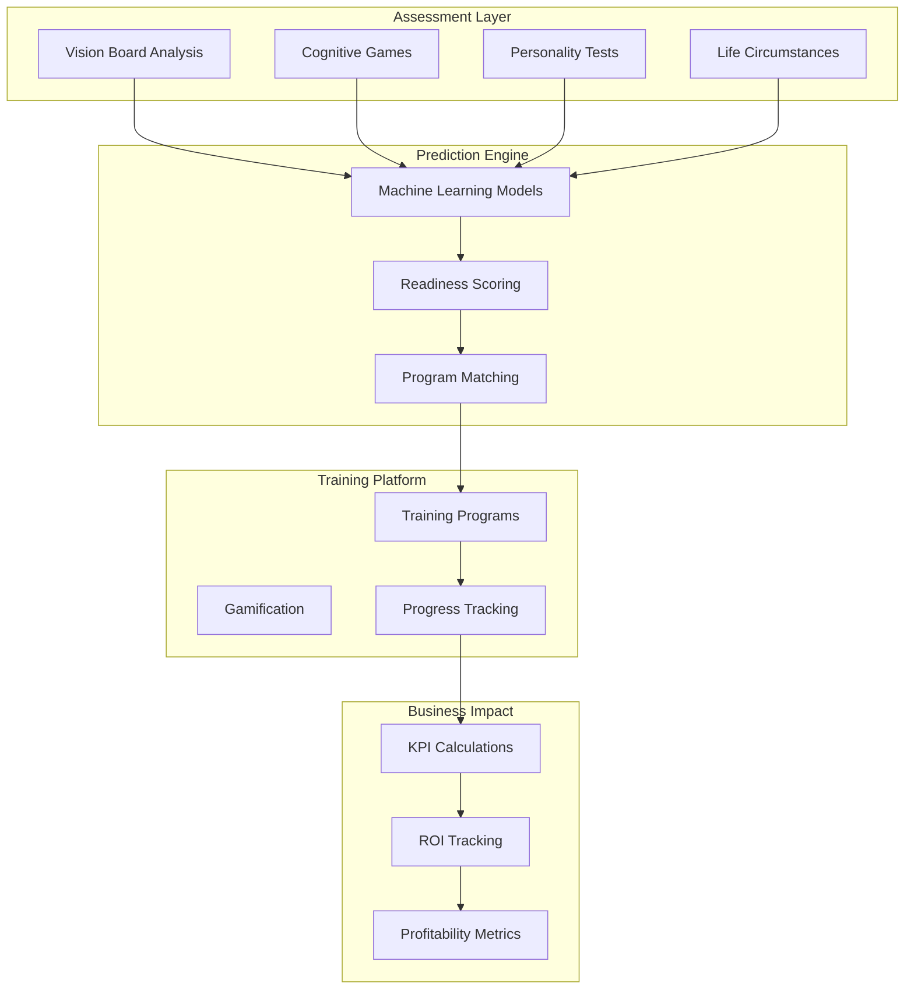

# SenseiiWyze Complete Integration Guide

## System Overview

The SenseiiWyze platform integrates three powerful systems to create a comprehensive workforce development and business impact measurement solution:

1. **Training Readiness Prediction System** - Assesses candidate readiness through vision boards, cognitive games, and personality tests
2. **Existing Supabase Infrastructure** - Provides learning management, gamification, and user tracking
3. **Profitability Flow KPI Tree** - Measures business impact and ROI of training investments

## Unified Architecture



## Database Integration Strategy

### 1. Core Integration Points

The SenseiiWyze prediction tables connect to existing Supabase tables through these key relationships:

```sql
-- Primary Integration Points
profiles (existing) <--> training_readiness_predictions (new)
vision_boards (existing) <--> vision_board_analysis (new)
activities (existing) <--> cognitive_scores (new)
assessments (existing) <--> personality_assessments (new)
```

### 2. Enhanced Data Model

```sql
-- Connect existing profiles to new prediction system
ALTER TABLE profiles 
ADD COLUMN IF NOT EXISTS latest_readiness_score DECIMAL(5,2),
ADD COLUMN IF NOT EXISTS recommended_program_id UUID REFERENCES training_programs(id),
ADD COLUMN IF NOT EXISTS risk_category TEXT;

-- Link vision boards to analysis results
ALTER TABLE vision_boards
ADD COLUMN IF NOT EXISTS analysis_completed BOOLEAN DEFAULT false,
ADD COLUMN IF NOT EXISTS analysis_id UUID REFERENCES vision_board_analysis(id);

-- Connect activities to cognitive scoring
ALTER TABLE activities
ADD COLUMN IF NOT EXISTS cognitive_skill_type TEXT,
ADD COLUMN IF NOT EXISTS contributes_to_score cognitive_assessment_type;

-- Bridge table for comprehensive user profiling
CREATE TABLE user_readiness_profile (
    id UUID PRIMARY KEY DEFAULT gen_random_uuid(),
    profile_id UUID REFERENCES profiles(id) UNIQUE,
    
    -- Latest scores from all sources
    vision_score INTEGER,
    grit_score DECIMAL(5,2),
    logic_score DECIMAL(5,2),
    algorithm_score DECIMAL(5,2),
    
    -- Personality profile
    openness_score INTEGER,
    conscientiousness_score INTEGER,
    extraversion_score INTEGER,
    agreeableness_score INTEGER,
    neuroticism_score INTEGER,
    
    -- Life circumstances
    stability_score INTEGER,
    motivation_type TEXT,
    goal_timeline TEXT,
    
    -- Calculated readiness
    overall_readiness_score DECIMAL(5,2),
    best_program_match UUID REFERENCES training_programs(id),
    readiness_category TEXT,
    
    -- Business impact predictions
    predicted_productivity_gain DECIMAL(5,2),
    predicted_retention_probability DECIMAL(5,2),
    predicted_time_to_productivity INTEGER, -- days
    
    last_updated TIMESTAMP WITH TIME ZONE DEFAULT NOW()
);
```

### 3. Profitability Integration Tables

```sql
-- Track business outcomes for each trained employee
CREATE TABLE employee_business_outcomes (
    id UUID PRIMARY KEY DEFAULT gen_random_uuid(),
    profile_id UUID REFERENCES profiles(id),
    program_enrollment_id UUID REFERENCES program_enrollments(id),
    
    -- Baseline measurements (pre-training)
    baseline_date DATE,
    baseline_performance_score DECIMAL(5,2),
    baseline_productivity_index DECIMAL(5,2),
    baseline_quality_score DECIMAL(5,2),
    
    -- Current measurements
    measurement_date DATE,
    current_performance_score DECIMAL(5,2),
    current_productivity_index DECIMAL(5,2),
    current_quality_score DECIMAL(5,2),
    
    -- Business impact
    revenue_contribution DECIMAL(12,2),
    cost_savings_contribution DECIMAL(12,2),
    innovation_value DECIMAL(12,2),
    customer_satisfaction_impact DECIMAL(5,2),
    
    -- Retention impact
    retention_risk_reduced BOOLEAN,
    estimated_retention_value DECIMAL(10,2),
    
    created_at TIMESTAMP WITH TIME ZONE DEFAULT NOW()
);

-- Aggregate program ROI tracking
CREATE TABLE program_roi_metrics (
    id UUID PRIMARY KEY DEFAULT gen_random_uuid(),
    training_program_id UUID REFERENCES training_programs(id),
    measurement_period_start DATE,
    measurement_period_end DATE,
    
    -- Investment metrics
    total_participants INTEGER,
    total_investment DECIMAL(12,2),
    cost_per_participant DECIMAL(10,2),
    
    -- Return metrics
    total_revenue_impact DECIMAL(12,2),
    total_cost_savings DECIMAL(12,2),
    total_retention_value DECIMAL(12,2),
    
    -- ROI calculations
    gross_roi_percentage DECIMAL(8,2),
    net_roi_percentage DECIMAL(8,2),
    payback_period_months INTEGER,
    
    -- Success metrics
    completion_rate DECIMAL(5,2),
    placement_rate DECIMAL(5,2),
    retention_rate_12_months DECIMAL(5,2),
    
    created_at TIMESTAMP WITH TIME ZONE DEFAULT NOW()
);
```

## Implementation Guide

### Phase 1: Foundation Setup (Weeks 1-3)

#### 1.1 Database Schema Deployment

```bash
# Run the integrated schema SQL files in order
psql -d your_database -f 01-existing-schema-updates.sql
psql -d your_database -f 02-prediction-system-tables.sql
psql -d your_database -f 03-integration-bridges.sql
psql -d your_database -f 04-business-impact-tables.sql
```

#### 1.2 Data Migration & Mapping

```sql
-- Migrate existing vision boards for analysis
INSERT INTO vision_board_analysis (vision_board_id, created_at)
SELECT id, created_at FROM vision_boards WHERE analysis_completed = false;

-- Map existing activities to cognitive skills
UPDATE activities 
SET cognitive_skill_type = 
    CASE 
        WHEN category_id IN (SELECT id FROM categories WHERE name LIKE '%logic%') THEN 'logic'
        WHEN category_id IN (SELECT id FROM categories WHERE name LIKE '%algorithm%') THEN 'algorithm'
        WHEN category_id IN (SELECT id FROM categories WHERE name LIKE '%persistence%') THEN 'grit'
        ELSE 'general'
    END;
```

### Phase 2: Prediction Engine (Weeks 4-6)

#### 2.1 Vision Board Analysis Pipeline

```python
class VisionBoardAnalyzer:
    def __init__(self):
        self.cv_client = ComputerVisionClient()
        self.nlp_client = NLPClient()
        
    async def analyze_vision_board(self, vision_board_id: str):
        # Fetch vision board data
        board = await fetch_vision_board(vision_board_id)
        
        # Computer vision analysis
        cv_results = await self.cv_client.analyze_image(board.image_url)
        
        # Text extraction and analysis
        text_results = await self.nlp_client.analyze_text(board.extracted_text)
        
        # Calculate scores
        vision_score = self.calculate_vision_score(cv_results, text_results)
        
        # Store results
        await store_analysis_results(vision_board_id, {
            'vision_score': vision_score,
            'tech_objects_detected': cv_results.objects,
            'color_psychology': cv_results.colors,
            'specificity_score': text_results.specificity,
            'timeline_extracted': text_results.timeline,
            'sentiment_score': text_results.sentiment
        })
        
        return vision_score
```

#### 2.2 Readiness Score Calculation

```python
class ReadinessCalculator:
    def calculate_readiness(self, profile_id: str, program_id: str):
        # Fetch all scores
        scores = self.fetch_user_scores(profile_id)
        program = self.fetch_program_requirements(program_id)
        
        # Calculate weighted readiness
        cognitive_readiness = (
            scores.vision * program.vision_weight +
            scores.grit * program.grit_weight +
            scores.logic * program.logic_weight +
            scores.algorithm * program.algorithm_weight
        ) / 100
        
        # Apply modifiers
        life_modifier = scores.life_circumstances / 100
        motivation_modifier = 1.15 if scores.motivation_type == 'internal' else 0.95
        
        # Final score
        readiness_score = cognitive_readiness * life_modifier * motivation_modifier
        
        # Determine category
        if readiness_score >= 0.85:
            category = 'ready_to_enroll'
        elif readiness_score >= 0.75:
            category = 'ready_with_support'
        elif readiness_score >= 0.65:
            category = 'almost_ready'
        elif readiness_score >= 0.50:
            category = 'needs_preparation'
        else:
            category = 'not_ready'
            
        return {
            'readiness_score': readiness_score * 100,
            'category': category,
            'recommended_interventions': self.get_interventions(scores, program)
        }
```

### Phase 3: Business Impact Tracking (Weeks 7-9)

#### 3.1 KPI Calculation Engine

```python
class BusinessImpactCalculator:
    def calculate_employee_impact(self, profile_id: str, enrollment_id: str):
        # Get baseline and current metrics
        baseline = self.get_baseline_metrics(profile_id, enrollment_id)
        current = self.get_current_metrics(profile_id)
        
        # Calculate improvements
        performance_delta = current.performance - baseline.performance
        productivity_delta = current.productivity - baseline.productivity
        
        # Convert to financial impact
        revenue_impact = self.performance_to_revenue(performance_delta, profile_id)
        cost_savings = self.productivity_to_savings(productivity_delta, profile_id)
        
        # Calculate retention value
        if current.turnover_risk < 50 and baseline.turnover_risk >= 50:
            retention_value = 15000  # Average replacement cost
        else:
            retention_value = 0
            
        return {
            'revenue_contribution': revenue_impact,
            'cost_savings_contribution': cost_savings,
            'retention_value': retention_value,
            'total_impact': revenue_impact + cost_savings + retention_value
        }
```

#### 3.2 ROI Dashboard Queries

```sql
-- Program ROI Summary View
CREATE VIEW program_roi_summary AS
WITH program_metrics AS (
    SELECT 
        tp.id,
        tp.program_name,
        COUNT(DISTINCT pe.profile_id) as total_enrolled,
        COUNT(DISTINCT CASE WHEN pe.enrollment_status = 'completed' THEN pe.profile_id END) as completed,
        SUM(tp.base_price) as total_investment
    FROM training_programs tp
    JOIN program_enrollments pe ON tp.id = pe.training_program_id
    WHERE pe.enrollment_date >= CURRENT_DATE - INTERVAL '1 year'
    GROUP BY tp.id
),
impact_metrics AS (
    SELECT 
        pe.training_program_id,
        SUM(ebo.revenue_contribution) as total_revenue,
        SUM(ebo.cost_savings_contribution) as total_savings,
        SUM(ebo.retention_value) as total_retention_value
    FROM program_enrollments pe
    JOIN employee_business_outcomes ebo ON pe.id = ebo.program_enrollment_id
    GROUP BY pe.training_program_id
)
SELECT 
    pm.*,
    im.total_revenue,
    im.total_savings,
    im.total_retention_value,
    (im.total_revenue + im.total_savings + im.total_retention_value) as total_value,
    ROUND(((im.total_revenue + im.total_savings + im.total_retention_value - pm.total_investment) / 
           NULLIF(pm.total_investment, 0) * 100), 2) as roi_percentage
FROM program_metrics pm
LEFT JOIN impact_metrics im ON pm.id = im.training_program_id;
```

### Phase 4: Automation & Workflows (Weeks 10-12)

#### 4.1 Event-Driven Architecture

```javascript
// Event handlers for automated workflows
const eventHandlers = {
  'assessment_complete': async (data) => {
    // Check if all assessments are done
    const allComplete = await checkAllAssessmentsComplete(data.profile_id);
    
    if (allComplete) {
      // Calculate readiness scores for all programs
      const scores = await calculateAllProgramReadiness(data.profile_id);
      
      // Find best match
      const bestMatch = scores.reduce((best, current) => 
        current.readiness_score > best.readiness_score ? current : best
      );
      
      // Update user profile
      await updateUserReadinessProfile(data.profile_id, bestMatch);
      
      // Trigger appropriate workflow
      await triggerReadinessWorkflow(data.profile_id, bestMatch.category);
    }
  },
  
  'training_completed': async (data) => {
    // Set baseline for impact measurement
    await setPerformanceBaseline(data.profile_id);
    
    // Schedule follow-up measurements
    await scheduleImpactMeasurements(data.profile_id, [30, 90, 180, 365]);
    
    // Update completion metrics
    await updateProgramMetrics(data.training_program_id);
  },
  
  'impact_measurement_due': async (data) => {
    // Calculate current impact
    const impact = await calculateEmployeeImpact(data.profile_id, data.enrollment_id);
    
    // Store results
    await storeBusinessOutcome(data.profile_id, impact);
    
    // Update ROI metrics
    await updateProgramROI(data.training_program_id);
  }
};
```

#### 4.2 Intervention Workflows

```python
class InterventionManager:
    def assign_interventions(self, profile_id: str, readiness_data: dict):
        interventions = []
        
        # Logic gap intervention
        if readiness_data.logic_score < 70:
            interventions.append({
                'type': 'logic_bootcamp',
                'duration_weeks': 2,
                'expected_improvement': 12
            })
        
        # Grit building intervention
        if readiness_data.grit_score < 65:
            interventions.append({
                'type': 'persistence_training',
                'duration_weeks': 3,
                'expected_improvement': 15
            })
        
        # Vision clarity intervention
        if readiness_data.vision_score < 60:
            interventions.append({
                'type': 'goal_setting_workshop',
                'duration_weeks': 1,
                'expected_improvement': 10
            })
        
        # Assign interventions
        for intervention in interventions:
            self.create_intervention_assignment(profile_id, intervention)
        
        return interventions
```

## Monitoring & Analytics

### Real-time Dashboards

```typescript
// Dashboard configuration
const dashboardConfig = {
  realTimeMetrics: {
    activeAssessments: 'SELECT COUNT(*) FROM assessment_sessions WHERE completed_at IS NULL',
    todayEnrollments: 'SELECT COUNT(*) FROM program_enrollments WHERE DATE(enrollment_date) = CURRENT_DATE',
    readinessDistribution: `
      SELECT prediction_category, COUNT(*) 
      FROM training_readiness_predictions 
      WHERE created_at > CURRENT_DATE - INTERVAL '7 days'
      GROUP BY prediction_category
    `
  },
  
  businessImpact: {
    monthlyROI: 'SELECT * FROM program_roi_summary WHERE measurement_period_start >= CURRENT_DATE - INTERVAL \'30 days\'',
    topPerformers: `
      SELECT p.name, ebo.total_impact 
      FROM employee_business_outcomes ebo
      JOIN profiles p ON ebo.profile_id = p.id
      ORDER BY ebo.total_impact DESC
      LIMIT 10
    `,
    interventionSuccess: `
      SELECT it.intervention_name, 
             AVG(ui.improvement_achieved) as avg_improvement,
             COUNT(*) as total_applied
      FROM user_interventions ui
      JOIN intervention_types it ON ui.intervention_type_id = it.id
      WHERE ui.status = 'completed'
      GROUP BY it.intervention_name
    `
  }
};
```

### Key Performance Indicators

| KPI | Target | Measurement | Dashboard Location |
|-----|--------|-------------|-------------------|
| Assessment Completion Rate | >80% | Weekly | Operations Dashboard |
| Readiness Score Accuracy | >87% | Monthly | ML Performance |
| Program Match Success | >90% | Per Cohort | Enrollment Analytics |
| Training Completion Rate | >75% | Per Program | Program Performance |
| Job Placement Rate | >85% | 90 days post | Outcome Tracking |
| Average ROI | >500% | Quarterly | Executive Dashboard |
| Productivity Improvement | >20% | 6 months post | Business Impact |

## Security & Compliance

### Data Protection

```sql
-- Row Level Security for multi-tenant isolation
ALTER TABLE training_readiness_predictions ENABLE ROW LEVEL SECURITY;

CREATE POLICY "Users can view own predictions" ON training_readiness_predictions
    FOR SELECT USING (auth.uid() = profile_id);

CREATE POLICY "Admins can view all predictions" ON training_readiness_predictions
    FOR SELECT USING (
        EXISTS (
            SELECT 1 FROM profiles 
            WHERE id = auth.uid() 
            AND user_role = 'admin'
        )
    );
```

### Audit Trail

```sql
-- Comprehensive audit logging
CREATE TABLE audit_log (
    id UUID PRIMARY KEY DEFAULT gen_random_uuid(),
    user_id UUID REFERENCES profiles(id),
    action TEXT NOT NULL,
    table_name TEXT NOT NULL,
    record_id UUID,
    old_values JSONB,
    new_values JSONB,
    ip_address INET,
    user_agent TEXT,
    created_at TIMESTAMP WITH TIME ZONE DEFAULT NOW()
);

-- Trigger for automatic audit logging
CREATE OR REPLACE FUNCTION audit_trigger_function()
RETURNS TRIGGER AS $$
BEGIN
    INSERT INTO audit_log (
        user_id, action, table_name, record_id,
        old_values, new_values
    ) VALUES (
        auth.uid(), TG_OP, TG_TABLE_NAME, 
        COALESCE(NEW.id, OLD.id),
        row_to_json(OLD), row_to_json(NEW)
    );
    RETURN NEW;
END;
$$ LANGUAGE plpgsql;
```

## Conclusion

This integration guide provides a complete blueprint for combining the SenseiiWyze Training Readiness Prediction System with existing infrastructure to create a powerful workforce development platform. The system enables:

1. **Predictive Analytics** - Identify the right candidates for the right programs
2. **Personalized Learning** - Match individuals to programs based on comprehensive assessment
3. **Business Impact Measurement** - Track and quantify the ROI of training investments
4. **Continuous Improvement** - Use data to optimize programs and interventions

By following this implementation guide, organizations can build a data-driven approach to workforce development that delivers measurable business results.