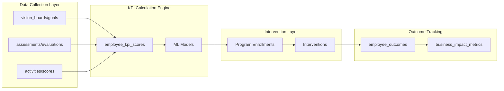

# Supabase Database Schema Analysis Report

**Generated Date:** 2025-07-22  
**Analysis of Two Supabase Projects:**
- Project 1: `kszrzybbmdzfsouztknz`
- Project 2: `mtzwzsxblhulourliqvr`

---

## Executive Summary

This report analyzes two Supabase projects containing comprehensive database schemas for learning management systems with assessment capabilities, gamification features, user management, and business functionality. Both projects share similar architectural patterns but differ in complexity and specific features.

- **Project 1 (`kszrzybbmdzfsouztknz`)**: 29 tables representing a learning/assessment platform with vision boards
- **Project 2 (`mtzwzsxblhulourliqvr`)**: 48 tables representing a comprehensive SaaS platform with billing, advanced user management, and enhanced features

---

## Project 1 Analysis: kszrzybbmdzfsouztknz

### Database Overview
Contains **29 tables** in the public schema representing a learning management and gamification platform.

### Core Table Categories

#### 🔑 User Management & Authentication
- **`profiles`** (Primary user table)
  - **Columns**: id (uuid, PK, FK to auth.users), email (unique), name, workplace, user_role (enum), employment_status, profile_photo
  - **Relationships**: References `workplaces` via `workplace_ref` and `institution_ref`
  - **Features**: Position tracking (topPos, bottomPos, leftPos, rightPos), soft delete support

- **`workplaces`** (Organizations/Institutions)
  - **Columns**: id (uuid, PK), workplace_name, workplace_email (unique), workplace_domain (unique)
  - **Features**: JSON address storage, enabled assessments array, logo support

- **`account_user`** (Many-to-many relationship)
  - **Columns**: user_id (FK to profiles), account_id (FK to workplaces), account_role (enum)
  - **Purpose**: Multi-tenant user-organization associations

#### 📋 Assessment System
- **`assessments`** (Assessment templates)
  - **Structure**: Flexible JSON-based metadata, strategy, and results schema
  - **Features**: Cover images, time estimates, type classification

- **`questions`** → **`answers`** → **`evaluations`**
  - **Flow**: Questions belong to assessments → Users provide answers → Evaluations track completion
  - **Key Constraint**: Unique answers per evaluation: `(question_id, evaluation_id)`

#### 🎮 Gamification Engine
- **`activities`** (Game-like learning activities)
  - Connected to: `categories` → `tasks` → `task_completion`
  - **Progress Tracking**: `activity_progress`, `game_info`, `user_tasks`

- **Status Management**:
  - **`status`**: Task state tracking (UNTOUCHED/ONGOING/COMPLETED)
  - **`scores`**: Scoring system

#### 🎯 Vision Board System
- **`vision_boards`** → **`goals`** → **`obstacles`**
  - **Features**: Visual positioning system, size templates, edit logging
  - **Unique Feature**: Creative goal-setting with spatial positioning

#### 👥 Invitation System
- **`invitations`** (User invitations with tokenized access)

### Notable Design Patterns

#### Strengths
- Multi-tenant architecture with workplace isolation
- Flexible assessment system using JSON metadata
- Comprehensive audit trails (created_at, updated_at)
- Creative vision board functionality

#### Issues Identified
- **Missing Foreign Keys**: Some relationships lack proper constraints
- **Data Type Inconsistencies**: Mix of text/varchar, integer/bigint
- **Redundant Tables**: `profiles_copy` appears to be unnecessary

---

## Project 2 Analysis: mtzwzsxblhulourliqvr

### Database Overview
Contains **48 tables** representing a sophisticated SaaS platform with comprehensive business features.

### Enhanced Features Beyond Project 1

#### 🏢 Advanced Account Management
- **`accounts`** (Primary tenant boundary)
  - **Advanced Features**: Personal vs business accounts, public data JSON, picture URLs
  
- **`accounts_memberships`** (Enhanced user-account relationships)
  - **Role System**: References `roles` table with hierarchy levels

- **`roles`** + **`role_permissions`**
  - **RBAC Implementation**: Hierarchical role system with granular permissions

#### 💳 Comprehensive Billing System
- **`billing_customers`** → **`subscriptions`** → **`subscription_items`**
- **`orders`** → **`order_items`** (One-time purchases)
- **`plans`** (Available subscription tiers)
- **`credits_usage`** (Usage tracking and quotas)

**Features**: Multi-provider support, flexible pricing, trial periods, cancellation management

#### 💬 Communication & Task Management
- **`chats`** → **`chat_messages`** (In-app messaging)
- **`tasks`** (Account-specific task management)
- **`notifications`** (System notifications with channels and expiration)

#### 🔐 Enhanced Security
- **`nonces`** (Security token management)
- **`invitations`** (Enhanced invitation system with role assignments)

#### 📊 Advanced Features
- **Credits/Usage System**: Token-based resource consumption
- **Multi-channel Notifications**: In-app, email, SMS support
- **Comprehensive Audit Trails**: Enhanced logging across all entities

### Architectural Improvements Over Project 1

1. **Better Normalization**: More consistent data types and relationships
2. **Enhanced RBAC**: Proper role hierarchy and permissions
3. **Business Features**: Complete billing and subscription management
4. **Communication Tools**: Built-in messaging and notification system
5. **Security Enhancements**: Better token management and security controls

---

## Comparative Analysis

| Feature | Project 1 | Project 2 |
|---------|-----------|-----------|
| **Total Tables** | 29 | 48 |
| **User Management** | Basic profiles + workplaces | Advanced accounts with RBAC |
| **Assessment System** | ✅ Full featured | ✅ Full featured |
| **Gamification** | ✅ Complete | ✅ Complete + Enhanced |
| **Vision Boards** | ✅ Full featured | ✅ Full featured |
| **Billing System** | ❌ Not present | ✅ Enterprise-grade |
| **Communication** | ❌ Limited | ✅ Chat + Notifications |
| **Role Management** | ❌ Basic enums | ✅ Hierarchical RBAC |
| **Multi-tenancy** | ✅ Workplace-based | ✅ Account-based (enhanced) |

---

## Database Relationships Map

### Project 1 Core Relationships
```
auth.users → profiles ↔ account_user ↔ workplaces
                ↓
          evaluations ← assessments → questions → answers
                ↓
        vision_boards → goals → obstacles
                ↓
          activities → tasks → task_completion → scores/status
```

### Project 2 Enhanced Relationships  
```
auth.users → profiles ↔ accounts_memberships ↔ accounts
                ↓                                ↓
          evaluations                    billing_customers
                ↓                                ↓
        vision_boards                    subscriptions → subscription_items
                ↓                                ↓
          activities                         orders → order_items
                ↓                                ↓
        chats → chat_messages              notifications
                ↓
        roles → role_permissions
```

---

## Integration with Profitability Flow KPI Tree

### Mapping Database Tables to KPI Variables

The existing database schema can support the profitability flow variables with strategic enhancements:

#### 🔵 Data Source Mappings

| KPI Variable | Database Tables | Current Support | Required Enhancements |
|--------------|-----------------|-----------------|----------------------|
| **VB** (Vision Board) | `vision_boards`, `goals`, `obstacles` | ✅ Full support | Add goal categorization, progress tracking metrics |
| **PQ** (Psychology Quiz) | `assessments`, `evaluations`, `answers` | ✅ Partial support | Add personality trait fields, values alignment scoring |
| **GA** (Gaming App) | `activities`, `tasks`, `scores`, `game_info` | ✅ Full support | Add skill demonstration tracking, collaboration metrics |

#### 🟣 KPI Score Storage Requirements

New tables/columns needed for KPI calculations:

```sql
-- Employee KPI Scores Table (suggested addition)
CREATE TABLE employee_kpi_scores (
    id UUID PRIMARY KEY DEFAULT gen_random_uuid(),
    profile_id UUID REFERENCES profiles(id),
    account_id UUID REFERENCES accounts(id),
    
    -- Risk & Readiness Scores
    turnover_risk_score DECIMAL(5,2), -- 0-100%
    engagement_score DECIMAL(5,2), -- 0-100%
    productivity_index DECIMAL(5,2), -- baseline = 100
    burnout_risk_score DECIMAL(5,2), -- 0-100%
    high_potential_score DECIMAL(5,2), -- 0-100%
    program_readiness_scores JSONB, -- {leadership: 85, technical: 72, etc}
    
    -- Score Components (for transparency)
    score_components JSONB,
    
    -- Timestamps
    calculated_at TIMESTAMP WITH TIME ZONE DEFAULT NOW(),
    valid_until TIMESTAMP WITH TIME ZONE,
    
    -- Indexes for performance
    CONSTRAINT unique_profile_account_date UNIQUE(profile_id, account_id, calculated_at)
);

-- Program Enrollments (enhancement to existing structure)
ALTER TABLE activities ADD COLUMN IF NOT EXISTS program_type VARCHAR(50); -- LP, TP, MP, WP, PP, RI
ALTER TABLE activities ADD COLUMN IF NOT EXISTS investment_per_person DECIMAL(10,2);
ALTER TABLE activities ADD COLUMN IF NOT EXISTS expected_roi DECIMAL(5,2);

-- Employee Outcomes Tracking
CREATE TABLE employee_outcomes (
    id UUID PRIMARY KEY DEFAULT gen_random_uuid(),
    profile_id UUID REFERENCES profiles(id),
    outcome_type VARCHAR(50), -- SR, EM, RT, PF, IN, WB
    baseline_value DECIMAL(10,2),
    current_value DECIMAL(10,2),
    target_value DECIMAL(10,2),
    measurement_date DATE,
    impact_dollars DECIMAL(12,2)
);
```

#### 🟢 Program & Intervention Tracking

Map existing tables to intervention programs:

| Program | Existing Table | Enhancement Needed |
|---------|----------------|-------------------|
| **LP** (Leadership) | `activities` + custom category | Add leadership competency tracking |
| **TP** (Technical) | `activities` + `tasks` | Add skill gap analysis fields |
| **MP** (Mentorship) | Could use `chats` | Add mentor-mentee pairing table |
| **WP** (Wellness) | New table needed | Create wellness_program_participation |
| **PP** (Performance Pay) | Link to `billing_customers` | Add performance bonus tracking |
| **RI** (Retention) | Track in `employee_outcomes` | Add intervention tracking |

#### 🔴 Business Impact Calculations

Leverage existing billing and analytics:

```sql
-- Business Impact Metrics View (suggested)
CREATE VIEW business_impact_metrics AS
SELECT 
    a.id as account_id,
    -- Revenue Impact
    SUM(CASE WHEN eo.outcome_type = 'PF' THEN eo.impact_dollars ELSE 0 END) as productivity_revenue,
    SUM(CASE WHEN eo.outcome_type = 'IN' THEN eo.impact_dollars ELSE 0 END) as innovation_revenue,
    
    -- Cost Savings
    COUNT(CASE WHEN eks.turnover_risk_score < 50 AND prev.turnover_risk_score >= 50 THEN 1 END) * 15000 as turnover_cost_saved,
    COUNT(CASE WHEN eks.burnout_risk_score < 70 AND prev.burnout_risk_score >= 70 THEN 1 END) * 125000 as burnout_cost_avoided,
    
    -- Program ROI
    SUM(a2.investment_per_person) as total_program_investment,
    
    -- Profitability Impact
    (productivity_revenue + innovation_revenue + turnover_cost_saved + burnout_cost_avoided - total_program_investment) as net_profit_impact
    
FROM accounts a
JOIN employee_kpi_scores eks ON a.id = eks.account_id
LEFT JOIN employee_outcomes eo ON eks.profile_id = eo.profile_id
LEFT JOIN activities a2 ON a2.account_id = a.id AND a2.program_type IS NOT NULL
GROUP BY a.id;
```

### Data Flow Architecture



### Implementation Roadmap

1. **Phase 1: Schema Extensions** (Week 1-2)
   - Add `employee_kpi_scores` table
   - Extend `activities` for program tracking
   - Create `employee_outcomes` table

2. **Phase 2: Data Pipeline** (Week 3-4)
   - Build KPI calculation jobs
   - Implement scoring algorithms
   - Create real-time triggers

3. **Phase 3: Integration** (Week 5-6)
   - Connect to existing assessment system
   - Link vision boards to goals tracking
   - Integrate gaming scores with productivity

4. **Phase 4: Analytics** (Week 7-8)
   - Build impact calculation views
   - Create ROI dashboards
   - Implement predictive models

## Key Insights & Recommendations

### Project Evolution Path
Project 2 appears to be an enhanced version of Project 1, with:
- More sophisticated user management
- Complete business/billing integration  
- Enhanced communication features
- Better security and role management
- **NEW**: Ready for KPI tree integration with minimal schema changes

### Recommended Improvements for Both Projects

#### 1. **Data Consistency**
- Standardize data types (text vs varchar, timestamp consistency)
- Add missing foreign key constraints
- Implement proper indexes on frequently queried columns
- **NEW**: Ensure KPI score tables use consistent decimal precision

#### 2. **Security Enhancements**
- Implement Row Level Security (RLS) policies
- Add audit logging for sensitive operations
- Enhance input validation constraints
- **NEW**: Secure KPI scores with role-based access

#### 3. **Performance Optimizations**
- Index foreign key columns
- Add composite indexes for common query patterns
- Consider partitioning for large tables (if applicable)
- **NEW**: Optimize KPI calculation queries with materialized views

#### 4. **KPI Integration** (NEW)
- Implement employee scoring infrastructure
- Build intervention tracking system
- Create business impact measurement framework
- Deploy real-time KPI dashboards

#### 4. **Schema Cleanup**
- Remove redundant tables (e.g., `profiles_copy` in Project 1)
- Normalize position tracking in vision boards
- Consolidate similar functionality between assessment and activity systems

### Business Intelligence Opportunities

Both databases contain rich data for analytics:
- **Learning Analytics**: Progress tracking, completion rates, assessment performance
- **User Engagement**: Activity participation, vision board usage, gamification metrics
- **Business Metrics**: (Project 2) Subscription analytics, usage patterns, billing insights
- **Organizational Insights**: Multi-tenant usage patterns, workplace adoption rates

---

## Technical Specifications

### Custom Enum Types Used
Both projects use extensive custom enum types for:
- User roles and permissions
- Task states and types  
- Billing and subscription statuses
- Notification channels and types
- Assessment and activity classifications

### JSON Storage Patterns
Extensive use of JSONB for flexible data:
- Assessment metadata and results
- Activity configurations
- User preferences and settings
- Public account data (Project 2)

### Temporal Data Management
Comprehensive timestamp tracking:
- Entity creation and modification times
- User activity and completion timestamps
- Subscription and billing period tracking
- Audit trail maintenance

---

## Conclusion

Both projects represent sophisticated database designs for learning management platforms. Project 2 demonstrates significant architectural maturity with enterprise-grade features including comprehensive billing, advanced user management, and enhanced communication tools. 

The schemas support complex business logic while maintaining flexibility through JSON metadata storage and comprehensive relationship modeling. With recommended improvements in data consistency and performance optimization, these databases would provide excellent foundations for scalable SaaS learning platforms.

---

*This analysis was generated through automated schema inspection and relationship mapping of the Supabase projects. For implementation details or specific queries, refer to the individual table documentation sections above.*