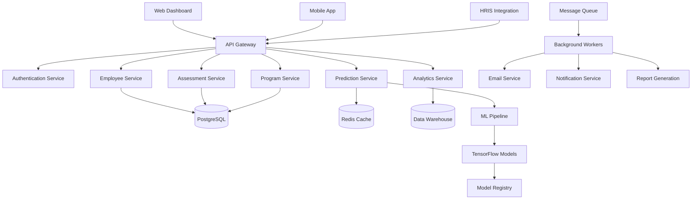

# HR Intelligence Platform - Technical Architecture

> **Last Updated:** 2024-01-15 | **Version:** 1.0 | **Owner:** Engineering Team
> **Status:** ✅ Current | **Review Date:** 2024-04-15 | **Stakeholders:** Development, DevOps, Security

## Document Purpose
Comprehensive technical documentation covering system architecture, API specifications, core algorithms, security protocols, and deployment infrastructure for the HR Intelligence Platform.

## Target Audience  
Engineering teams, system administrators, integration partners, and technical stakeholders who need to understand the platform's technical implementation and capabilities.

## Related Documents
- **[Business Model](business-model.md)** - Commercial strategy, market opportunity, and revenue model
- **[User Workflows](user-workflows.md)** - User experience design and role-based dashboard workflows  
- **[Implementation Guide](implementation-guide.md)** - Deployment procedures and operational setup

---

## 🏗️ System Overview

### Core Architecture Principles
- **Microservices Design:** Loosely coupled services for scalability and maintainability
- **API-First Approach:** All functionality exposed through RESTful APIs
- **Event-Driven Processing:** Real-time data processing and notifications
- **Multi-Tenant Architecture:** Secure isolation between customer data
- **Predictive Intelligence:** ML-powered insights with explainable AI

### Technology Stack
| Layer | Technology | Version | Purpose | Rationale |
|-------|------------|---------|---------|------------|
| **Frontend** | React.js | 18.x | Dashboard UI | Component reusability, ecosystem maturity |
| **Mobile** | React Native | 0.72.x | Mobile apps | Cross-platform, shared business logic |
| **API Gateway** | Node.js/Express | 4.18.x | Request routing | High performance, middleware ecosystem |
| **Backend Services** | Python/FastAPI | 0.104.x | Business logic | Fast development, async support |
| **Database** | PostgreSQL | 15.x | Primary data store | ACID compliance, JSON support |
| **Cache** | Redis | 7.x | Session/query cache | High performance, pub/sub capabilities |
| **ML Pipeline** | Python/TensorFlow | 2.14.x | Prediction engine | Industry standard, GPU support |
| **Message Queue** | RabbitMQ | 3.12.x | Async processing | Reliable, feature-rich |
| **Infrastructure** | AWS | - | Cloud hosting | Enterprise reliability, global presence |
| **Monitoring** | DataDog | - | Observability | Comprehensive APM and logging |

### System Architecture Diagram


---

## 🔌 API Specifications

### Authentication & Authorization
```http
POST /api/v1/auth/login
Content-Type: application/json

{
  "email": "user@company.com",
  "password": "secure_password",
  "organization_id": "org_123"
}

Response:
{
  "access_token": "eyJhbGciOiJIUzI1NiIsInR5cCI6IkpXVCJ9...",
  "refresh_token": "eyJhbGciOiJIUzI1NiIsInR5cCI6IkpXVCJ9...",
  "expires_in": 3600,
  "user": {
    "id": "user_456",
    "email": "user@company.com",
    "role": "hr_manager",
    "permissions": ["read_employees", "write_programs", "view_analytics"]
  }
}
```

### Core API Endpoints

#### Employee Management
```http
# Get employee list with filters
GET /api/v1/employees?location=store_7&role=cashier&risk_level=high
Authorization: Bearer {token}

Response:
{
  "employees": [
    {
      "id": "emp_123",
      "name": "Maria Santos",
      "role": "cashier",
      "location": "store_7",
      "tenure_months": 8,
      "scores": {
        "flight_risk": 78,
        "readiness": 85,
        "learning_velocity": 92
      },
      "programs": [
        {
          "id": "prog_456",
          "name": "Supervisor Training",
          "status": "enrolled",
          "progress": 65
        }
      ]
    }
  ],
  "pagination": {
    "page": 1,
    "per_page": 20,
    "total": 150
  }
}

# Get individual employee profile
GET /api/v1/employees/{employee_id}
Authorization: Bearer {token}

# Update employee data
PUT /api/v1/employees/{employee_id}
Authorization: Bearer {token}
Content-Type: application/json

{
  "role": "shift_supervisor",
  "location": "store_8",
  "manager_id": "mgr_789"
}
```

#### Assessment & Prediction
```http
# Submit employee assessment data
POST /api/v1/assessments
Authorization: Bearer {token}
Content-Type: application/json

{
  "employee_id": "emp_123",
  "assessment_type": "comprehensive",
  "data": {
    "vision_board": {
      "image_data": "base64_encoded_image",
      "color_analysis": {
        "dominant_colors": ["red", "orange", "blue"],
        "color_psychology": {
          "leadership_potential": 0.85,
          "stability_seeking": 0.23,
          "growth_mindset": 0.92
        }
      },
      "content_themes": {
        "career_aspirations": ["management", "leadership"],
        "personal_goals": ["family", "education"],
        "risk_indicators": ["work_life_balance"]
      }
    },
    "game_results": {
      "leadership_game": {
        "score": 85,
        "completion_time": 240,
        "decision_patterns": ["collaborative", "decisive"]
      },
      "communication_game": {
        "score": 70,
        "scenario_responses": ["empathetic", "clear"]
      },
      "problem_solving_game": {
        "score": 90,
        "strategies_used": ["analytical", "creative"]
      },
      "time_management_game": {
        "score": 60,
        "efficiency_metrics": ["prioritization", "delegation"]
      },
      "emotional_intelligence_game": {
        "score": 78,
        "empathy_scenarios": ["customer_service", "team_conflict"]
      }
    },
    "target_role": "shift_supervisor"
  }
}

Response:
{
  "assessment_id": "assess_789",
  "employee_id": "emp_123",
  "predictions": {
    "readiness_score": 85,
    "flight_risk_score": 78,
    "training_completion_probability": 89,
    "investment_roi_score": 92,
    "program_participation_likelihood": 87
  },
  "recommendations": [
    {
      "type": "program_enrollment",
      "program_id": "supervisor_track",
      "confidence": 94,
      "roi_projection": 10100,
      "timeline_months": 6,
      "success_probability": 89
    },
    {
      "type": "retention_intervention",
      "action": "schedule_flexibility",
      "impact": "reduce_flight_risk_23_percent",
      "urgency": "high"
    },
    {
      "type": "mentorship_assignment",
      "suggested_mentor": "mgr_456",
      "reasoning": "similar_career_path"
    }
  ],
  "confidence_interval": {
    "readiness_min": 82,
    "readiness_max": 94,
    "flight_risk_min": 72,
    "flight_risk_max": 84
  },
  "data_quality_score": 94,
  "processing_time_ms": 145
}
```

#### Program Management
```http
# Get available programs
GET /api/v1/programs?status=active&role=cashier
Authorization: Bearer {token}

Response:
{
  "programs": [
    {
      "id": "prog_456",
      "name": "Cashier to Shift Supervisor",
      "from_role": "cashier",
      "to_role": "shift_supervisor",
      "duration_weeks": 8,
      "cost_per_employee": 900,
      "max_participants": 25,
      "current_enrollment": 18,
      "success_rate": 89,
      "roi_projection": 10100,
      "requirements": {
        "minimum_readiness_score": 65,
        "required_skills": ["leadership", "communication"],
        "personality_fit_score": 70
      },
      "modules": [
        {
          "id": "mod_1",
          "name": "Leadership Fundamentals",
          "duration_weeks": 2,
          "completion_rate": 95
        },
        {
          "id": "mod_2", 
          "name": "Team Communication",
          "duration_weeks": 2,
          "completion_rate": 87
        }
      ]
    }
  ]
}

# Enroll employee in program
POST /api/v1/programs/{program_id}/enrollments
Authorization: Bearer {token}
Content-Type: application/json

{
  "employee_id": "emp_123",
  "enrollment_date": "2024-01-15",
  "expected_completion": "2024-03-15",
  "manager_approval": "mgr_456"
}

# Track program progress
GET /api/v1/programs/{program_id}/enrollments/{enrollment_id}/progress
Authorization: Bearer {token}
```

#### Analytics & Reporting
```http
# Get executive dashboard data
GET /api/v1/analytics/executive?timeframe=last_quarter
Authorization: Bearer {token}

Response:
{
  "overview": {
    "total_employees": 847,
    "active_programs": 12,
    "total_roi": 247000,
    "turnover_reduction": 23
  },
  "kpis": {
    "retention_rate": 78,
    "internal_promotion_rate": 34,
    "training_completion_rate": 67,
    "cost_per_hire": 5400
  },
  "trends": {
    "retention_trend": "increasing",
    "promotion_trend": "increasing", 
    "cost_trend": "decreasing"
  },
  "alerts": {
    "critical": 3,
    "high": 12,
    "medium": 8
  }
}

# Generate custom report
POST /api/v1/analytics/reports
Authorization: Bearer {token}
Content-Type: application/json

{
  "report_type": "cohort_analysis",
  "parameters": {
    "cohort": "q3_2024_supervisor_program",
    "metrics": ["completion_rate", "promotion_rate", "roi"],
    "comparison_group": "control_group",
    "timeframe": "6_months"
  }
}
```

### API Rate Limits & Performance
| Endpoint Category | Rate Limit | Response Time | Caching |
|-------------------|------------|---------------|---------|
| **Authentication** | 100/min | <50ms | No |
| **Employee Data** | 1000/min | <100ms | 5 minutes |
| **Assessments** | 50/min | <200ms | No |
| **Predictions** | 100/min | <150ms | 10 minutes |
| **Programs** | 500/min | <75ms | 2 minutes |
| **Analytics** | 200/min | <300ms | 15 minutes |

---

## 🧠 Predictive HR Intelligence Engine

### Core Readiness Score Algorithm

The platform's central algorithm combines three key data sources to calculate employee readiness scores:

```python
def calculate_readiness_score(employee_data):
    """
    Master readiness score combining all predictive factors
    """
    # Vision Board Analysis (30% weight)
    vision_score = analyze_vision_board(employee_data['vision_images'])
    
    # Psychometric Game Performance (40% weight)
    psychometric_score = calculate_psychometric_match(employee_data['game_results'])
    
    # BLS Job Requirement Alignment (30% weight)
    bls_alignment = calculate_bls_job_match(employee_data['target_role'])
    
    readiness_score = (
        (vision_score * 0.30) +
        (psychometric_score * 0.40) +
        (bls_alignment * 0.30)
    )
    
    return min(100, max(0, readiness_score))
```

### Vision Board Analysis Engine

Extracts personality traits from color psychology and content analysis:

```python
def analyze_vision_board(vision_images):
    """
    Extract personality traits from vision board color/content analysis
    """
    color_psychology = extract_color_psychology(vision_images)
    content_themes = analyze_content_themes(vision_images)
    spatial_patterns = analyze_placement_patterns(vision_images)
    
    # Color theory mapping to personality traits
    personality_indicators = {
        'leadership_potential': (
            color_psychology['dominant_colors']['red'] * 0.4 +
            color_psychology['dominant_colors']['orange'] * 0.3 +
            spatial_patterns['center_placement'] * 0.3
        ),
        'learning_agility': (
            color_psychology['color_diversity'] * 0.5 +
            content_themes['education_imagery'] * 0.5
        ),
        'stability_seeking': (
            color_psychology['earth_tones'] * 0.6 +
            content_themes['family_imagery'] * 0.4
        )
    }
    
    return calculate_weighted_personality_score(personality_indicators)
```

### Four Core Prediction Models

#### 1. Flight Risk Prediction
```python
flight_risk_score = 100 - (
    (readiness_score * 0.35) +
    (job_satisfaction_proxy * 0.25) +
    (career_aspiration_alignment * 0.20) +
    (tenure_stability_indicator * 0.20)
)

# Supporting calculations
job_satisfaction_proxy = vision_board_positivity * game_engagement_rate
career_aspiration_alignment = bls_role_match * personal_goal_overlap
tenure_stability_indicator = (age_factor * 0.6) + (local_job_market_stability * 0.4)
```

#### 2. Training Completion Likelihood
```python
training_completion_probability = (
    (readiness_score * 0.40) +
    (learning_velocity_score * 0.35) +
    (intrinsic_motivation_score * 0.25)
)

learning_velocity_score = (
    game_progression_rate * 0.6 +
    skill_acquisition_pattern * 0.4
)

intrinsic_motivation_score = (
    vision_board_growth_themes * 0.5 +
    self_improvement_indicators * 0.5
)
```

#### 3. Investment Worthiness Index
```python
investment_roi_score = (
    (100 - flight_risk_score) * 0.30 +
    training_completion_probability * 0.25 +
    productivity_potential * 0.25 +
    leadership_readiness * 0.20
)

productivity_potential = (
    psychometric_efficiency_scores * 0.7 +
    bls_skill_overlap_percentage * 0.3
)

leadership_readiness = (
    vision_board_leadership_indicators * 0.4 +
    game_leadership_scenarios_performance * 0.6
)
```

#### 4. Educational Program Participation Likelihood
```python
education_participation_score = (
    (readiness_score * 0.35) +
    (growth_mindset_indicator * 0.30) +
    (time_availability_proxy * 0.20) +
    (peer_influence_factor * 0.15)
)

growth_mindset_indicator = (
    vision_board_learning_imagery * 0.5 +
    game_challenge_seeking_behavior * 0.5
)
```

### BLS Skills Integration Framework

Maps 10 measurable psychometric game skills to 17 BLS O*NET skill categories:

```python
def calculate_bls_job_match(target_role, psychometric_results):
    """
    Map 10 measurable game skills to 17 BLS skill categories
    """
    # BLS O*NET skill requirements for target role
    bls_requirements = get_bls_skill_requirements(target_role)
    
    # Game-measured skills (10 out of 17 possible)
    measurable_skills = {
        'problem_solving': psychometric_results['puzzle_game_score'],
        'communication': psychometric_results['scenario_response_quality'],
        'leadership': psychometric_results['team_challenge_performance'],
        'adaptability': psychometric_results['rule_change_adaptation'],
        'attention_to_detail': psychometric_results['pattern_recognition'],
        'time_management': psychometric_results['multi_task_efficiency'],
        'emotional_intelligence': psychometric_results['empathy_scenarios'],
        'learning_speed': psychometric_results['skill_acquisition_rate'],
        'stress_tolerance': psychometric_results['pressure_performance'],
        'creativity': psychometric_results['open_ended_solutions']
    }
    
    # Calculate percentage match for each skill
    skill_matches = {}
    for skill, requirement_level in bls_requirements.items():
        if skill in measurable_skills:
            # Direct measurement available
            skill_matches[skill] = min(100,
                (measurable_skills[skill] / requirement_level) * 100
            )
        else:
            # Infer from related skills
            skill_matches[skill] = infer_skill_level(
                skill, measurable_skills, bls_requirements
            )
    
    return calculate_weighted_match_score(skill_matches, bls_requirements)
```

### Real-time Processing Pipeline

```python
class ReadinessScoreEngine:
    def __init__(self):
        self.bls_data = load_bls_occupational_data()
        self.vision_analyzer = VisionBoardAnalyzer()
        self.psychometric_processor = PsychometricGameProcessor()
    
    def process_employee_data(self, employee_id):
        # Gather all data sources
        vision_data = self.get_vision_board_data(employee_id)
        game_results = self.get_psychometric_results(employee_id)
        target_roles = self.get_career_aspirations(employee_id)
        
        # Calculate component scores
        scores = {
            'flight_risk': self.calculate_flight_risk(employee_id),
            'training_completion': self.calculate_training_likelihood(employee_id),
            'investment_worthiness': self.calculate_investment_score(employee_id),
            'education_participation': self.calculate_education_likelihood(employee_id)
        }
        
        # Generate actionable insights
        recommendations = self.generate_hr_recommendations(scores)
        
        return {
            'employee_id': employee_id,
            'readiness_score': self.calculate_readiness_score(employee_data),
            'component_scores': scores,
            'recommendations': recommendations,
            'confidence_interval': self.calculate_confidence(employee_data)
        }
```

### HR KPI Integration

```python
def update_hr_kpis(employee_scores):
    """
    Update HR dashboard with predictive intelligence
    """
    kpi_updates = {}
    
    # Predicted impact on retention rate
    high_risk_employees = [e for e in employee_scores if e['flight_risk'] > 70]
    kpi_updates['predicted_turnover_rate'] = len(high_risk_employees) / len(employee_scores)
    
    # Training ROI optimization
    training_ready = [e for e in employee_scores if e['training_completion'] > 75]
    kpi_updates['optimized_training_cohort_size'] = len(training_ready)
    
    # Internal promotion pipeline strength
    promotion_ready = [e for e in employee_scores if e['readiness_score'] > 80]
    kpi_updates['internal_talent_pipeline'] = len(promotion_ready)
    
    return kpi_updates
```

---

## 🔒 Security & Compliance

### Data Protection Standards
```python
class SecurityManager:
    def __init__(self):
        self.encryption_key = os.getenv('ENCRYPTION_KEY')
        self.algorithm = 'AES-256-GCM'

    def encrypt_sensitive_data(self, data):

    """
    Master readiness score combining all predictive factors
    """
    
    def __init__(self):
        self.bls_data = self.load_bls_occupational_data()
        self.vision_analyzer = VisionBoardAnalyzer()
        self.psychometric_processor = PsychometricGameProcessor()
    
    def calculate_readiness_score(self, employee_data):
        """
        Calculate comprehensive readiness score (0-100)
        
        Args:
            employee_data (dict): Complete employee assessment data
            
        Returns:
            float: Readiness score with confidence interval
        """
        # Vision Board Analysis (30% weight)
        vision_score = self.analyze_vision_board(employee_data['vision_images'])
        
        # Psychometric Game Performance (40% weight)
        psychometric_score = self.calculate_psychometric_match(employee_data['game_results'])
        
        # BLS Job Requirement Alignment (30% weight)
        bls_alignment = self.calculate_bls_job_match(
            employee_data['target_role'], 
            employee_data['game_results']
        )
        
        # Calculate weighted readiness score
        readiness_score = (
            (vision_score * 0.30) +
            (psychometric_score * 0.40) +
            (bls_alignment * 0.30)
        )
        
        # Apply confidence adjustments
        confidence_factor = self.calculate_confidence_factor(employee_data)
        final_score = readiness_score * confidence_factor
        
        return {
            'score': min(100, max(0, final_score)),
            'confidence_interval': self.calculate_confidence_interval(employee_data),
            'component_scores': {
                'vision_analysis': vision_score,
                'psychometric_match': psychometric_score,
                'bls_alignment': bls_alignment
            }
        }
    
    def analyze_vision_board(self, vision_images):
        """
        Extract personality traits from vision board analysis
        """
        color_psychology = self.extract_color_psychology(vision_images)
        content_themes = self.analyze_content_themes(vision_images)
        spatial_patterns = self.analyze_placement_patterns(vision_images)
        
        # Color theory mapping to personality traits
        personality_indicators = {
            'leadership_potential': (
                color_psychology['dominant_colors']['red'] * 0.4 +
                color_psychology['dominant_colors']['orange'] * 0.3 +
                spatial_patterns['center_placement'] * 0.3
            ),
            'learning_agility': (
                color_psychology['color_diversity'] * 0.5 +
                content_themes['education_imagery'] * 0.5
            ),
            'stability_seeking': (
                color_psychology['earth_tones'] * 0.6 +
                content_themes['family_imagery'] * 0.4
            ),
            'growth_mindset': (
                content_themes['career_imagery'] * 0.7 +
                color_psychology['bright_colors'] * 0.3
            )
        }
        
        return self.calculate_weighted_personality_score(personality_indicators)
    
    def calculate_psychometric_match(self, game_results):
        """
        Map game performance to skill assessments
        """
        skill_mappings = {
            'leadership_game': {
                'leadership': 1.0,
                'decision_making': 0.8,
                'team_management': 0.9
            },
            'communication_game': {
                'communication': 1.0,
                'interpersonal_skills': 0.9,
                'presentation': 0.7
            },
            'problem_solving_game': {
                'analytical_thinking': 1.0,
                'creativity': 0.8,
                'critical_thinking': 0.9
            },
            'time_management_game': {
                'organization': 1.0,
                'prioritization': 0.9,
                'efficiency': 0.8
            },
            'emotional_intelligence_game': {
                'empathy': 1.0,
                'self_awareness': 0.8,
                'relationship_management': 0.9
            }
        }
        
        total_score = 0
        total_weight = 0
        
        for game, results in game_results.items():
            if game in skill_mappings:
                game_score = results['score']
                for skill, weight in skill_mappings[game].items():
                    total_score += game_score * weight
                    total_weight += weight
        
        return total_score / total_weight if total_weight > 0 else 0
```

### Flight Risk Prediction Algorithm
```python
def calculate_flight_risk(self, employee_data):
    """
    Predict likelihood of employee leaving (0-100 scale)
    
    Formula: 100 - (readiness_score * 0.35 + job_satisfaction * 0.25 + 
                    career_alignment * 0.20 + tenure_stability * 0.20)
    """
    # Core readiness factor (inverse relationship)
    readiness_factor = (100 - employee_data['readiness_score']) * 0.35
    
    # Job satisfaction proxy (from vision board and engagement)
    job_satisfaction_proxy = (
        employee_data['vision_board']['positivity_score'] * 0.6 +
        employee_data['game_results']['engagement_rate'] * 0.4
    ) * 0.25
    
    # Career aspiration alignment
    career_alignment = (
        employee_data['bls_role_match'] * 0.7 +
        employee_data['personal_goal_overlap'] * 0.3
    ) * 0.20
    
    # Tenure stability indicators
    tenure_stability = (
        self.calculate_age_factor(employee_data['age']) * 0.6 +
        self.calculate_local_market_stability(employee_data['location']) * 0.4
    ) * 0.20
    
    flight_risk_score = readiness_factor + job_satisfaction_proxy + career_alignment + tenure_stability
    
    return min(100, max(0, flight_risk_score))

def calculate_age_factor(self, age):
    """Age-based stability factor (18-65 range)"""
    if age < 25:
        return 0.3  # Higher flight risk for younger employees
    elif age < 35:
        return 0.5
    elif age < 45:
        return 0.7
    elif age < 55:
        return 0.8
    else:
        return 0.6  # Slight decrease for older employees
```

### Training Completion Prediction
```python
def calculate_training_completion_probability(self, employee_data, program_data):
    """
    Predict likelihood of completing training program (0-100%)
    """
    # Learning velocity from game performance
    learning_velocity_score = (
        employee_data['game_results']['skill_acquisition_rate'] * 0.6 +
        employee_data['game_results']['progression_pattern'] * 0.4
    ) * 0.35
    
    # Intrinsic motivation from vision board
    intrinsic_motivation_score = (
        employee_data['vision_board']['growth_themes'] * 0.5 +
        employee_data['vision_board']['self_improvement_indicators'] * 0.5
    ) * 0.25
    
    # Program-specific factors
    program_fit_score = (
        employee_data['readiness_score'] * 0.4 +
        program_data['difficulty_match'] * 0.3 +
        program_data['time_commitment_match'] * 0.3
    ) * 0.40
    
    completion_probability = (
        learning_velocity_score +
        intrinsic_motivation_score +
        program_fit_score
    )
    
    return min(100, max(0, completion_probability))
```

### Investment ROI Calculation
```python
def calculate_investment_roi_score(self, employee_data, program_data):
    """
    Calculate expected ROI for investing in employee development
    """
    # Retention value (prevented turnover costs)
    retention_value = (
        (100 - employee_data['flight_risk_score']) / 100
    ) * program_data['replacement_cost']
    
    # Productivity gains
    productivity_gains = (
        employee_data['readiness_score'] / 100
    ) * program_data['productivity_improvement']
    
    # Training completion probability
    completion_probability = self.calculate_training_completion_probability(
        employee_data, program_data
    )
    
    # Program cost
    program_cost = program_data['cost_per_employee']
    
    # Calculate ROI
    expected_value = (
        retention_value * (completion_probability / 100) +
        productivity_gains * (completion_probability / 100)
    )
    
    roi_score = (expected_value - program_cost) / program_cost * 100
    
    return max(0, roi_score)
```

---

## 🔒 Security & Compliance

### Data Protection Standards
```python
# Encryption at rest and in transit
class SecurityManager:
    def __init__(self):
        self.encryption_key = os.getenv('ENCRYPTION_KEY')
        self.algorithm = 'AES-256-GCM'
    
    def encrypt_sensitive_data(self, data):
        """Encrypt PII and sensitive assessment data"""
        cipher = AES.new(self.encryption_key, AES.MODE_GCM)
        ciphertext, tag = cipher.encrypt_and_digest(data.encode())
        return {
            'ciphertext': base64.b64encode(ciphertext).decode(),
            'nonce': base64.b64encode(cipher.nonce).decode(),
            'tag': base64.b64encode(tag).decode()
        }
    
    def decrypt_sensitive_data(self, encrypted_data):
        """Decrypt data for authorized access"""
        cipher = AES.new(
            self.encryption_key, 
            AES.MODE_GCM, 
            nonce=base64.b64decode(encrypted_data['nonce'])
        )
        plaintext = cipher.decrypt_and_verify(
            base64.b64decode(encrypted_data['ciphertext']),
            base64.b64decode(encrypted_data['tag'])
        )
        return plaintext.decode()
```

### Access Control Matrix
| Resource | Role | Permissions | Data Access |
|----------|------|-------------|-------------|
| **Employee Profiles** | Store Manager | Read own team | Team data only |
| **Employee Profiles** | HR Manager | Read/Write all | Organization data |
| **Programs** | Program Admin | Full CRUD | All program data |
| **Analytics** | Executive | Read-only | Aggregated data only |
| **System Config** | Admin | Full access | All data |

### Compliance Framework
```python
class ComplianceManager:
    def __init__(self):
        self.gdpr_controller = GDPRController()
        self.hipaa_controller = HIPAAController()
        self.soc2_controller = SOC2Controller()
    
    def process_data_request(self, request_type, user_id):
        """Handle GDPR data subject requests"""
        if request_type == 'access':
            return self.gdpr_controller.export_user_data(user_id)
        elif request_type == 'deletion':
            return self.gdpr_controller.anonymize_user_data(user_id)
        elif request_type == 'portability':
            return self.gdpr_controller.export_structured_data(user_id)
    
    def audit_data_access(self, user_id, resource, action):
        """Log all data access for compliance"""
        audit_log = {
            'timestamp': datetime.utcnow(),
            'user_id': user_id,
            'resource': resource,
            'action': action,
            'ip_address': request.remote_addr,
            'user_agent': request.headers.get('User-Agent')
        }
        self.audit_logger.log(audit_log)
```

---

## 📊 Performance & Monitoring

### Performance Targets
| Metric | Target | Current | Monitoring Tool | Alert Threshold |
|--------|--------|---------|-----------------|-----------------|
| **API Response Time** | <200ms | 145ms | DataDog APM | >300ms |
| **System Uptime** | >99.9% | 99.95% | Pingdom | <99.5% |
| **Prediction Accuracy** | >85% | 87% | Custom ML monitoring | <80% |
| **Data Processing Speed** | <5min | 3.2min | Custom metrics | >10min |
| **Database Query Time** | <50ms | 23ms | PostgreSQL monitoring | >100ms |

### Monitoring Stack Configuration
```yaml
# DataDog Configuration
datadog:
  api_key: ${DD_API_KEY}
  app_name: "hr-intelligence-platform"
  service_name: "hr-api"
  env: "production"
  
  apm:
    enabled: true
    sample_rate: 0.1
    max_traces_per_second: 100
  
  logs:
    enabled: true
    log_level: "INFO"
    log_format: "json"
  
  metrics:
    custom_metrics:
      - "hr.readiness_score.accuracy"
      - "hr.flight_risk.prediction_error"
      - "hr.program.completion_rate"
      - "hr.api.response_time.p95"
```

### Error Handling & Alerting


```python
class ErrorHandler:
    def __init__(self):
        self.sentry_client = sentry_sdk.init(
            dsn=os.getenv('SENTRY_DSN'),
            environment=os.getenv('ENVIRONMENT'),
            traces_sample_rate=0.1
        )
    
    def handle_prediction_error(self, error, employee_data):
        """Handle ML prediction failures gracefully"""
        # Log error with context
        sentry_sdk.capture_exception(error, extra={
            'employee_id': employee_data.get('employee_id'),
            'assessment_type': employee_data.get('assessment_type'),
            'data_quality_score': employee_data.get('data_quality_score')
        })
        
        # Return fallback prediction
        return {
            'readiness_score': 50,  # Neutral default
            'confidence_interval': {'min': 40, 'max': 60},
            'error_message': 'Prediction temporarily unavailable',
            'fallback_used': True
        }
    
    def handle_api_timeout(self, endpoint, timeout_duration):
        """Handle API timeouts with circuit breaker pattern"""
        if self.circuit_breaker.is_open(endpoint):
            return self.get_cached_response(endpoint)
        else:
            return self.retry_with_backoff(endpoint)
```

---

## 🚀 Deployment & Infrastructure

### Environment Configuration
```yaml
# Production Environment
production:
  infrastructure:
    region: "us-east-1"
    availability_zones: ["us-east-1a", "us-east-1b", "us-east-1c"]
    
  compute:
    api_servers:
      instance_type: "t3.large"
      count: 4
      auto_scaling: true
      min_capacity: 2
      max_capacity: 10
    
    ml_pipeline:
      instance_type: "g4dn.xlarge"  # GPU for ML inference
      count: 2
      auto_scaling: false
    
    database:
      instance_type: "db.r5.large"
      multi_az: true
      read_replicas: 2
    
    cache:
      redis_cluster:
        node_type: "cache.t3.micro"
        num_cache_nodes: 3

# Staging Environment  
staging:
  infrastructure:
    region: "us-east-1"
    availability_zones: ["us-east-1a"]
    
  compute:
    api_servers:
      instance_type: "t3.medium"
      count: 1
      auto_scaling: false
    
    database:
      instance_type: "db.t3.micro"
      multi_az: false
      read_replicas: 0
```

### CI/CD Pipeline
```yaml
# GitHub Actions Workflow
name: Deploy to Production

on:
  push:
    branches: [main]

jobs:
  test:
    runs-on: ubuntu-latest
    steps:
      - uses: actions/checkout@v3
      - name: Run Tests
        run: |
          npm install
          npm test
          python -m pytest tests/
      
      - name: Security Scan
        run: |
          npm audit --audit-level=high
          bandit -r src/
      
      - name: Build Docker Image
        run: |
          docker build -t hr-intelligence:latest .
      
      - name: Deploy to Staging
        run: |
          aws ecs update-service --cluster staging --service api --force-new-deployment
      
      - name: Run Integration Tests
        run: |
          ./scripts/run-integration-tests.sh
      
      - name: Deploy to Production
        if: success()
        run: |
          aws ecs update-service --cluster production --service api --force-new-deployment
```

### Database Schema
```sql
-- Core employee table
CREATE TABLE employees (
    id UUID PRIMARY KEY DEFAULT gen_random_uuid(),
    organization_id UUID NOT NULL REFERENCES organizations(id),
    external_id VARCHAR(255),  -- HRIS system ID
    first_name VARCHAR(100) NOT NULL,
    last_name VARCHAR(100) NOT NULL,
    email VARCHAR(255) UNIQUE,
    role VARCHAR(100) NOT NULL,
    location_id UUID REFERENCES locations(id),
    manager_id UUID REFERENCES employees(id),
    hire_date DATE NOT NULL,
    status VARCHAR(50) DEFAULT 'active',
    created_at TIMESTAMP DEFAULT NOW(),
    updated_at TIMESTAMP DEFAULT NOW()
);

-- Assessment results
CREATE TABLE assessments (
    id UUID PRIMARY KEY DEFAULT gen_random_uuid(),
    employee_id UUID NOT NULL REFERENCES employees(id),
    assessment_type VARCHAR(50) NOT NULL,
    data JSONB NOT NULL,  -- Encrypted assessment data
    predictions JSONB,     -- ML prediction results
    confidence_interval JSONB,
    data_quality_score INTEGER,
    created_at TIMESTAMP DEFAULT NOW(),
    processed_at TIMESTAMP
);

-- Programs and enrollments
CREATE TABLE programs (
    id UUID PRIMARY KEY DEFAULT gen_random_uuid(),
    organization_id UUID NOT NULL REFERENCES organizations(id),
    name VARCHAR(255) NOT NULL,
    from_role VARCHAR(100),
    to_role VARCHAR(100) NOT NULL,
    duration_weeks INTEGER NOT NULL,
    cost_per_employee DECIMAL(10,2),
    max_participants INTEGER,
    requirements JSONB,
    modules JSONB,
    created_at TIMESTAMP DEFAULT NOW()
);

CREATE TABLE program_enrollments (
    id UUID PRIMARY KEY DEFAULT gen_random_uuid(),
    program_id UUID NOT NULL REFERENCES programs(id),
    employee_id UUID NOT NULL REFERENCES employees(id),
    enrollment_date DATE NOT NULL,
    expected_completion_date DATE,
    actual_completion_date DATE,
    status VARCHAR(50) DEFAULT 'enrolled',
    progress_percentage INTEGER DEFAULT 0,
    created_at TIMESTAMP DEFAULT NOW()
);

-- Analytics and reporting
CREATE TABLE analytics_events (
    id UUID PRIMARY KEY DEFAULT gen_random_uuid(),
    organization_id UUID NOT NULL REFERENCES organizations(id),
    event_type VARCHAR(100) NOT NULL,
    event_data JSONB NOT NULL,
    user_id UUID REFERENCES employees(id),
    timestamp TIMESTAMP DEFAULT NOW()
);
```

---

## 📝 API Documentation

### OpenAPI Specification
```yaml
openapi: 3.0.3
info:
  title: HR Intelligence Platform API
  version: 1.0.0
  description: AI-powered HR intelligence and employee development platform

servers:
  - url: https://api.hrinsights.com/v1
    description: Production server
  - url: https://staging-api.hrinsights.com/v1
    description: Staging server

components:
  securitySchemes:
    bearerAuth:
      type: http
      scheme: bearer
      bearerFormat: JWT
  
  schemas:
    Employee:
      type: object
      properties:
        id:
          type: string
          format: uuid
        name:
          type: string
        role:
          type: string
        scores:
          $ref: '#/components/schemas/EmployeeScores'
    
    EmployeeScores:
      type: object
      properties:
        flight_risk:
          type: integer
          minimum: 0
          maximum: 100
        readiness_score:
          type: integer
          minimum: 0
          maximum: 100
        learning_velocity:
          type: integer
          minimum: 0
          maximum: 100

paths:
  /employees:
    get:
      summary: List employees
      security:
        - bearerAuth: []
      parameters:
        - name: location
          in: query
          schema:
            type: string
        - name: role
          in: query
          schema:
            type: string
      responses:
        '200':
          description: Successful response
          content:
            application/json:
              schema:
                type: object
                properties:
                  employees:
                    type: array
                    items:
                      $ref: '#/components/schemas/Employee'
```

---

## 🔧 Development Setup

### Local Development Environment
```bash
# Prerequisites
- Node.js 18.x
- Python 3.11+
- PostgreSQL 15.x
- Redis 7.x
- Docker & Docker Compose

# Setup steps
git clone https://github.com/company/hr-intelligence-platform
cd hr-intelligence-platform

# Backend setup
cd backend
python -m venv venv
source venv/bin/activate  # On Windows: venv\Scripts\activate
pip install -r requirements.txt
python manage.py migrate
python manage.py runserver

# Frontend setup  
cd ../frontend
npm install
npm run dev

# Database setup
docker-compose up -d postgres redis
```

### Testing Strategy
```python
# Unit tests for core algorithms
class TestReadinessScoreEngine:
    def test_calculate_readiness_score(self):
        engine = ReadinessScoreEngine()
        test_data = {
            'vision_board': {'color_psychology': {'leadership_potential': 0.85}},
            'game_results': {'leadership_game': {'score': 85}},
            'target_role': 'supervisor'
        }
        
        result = engine.calculate_readiness_score(test_data)
        
        assert 0 <= result['score'] <= 100
        assert 'confidence_interval' in result
        assert 'component_scores' in result

# Integration tests for API endpoints
class TestEmployeeAPI:
    def test_get_employee_list(self, client):
        response = client.get('/api/v1/employees')
        assert response.status_code == 200
        assert 'employees' in response.json()
    
    def test_create_assessment(self, client):
        assessment_data = {
            'employee_id': 'test_emp_123',
            'assessment_type': 'comprehensive',
            'data': {'vision_board': {}, 'game_results': {}}
        }
        
        response = client.post('/api/v1/assessments', json=assessment_data)
        assert response.status_code == 201
        assert 'predictions' in response.json()
```

---

## 📝 Appendix

### Performance Benchmarks
- **API Response Time:** P95 < 200ms, P99 < 500ms
- **Database Queries:** < 50ms for 95% of queries
- **ML Predictions:** < 5 seconds for batch processing
- **Concurrent Users:** Support 10,000+ simultaneous users

### Security Checklist
- [ ] All endpoints require authentication
- [ ] JWT tokens expire after 1 hour
- [ ] PII data encrypted at rest
- [ ] API rate limiting implemented
- [ ] SQL injection prevention
- [ ] XSS protection enabled
- [ ] CORS properly configured
- [ ] Audit logging enabled
- [ ] Regular security scans
- [ ] SOC 2 compliance maintained

### Monitoring Alerts
- **Critical:** System downtime, security breaches, data loss
- **High:** API response time > 500ms, prediction accuracy < 80%
- **Medium:** Database connection issues, high error rates
- **Low:** Deprecated feature usage, performance degradation

---

*This technical architecture document provides the foundation for all development, deployment, and integration decisions. Regular updates ensure alignment with evolving requirements and technology standards.*