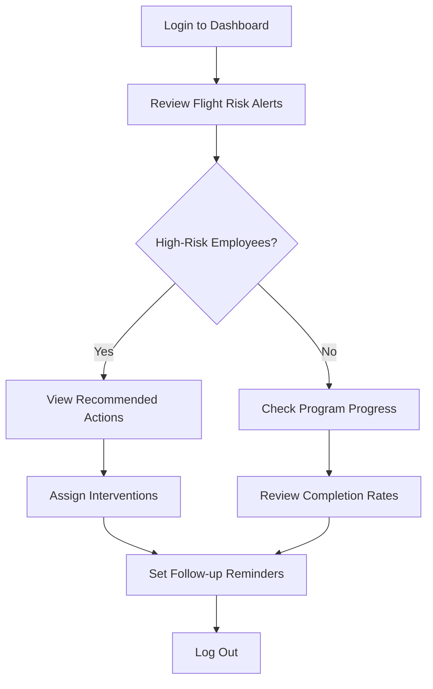
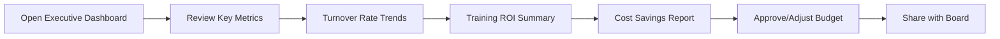
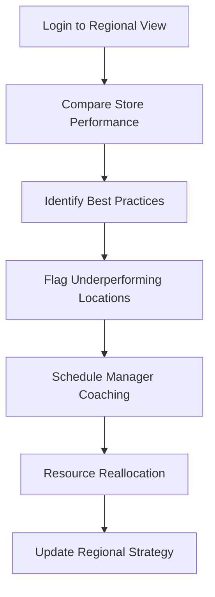
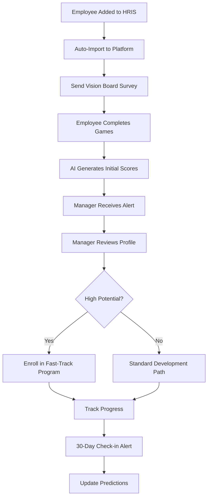
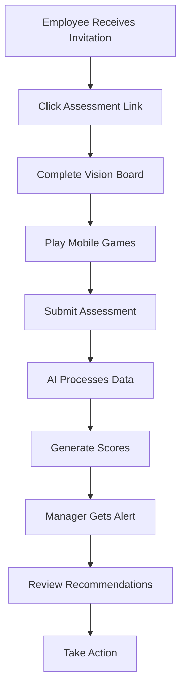
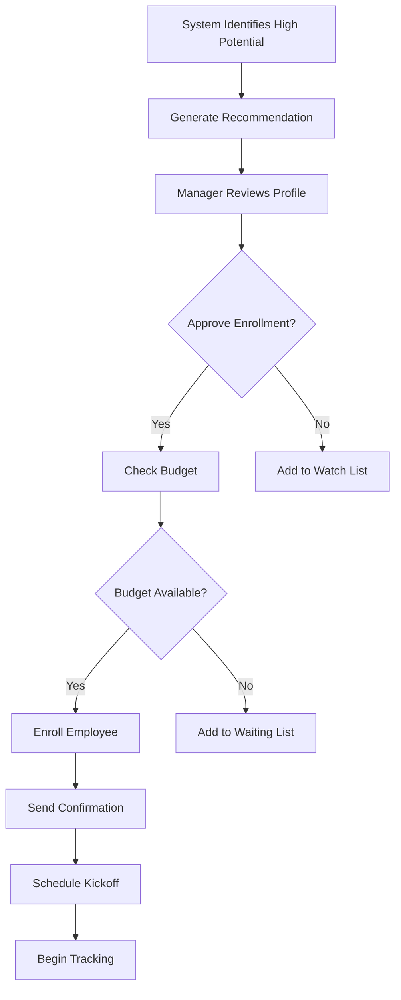
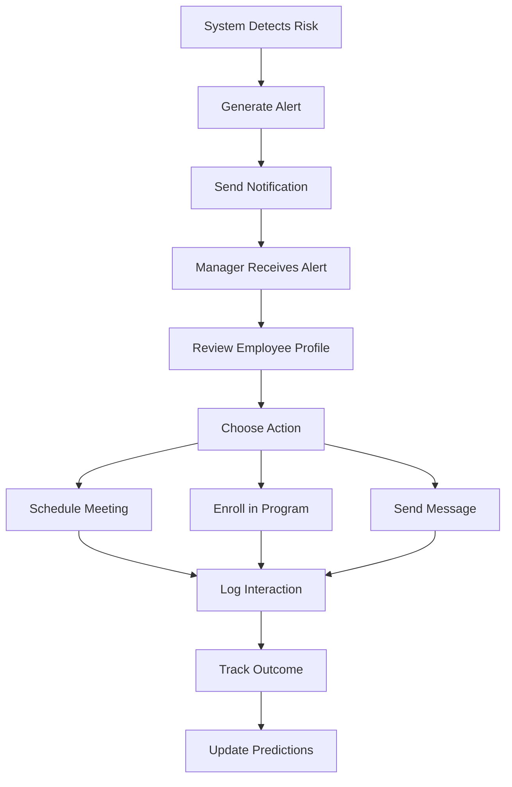

# HR Intelligence Platform - User Workflows & Experience

> **Last Updated:** 2024-01-15 | **Version:** 1.0 | **Owner:** UX Team
> **Status:** ✅ Current | **Review Date:** 2024-04-15 | **Stakeholders:** Product, Design, Customer Success

## Document Purpose
Comprehensive user experience documentation covering all user personas, workflows, screen specifications, and interaction patterns for the HR Intelligence Platform.

## Target Audience  
Product managers, designers, customer success teams, and stakeholders who need to understand user journeys and experience requirements.

## Related Documents
- **[Business Model](business-model.md)** - Value proposition, customer segments, and market strategy
- **[Technical Architecture](technical-architecture.md)** - System implementation and predictive algorithms  
- **[Implementation Guide](implementation-guide.md)** - Deployment phases and integration procedures

---

## 👥 User Personas & Roles

### Role-Based Access Matrix
| Feature | Store Manager | HR Manager | Executive | Admin |
|---------|---------------|------------|-----------|--------|
| **Employee Profiles** | Own team only | All employees | Summary view | Full access |
| **Program Management** | View only | Full access | Approval required | Full access |
| **Analytics** | Team metrics | Department view | Executive summary | All analytics |
| **Billing** | No access | Budget view | Full visibility | Full access |
| **Organization Setup** | No access | Limited config | View only | Full access |
| **Alert Management** | Team alerts | All alerts | Critical only | All alerts |

### User Persona Details

#### Store Manager (Primary User)
- **Demographics:** 25-45 years old, retail/hospitality background
- **Goals:** Reduce team turnover, identify high performers, develop talent
- **Pain Points:** Limited time, subjective decisions, high turnover costs
- **Tech Comfort:** Moderate - uses mobile apps daily, basic computer skills
- **Daily Tasks:** Team management, scheduling, performance reviews

#### HR Manager (Power User)
- **Demographics:** 30-50 years old, HR certification, multi-location oversight
- **Goals:** Strategic workforce planning, program ROI, compliance
- **Pain Points:** Data silos, manual processes, lack of predictive insights
- **Tech Comfort:** High - uses multiple HR systems, data analysis skills
- **Daily Tasks:** Policy management, reporting, strategic planning

#### Executive (Decision Maker)
- **Demographics:** 40-60 years old, C-suite or VP level, business focus
- **Goals:** Strategic workforce decisions, ROI optimization, competitive advantage
- **Pain Points:** Lack of workforce intelligence, reactive decision making
- **Tech Comfort:** Moderate - uses dashboards, relies on summaries
- **Daily Tasks:** Strategic planning, budget decisions, board reporting

---

## 🔄 Role-Based Dashboard Workflows

### HR Manager Daily & Strategic Workflows

#### Daily Monitoring (5 minutes)


#### Weekly Strategic Review (15 minutes)
| Step | Action | Time | Output |
| --- | --- | --- | --- |
| 1 | **Open Analytics Tab** | 2 min | Department-level insights |
| 2 | **Review ROI Dashboard** | 5 min | Program performance metrics |
| 3 | **Identify Trends** | 3 min | Patterns in turnover/retention |
| 4 | **Adjust Programs** | 3 min | Budget reallocation decisions |
| 5 | **Generate Reports** | 2 min | Executive summary for leadership |

#### Monthly Deep Dive (45 minutes)
```plaintext
1. Cohort Analysis (15 min)
    → Compare program graduates vs. control groups
    → Measure productivity improvements
    → Calculate actual ROI vs. projections

2. Pipeline Planning (15 min)
    → Identify succession planning gaps
    → Review upcoming promotion needs
    → Plan next quarter's program enrollments

3. Budget Optimization (15 min)
    → Analyze cost-per-successful-promotion
    → Reallocate funds to highest-ROI programs
    → Forecast next quarter's investment needs
```

### Executive/C-Suite Workflows

#### Monthly Executive Summary (10 minutes)


#### Executive Dashboard Views by Role
| Executive Role | Primary Metrics | Secondary Metrics | Action Items |
| --- | --- | --- | --- |
| **CEO** | Overall turnover reduction, Total ROI | Employee satisfaction trends | Strategic workforce planning |
| **CFO** | Cost savings, Training ROI, Budget efficiency | Program cost per outcome | Budget approval/reallocation |
| **COO** | Productivity improvements, Program completion rates | Department-specific performance | Operational process changes |
| **CHRO** | Retention rates, Internal promotion rates | Diversity in promotions | HR strategy adjustments |

### Store Manager Workflows

#### Weekly Team Review (10 minutes)
```plaintext
Morning Routine:
1. Check team flight risk scores (2 min)
2. Review employees in active programs (3 min)
3. Identify coaching opportunities (2 min)
4. Schedule one-on-ones with at-risk employees (3 min)
```

#### Employee Development Action Matrix
| Scenario | Dashboard Alert | Manager Action | Time Investment |
| --- | --- | --- | --- |
| **High Potential Identified** | "Maria shows 85% supervisor readiness" | Schedule career conversation | 15 minutes |
| **Flight Risk Alert** | "John's engagement dropping (78% risk)" | Offer flexible schedule/mentoring | 20 minutes |
| **Program Completion** | "Sarah completed leadership training" | Discuss promotion timeline | 10 minutes |
| **Struggling in Program** | "Mike at 40% completion rate" | Provide additional support | 25 minutes |

### Regional Director Workflows

#### Multi-Location Analysis (30 minutes weekly)


#### Performance Comparison Dashboard
| Store Location | Turnover Rate | Program Success Rate | ROI per Employee | Action Needed |
| --- | --- | --- | --- | --- |
| **Store A** | 22% ↓ | 89% ↑ | $8,400 | Share best practices |
| **Store B** | 45% ↑ | 34% ↓ | $2,100 | Manager training needed |
| **Store C** | 31% → | 67% → | $5,200 | Standard monitoring |
| **Store D** | 18% ↓ | 92% ↑ | $9,800 | Model location |

### Data Analyst/HR Analytics Workflows

#### Deep Data Analysis (2 hours monthly)
```plaintext
1. Data Validation (30 min)
    → Verify prediction accuracy
    → Check data quality metrics
    → Identify anomalies

2. Trend Analysis (45 min)
    → Seasonal patterns
    → Demographic insights
    → Program effectiveness trends

3. Predictive Modeling (30 min)
    → Refine algorithms
    → A/B test new features
    → Update success thresholds

4. Reporting (15 min)
    → Generate insights summary
    → Create visualization updates
    → Recommend dashboard improvements
```

---

## 🔄 Core User Journeys

### 1. New Employee Onboarding Flow


### 2. Daily Manager Workflow (5 minutes)
| Step | Action | Time | Screen | Key Decision |
|------|--------|------|--------|--------------|
| 1 | **Login & Overview** | 1 min | Dashboard Home | Check urgent alerts |
| 2 | **Review Team Status** | 2 min | Team View | Identify at-risk employees |
| 3 | **Take Quick Actions** | 1 min | Action Center | Schedule interventions |
| 4 | **Update Notes** | 1 min | Employee Profile | Log interactions |

### 3. Weekly HR Manager Review (15 minutes)
```plaintext
Weekly Strategic Review:
1. Open Analytics Dashboard (2 min)
2. Review Department Performance (5 min)
3. Check Program ROI Metrics (3 min)
4. Identify Trends & Patterns (3 min)
5. Plan Next Week's Actions (2 min)
```

### 4. Monthly Executive Review (30 minutes)
```plaintext
Executive Monthly Flow:
1. Login → Executive Dashboard (2 min)
2. Review KPI Summary (5 min)
3. Analyze Department Performance (10 min)
4. Review Budget vs. ROI (8 min)
5. Approve Strategic Changes (3 min)
6. Generate Board Report (2 min)
```

---

## 📱 Screen Specifications

### Dashboard Home Screen
```plaintext
┌─────────────────────────────────────────────────────┐
│ 📊 HR Intelligence Dashboard                       │
├─────────────────────────────────────────────────────┤
│                                                     │
│ ┌─────────────┐ ┌─────────────┐ ┌─────────────┐   │
│ │🚨 Alerts    │ │📈 Trends    │ │💰 ROI       │   │
│ │ 7 High Risk │ │ 23% ↓ Turn. │ │ $47K Saved  │   │
│ └─────────────┘ └─────────────┘ └─────────────┘   │
│                                                     │
│ ┌─────────────────────────────────────────────────┐ │
│ │ 🔥 Priority Actions                             │ │
│ │ • Maria S. (Cashier) - 89% flight risk         │ │
│ │   → Recommend supervisor program                │ │
│ │ • John D. (Stock) - Ready for promotion        │ │
│ │   → Schedule manager interview                  │ │
│ │ • Team 7 - Low engagement scores               │ │
│ │   → Deploy team building program               │ │
│ └─────────────────────────────────────────────────┘ │
│                                                     │
│ ┌─────────────────────────────────────────────────┐ │
│ │ 📊 Performance Trends (Last 6 Months)          │ │
│ │     ↗ Retention Rate: 67% → 78%                │ │
│ │     ↗ Internal Promotions: 12% → 34%           │ │
│ │     ↘ Cost per Hire: $8,200 → $5,400          │ │
│ │     ↗ Training Completion: 45% → 67%           │ │
│ └─────────────────────────────────────────────────┘ │
│                                                     │
│ [View All Employees] [Run Report] [Program Status] │
└─────────────────────────────────────────────────────┘
```

### Employee Profile Screen
```plaintext
┌─────────────────────────────────────────────────────┐
│ 👤 Maria Santos - Employee Profile                 │
├─────────────────────────────────────────────────────┤
│                                                     │
│ Role: Cashier | Tenure: 8 months | Location: Store #7 │
│ Manager: Jennifer L. | Status: Active              │
│                                                     │
│ ┌─────────────┐ ┌─────────────┐ ┌─────────────┐   │
│ │Flight Risk  │ │Readiness    │ │Investment   │   │
│ │ 78% HIGH    │ │ 85% READY   │ │ $10,100 ROI │   │
│ └─────────────┘ └─────────────┘ └─────────────┘   │
│                                                     │
│ ┌─────────────────────────────────────────────────┐ │
│ │ 🎯 Skills Assessment (from games)               │ │
│ │ Leadership: ████████░░ 80%                     │ │
│ │ Communication: ███████░░░ 70%                  │ │
│ │ Problem Solving: █████████░ 90%                │ │
│ │ Time Management: ██████░░░░ 60%                │ │
│ │ [View All 10 Skills]                           │ │
│ └─────────────────────────────────────────────────┘ │
│                                                     │
│ ┌─────────────────────────────────────────────────┐ │
│ │ 🎨 Vision Board Analysis                        │ │
│ │ Career Aspirations: Management (85% confidence) │ │
│ │ Motivators: Growth, Recognition, Stability      │ │
│ │ Risk Factors: Work-life balance concerns        │ │
│ │ [View Full Analysis]                            │ │
│ └─────────────────────────────────────────────────┘ │
│                                                     │
│ ┌─────────────────────────────────────────────────┐ │
│ │ 🎓 Program Recommendations                      │ │
│ │ 1. Supervisor Training Program                  │ │
│ │    Match: 89% | ROI: $10,100 | Duration: 8 wks │ │
│ │    [Enroll Now] [Learn More]                   │ │
│ │                                                 │ │
│ │ 2. Leadership Development Track                 │ │
│ │    Match: 82% | ROI: $7,800 | Duration: 12 wks │ │
│ │    [Enroll Now] [Learn More]                   │ │
│ └─────────────────────────────────────────────────┘ │
│                                                     │
│ ┌─────────────────────────────────────────────────┐ │
│ │ 📝 Action History                               │ │
│ │ 2024-08-07: Manager meeting scheduled          │ │
│ │ 2024-08-05: Completed leadership assessment    │ │
│ │ 2024-08-01: Vision board analysis completed    │ │
│ │ 2024-07-28: Flight risk score increased        │ │
│ │ [View Full History]                             │ │
│ └─────────────────────────────────────────────────┘ │
│                                                     │
│ [Edit Profile] [Add Note] [Send Message] [Archive] │
└─────────────────────────────────────────────────────┘
```

### Program Management Screen
```plaintext
┌─────────────────────────────────────────────────────┐
│ 🎓 Active Programs Dashboard                       │
├─────────────────────────────────────────────────────┤
│                                                     │
│ ┌─────────────────────────────────────────────────┐ │
│ │ Cashier → Supervisor Program                    │ │
│ │ ┌─────────────┐ ┌─────────────┐ ┌─────────────┐ │ │
│ │ │ Enrolled    │ │ Completed   │ │ Success Rate│ │ │
│ │ │ 23 people   │ │ 18 people   │ │ 89%         │ │ │
│ │ └─────────────┘ └─────────────┘ └─────────────┘ │ │
│ │                                                 │ │
│ │ Current Participants:                           │ │
│ │ • Maria S. - Week 2/8 (On track)              │ │
│ │ • John D. - Week 6/8 (Struggling)             │ │
│ │ • Sarah L. - Week 4/8 (Ahead of schedule)     │ │
│ │                                                 │ │
│ │ [View All] [Add Participant] [Program Details] │ │
│ └─────────────────────────────────────────────────┘ │
│                                                     │
│ Program Performance:                               │
│ ┌─────────────────────────────────────────────────┐ │
│ │ Sales → Team Lead: 67% completion, $8.2K ROI   │ │
│ │ Stock → Inventory Mgr: 78% completion, $12K ROI│ │
│ │ Service → Supervisor: 89% completion, $10K ROI │ │
│ └─────────────────────────────────────────────────┘ │
│                                                     │
│ [Create New Program] [Bulk Enroll] [Export Report] │
└─────────────────────────────────────────────────────┘
```

### Alert Management Screen
```plaintext
┌─────────────────────────────────────────────────────┐
│ 🚨 Alert Management Center                         │
├─────────────────────────────────────────────────────┤
│                                                     │
│ ┌─────────────┐ ┌─────────────┐ ┌─────────────┐   │
│ │🔴 Critical  │ │🟡 High      │ │🟢 Medium    │   │
│ │ 3 alerts    │ │ 12 alerts   │ │ 8 alerts    │   │
│ └─────────────┘ └─────────────┘ └─────────────┘   │
│                                                     │
│ ┌─────────────────────────────────────────────────┐ │
│ │ 🔴 CRITICAL ALERTS                              │ │
│ │                                                 │ │
│ │ ⚠️ Maria Santos (Store #7)                     │ │
│ │    Flight Risk: 89% (↑15% this week)           │ │
│ │    Action: Immediate manager intervention       │ │
│ │    [Assign Action] [Contact Manager] [Dismiss] │ │
│ │                                                 │ │
│ │ ⚠️ Store #3 Team Performance                   │ │
│ │    5 employees showing declining engagement     │ │
│ │    Action: Team assessment recommended          │ │
│ │    [Schedule Assessment] [View Team] [Dismiss]  │ │
│ │                                                 │ │
│ │ ⚠️ Supervisor Program - John D.                │ │
│ │    Completion risk: 85% (falling behind)       │ │
│ │    Action: Additional support needed            │ │
│ │    [Assign Mentor] [Extend Timeline] [Dismiss] │ │
│ └─────────────────────────────────────────────────┘ │
│                                                     │
│ ┌─────────────────────────────────────────────────┐ │
│ │ 🟡 HIGH PRIORITY ALERTS                         │ │
│ │                                                 │ │
│ │ • 8 employees ready for promotion consideration │ │
│ │ • Budget threshold reached (85% of monthly)     │ │
│ │ • 3 programs with low enrollment               │ │
│ │ • Store #5 turnover rate above target          │ │
│ │ [View All High Priority]                        │ │
│ └─────────────────────────────────────────────────┘ │
│                                                     │
│ Alert Settings:                                    │
│ ┌─────────────────────────────────────────────────┐ │
│ │ Flight Risk Threshold: [75]%                    │ │
│ │ Budget Alert at: [80]% of limit                 │ │
│ │ Email Notifications: [✓] Enabled                │ │
│ │ SMS Alerts for Critical: [✓] Enabled            │ │
│ │ Alert Recipients: [Manage List]                 │ │
│ └─────────────────────────────────────────────────┘ │
│                                                     │
│ [Create Custom Alert] [Alert History] [Settings]   │
└─────────────────────────────────────────────────────┘
```

### Analytics Dashboard Screen
```plaintext
┌─────────────────────────────────────────────────────┐
│ 📊 Executive Analytics Dashboard                   │
├─────────────────────────────────────────────────────┤
│                                                     │
│ ┌─────────────┐ ┌─────────────┐ ┌─────────────┐   │
│ │📈 Retention │ │💰 Training  │ │🎯 Promotions│   │
│ │ 78% (+11%)  │ │ ROI: 312%   │ │ 34% (+22%)  │   │
│ └─────────────┘ └─────────────┘ └─────────────┘   │
│                                                     │
│ ┌─────────────────────────────────────────────────┐ │
│ │ 📈 Key Performance Trends                       │ │
│ │                                                 │ │
│ │ Retention Rate: ████████████████████░░ 78%     │ │
│ │ Internal Promotions: ████████████░░░░ 34%      │ │
│ │ Training Completion: ██████████████░░ 67%      │ │
│ │ Cost per Hire: ████████████████████░░ $5,400   │ │
│ │                                                 │ │
│ │ [View Detailed Trends] [Export Data]            │ │
│ └─────────────────────────────────────────────────┘ │
│                                                     │
│ ┌─────────────────────────────────────────────────┐ │
│ │ 🏢 Department Performance                       │ │
│ │                                                 │ │
│ │ Sales: 82% retention, $12K avg ROI             │ │
│ │ Operations: 76% retention, $8.5K avg ROI       │ │
│ │ Customer Service: 71% retention, $6.2K avg ROI │ │
│ │ [View All Departments]                          │ │
│ └─────────────────────────────────────────────────┘ │
│                                                     │
│ ┌─────────────────────────────────────────────────┐ │
│ │ 💰 Financial Impact Summary                    │ │
│ │                                                 │ │
│ │ Total ROI Generated: $247,000                   │ │
│ │ Turnover Cost Savings: $156,000                 │ │
│ │ Training Investment: $91,000                    │ │
│ │ Net Positive Impact: $156,000                   │ │
│ │                                                 │ │
│ │ [View Detailed ROI Analysis]                    │ │
│ └─────────────────────────────────────────────────┘ │
│                                                     │
│ [Generate Report] [Schedule Review] [Export Data]  │
└─────────────────────────────────────────────────────┘
```

---

## 🧭 Dashboard Navigation Structure

### Main Navigation Tabs
```plaintext
📊 Overview Dashboard
   ├── Key Metrics Summary
   ├── Recent Alerts
   └── Quick Actions

👥 Employee Insights
   ├── Flight Risk Monitor
   ├── Readiness Scores
   └── Individual Profiles

🎯 Program Management
   ├── Active Programs
   ├── Completion Tracking
   └── ROI Analysis

📈 Analytics & Reports
   ├── Trend Analysis
   ├── Predictive Insights
   └── Custom Reports

⚙️ Settings & Admin
   ├── User Management
   ├── Program Configuration
   └── Integration Setup
```

### Quick Action Buttons
| Button | Function | User Access Level |
| --- | --- | --- |
| **🚨 View Alerts** | Show high-priority employee situations | All users |
| **📋 Assign Program** | Enroll employee in career pathway | HR Manager+ |
| **💬 Send Message** | Trigger coaching intervention | Store Manager+ |
| **📊 Generate Report** | Create custom analytics report | HR Analyst+ |
| **💰 Calculate ROI** | Show program financial impact | Executive+ |

---

## 📱 Mobile Experience

### Store Manager Mobile Workflow (5 minutes)
```plaintext
Quick Check Routine:
1. Open mobile app
2. View team status (traffic light system)
3. Check urgent alerts
4. Respond to employee messages
5. Log coaching interactions
```

### HR Manager Mobile Workflow (3 minutes)
```plaintext
On-the-Go Monitoring:
1. Review company-wide alerts
2. Approve program enrollments
3. Check budget status
4. Respond to manager requests
```

### Mobile Screen Hierarchy
```plaintext
Mobile App Structure:
├── 🏠 Home (Quick Overview)
├── 👥 Team (Employee List)
├── 🚨 Alerts (Priority Actions)
├── 📊 Reports (Key Metrics)
└── ⚙️ Settings (Preferences)
```

### Mobile Manager Dashboard
```plaintext
┌─────────────────┐
│ 📱 Store #7     │
├─────────────────┤
│ 23 employees    │
│                 │
│ Today's Alerts: │
│ 🔴 2 Critical   │
│ 🟡 5 High       │
│                 │
│ ┌─────────────┐ │
│ │ 🚨 URGENT   │ │
│ │ Maria S.    │ │
│ │ Flight Risk │ │
│ │ [View][Act] │ │
│ └─────────────┘ │
│                 │
│ Quick Stats:    │
│ Retention: 78%  │
│ Programs: 12    │
│ ROI: $47K       │
│                 │
│ [View All]      │
│ [Add Employee]  │
│ [Reports]       │
└─────────────────┘
```

### Mobile Employee Action Screen
```plaintext
┌─────────────────┐
│ 👤 Maria Santos │
├─────────────────┤
│                 │
│ Cashier, 8 mos  │
│                 │
│ 🔴 Flight Risk  │
│ 89% - CRITICAL  │
│                 │
│ 🟢 Ready for    │
│ Supervisor Prog │
│                 │
│ Actions:        │
│ ┌─────────────┐ │
│ │📞 Call Now  │ │
│ │💬 Send Msg  │ │
│ │📅 Schedule  │ │
│ │🎓 Enroll    │ │
│ └─────────────┘ │
│                 │
│ Last Contact:   │
│ 3 days ago      │
│                 │
│ [Full Profile]  │
│ [Add Note]      │
└─────────────────┘
```

---

## 🔔 Notification System

### Alert Prioritization
| Priority | Alert Type | Response Time | Notification Method | Example |
|----------|------------|---------------|-------------------|---------|
| **🔴 Critical** | Flight risk >90% | 24 hours | Email + SMS + In-app | "Maria Santos: 95% flight risk" |
| **🟡 High** | Program at-risk | 3 days | Email + In-app | "John D. falling behind in supervisor program" |
| **🟢 Medium** | Development opportunity | 1 week | In-app only | "Sarah L. ready for promotion consideration" |
| **🔵 Low** | General insights | Next review | Dashboard only | "Weekly team performance summary" |

### Email Notification Templates
```plaintext
Subject: 🚨 Critical Alert - Employee Flight Risk

Hi Jennifer,

CRITICAL ALERT for your team:

Employee: Maria Santos (Cashier, Store #7)
Flight Risk Score: 89% (↑15% this week)
Confidence Level: 94%

IMMEDIATE ACTIONS RECOMMENDED:
1. Schedule one-on-one meeting within 24 hours
2. Consider supervisor program enrollment ($900 investment, $10,100 ROI)
3. Offer schedule flexibility or other retention incentives

This employee has high promotion potential. Immediate intervention could prevent $8,200 in turnover costs.

View full profile: [Link]
Take action: [Link]

Need help? Reply to this email or call support.

Best regards,
HR Intelligence System
```

### In-App Notification Center
```plaintext
┌─────────────────────────────────────────────────────┐
│ 🔔 Notifications                                   │
├─────────────────────────────────────────────────────┤
│                                                     │
│ Today:                                             │
│ • 🔴 Critical: Maria Santos flight risk increased  │
│   2 hours ago                                      │
│                                                     │
│ • 🟢 Success: John completed supervisor program    │
│   4 hours ago                                      │
│                                                     │
│ • 💰 Budget: Monthly usage at 85% of limit        │
│   6 hours ago                                      │
│                                                     │
│ Yesterday:                                         │
│ • 📊 Report: Q3 retention analysis ready          │
│                                                     │
│ • 🎯 Program: 5 new enrollments in leadership     │
│                                                     │
│ This Week:                                         │
│ • 📈 Milestone: Store #3 hit 90% retention rate   │
│                                                     │
│ • 🔄 Integration: BambooHR sync completed          │
│                                                     │
│ [Mark All Read] [Settings] [Clear History]         │
└─────────────────────────────────────────────────────┘
```

---

## 🎨 Design System

### Color Palette
```css
/* Status Colors */
--critical: #DC2626;    /* Red - Urgent action needed */
--warning: #F59E0B;     /* Yellow - Attention required */
--success: #10B981;     /* Green - Positive outcome */
--info: #3B82F6;        /* Blue - Informational */

/* UI Colors */
--primary: #1F2937;     /* Dark gray - Primary text */
--secondary: #6B7280;   /* Medium gray - Secondary text */
--background: #F9FAFB;  /* Light gray - Background */
--surface: #FFFFFF;     /* White - Cards/containers */

/* Interactive States */
--hover: #F3F4F6;      /* Light gray - Hover state */
--active: #E5E7EB;     /* Medium gray - Active state */
--disabled: #D1D5DB;   /* Gray - Disabled state */
```

### Typography
```css
/* Headings */
h1 { font: 700 2rem/1.2 'Inter', sans-serif; }
h2 { font: 600 1.5rem/1.3 'Inter', sans-serif; }
h3 { font: 600 1.25rem/1.4 'Inter', sans-serif; }

/* Body Text */
body { font: 400 1rem/1.5 'Inter', sans-serif; }
.small { font: 400 0.875rem/1.4 'Inter', sans-serif; }
.caption { font: 400 0.75rem/1.3 'Inter', sans-serif; }

/* Special Text */
.metric { font: 700 1.5rem/1.2 'Inter', sans-serif; }
.alert { font: 600 0.875rem/1.4 'Inter', sans-serif; }
```

### Component Library
| Component | Usage | Example | States |
|-----------|-------|---------|--------|
| **Alert Card** | Priority notifications | Critical flight risk alerts | Critical, Warning, Info |
| **Metric Card** | KPI display | Retention rate, ROI | Positive, Negative, Neutral |
| **Action Button** | Primary actions | Enroll, Schedule, Contact | Default, Hover, Active, Disabled |
| **Status Badge** | Current state | High Risk, Ready, Completed | Success, Warning, Error, Info |
| **Progress Bar** | Completion tracking | Program progress, skill levels | 0-100% with color coding |
| **Data Table** | Employee lists, reports | Employee directory, analytics | Sortable, filterable, paginated |

### Icon System
```plaintext
Status Icons:
🚨 Critical Alert
⚠️ Warning Alert  
✅ Success/Complete
ℹ️ Information
❌ Error/Failed

Action Icons:
📞 Call/Contact
💬 Message/Chat
📅 Schedule/Calendar
🎓 Enroll/Program
📊 Analytics/Reports
⚙️ Settings/Configure

Navigation Icons:
🏠 Home/Dashboard
👥 Team/Employees
🎯 Programs/Training
📈 Analytics/Reports
🚨 Alerts/Notifications
```

---

## 🔄 User Flow Examples

### Employee Assessment Flow


### Program Enrollment Flow


### Alert Response Flow


---

## 📱 Responsive Design

### Breakpoint Strategy
```css
/* Mobile First Approach */
/* Base styles for mobile (320px+) */
.container { padding: 1rem; }
.grid { grid-template-columns: 1fr; }

/* Tablet (768px+) */
@media (min-width: 768px) {
  .container { padding: 2rem; }
  .grid { grid-template-columns: repeat(2, 1fr); }
}

/* Desktop (1024px+) */
@media (min-width: 1024px) {
  .container { padding: 3rem; }
  .grid { grid-template-columns: repeat(3, 1fr); }
}

/* Large Desktop (1440px+) */
@media (min-width: 1440px) {
  .container { max-width: 1200px; margin: 0 auto; }
  .grid { grid-template-columns: repeat(4, 1fr); }
}
```

### Mobile-Specific Considerations
- **Touch Targets:** Minimum 44px for all interactive elements
- **Gestures:** Swipe for navigation, pull-to-refresh for data
- **Offline Support:** Cache critical data for offline viewing
- **Performance:** Optimize images and reduce bundle size
- **Accessibility:** Support screen readers and voice navigation

---

## 🎯 User Testing & Validation

### Usability Testing Scenarios
| Scenario | User Type | Task | Success Criteria |
|----------|-----------|------|------------------|
| **Daily Check-in** | Store Manager | Review team status and take action | Complete in <5 minutes |
| **Employee Review** | HR Manager | Assess employee and enroll in program | Complete in <10 minutes |
| **Executive Review** | Executive | Review company performance | Complete in <15 minutes |
| **Alert Response** | Store Manager | Respond to critical alert | Complete in <3 minutes |

### Performance Metrics
| Metric | Target | Measurement Method |
|--------|--------|-------------------|
| **Task Completion Rate** | >90% | Usability testing |
| **Time on Task** | <5 minutes | Session recording |
| **Error Rate** | <5% | Error tracking |
| **User Satisfaction** | >4.0/5.0 | NPS surveys |

### A/B Testing Framework
```javascript
// Example A/B test for dashboard layout
const dashboardVariants = {
  'control': {
    layout: 'grid',
    metrics: 'summary',
    actions: 'buttons'
  },
  'variant_a': {
    layout: 'list',
    metrics: 'detailed',
    actions: 'cards'
  },
  'variant_b': {
    layout: 'hybrid',
    metrics: 'progressive',
    actions: 'contextual'
  }
};
```

---

## 📝 Accessibility Guidelines

### WCAG 2.1 Compliance
- **Level AA:** All features meet AA standards
- **Keyboard Navigation:** Full keyboard accessibility
- **Screen Reader Support:** ARIA labels and semantic HTML
- **Color Contrast:** Minimum 4.5:1 ratio for text
- **Focus Management:** Clear focus indicators

### Accessibility Features
```html
<!-- Example of accessible component -->
<div class="alert-card" role="alert" aria-live="polite">
  <h3 id="alert-title">Critical Alert</h3>
  <p id="alert-description">Employee Maria Santos has 89% flight risk</p>
  <button aria-describedby="alert-description">
    Take Action
  </button>
</div>
```

### Internationalization (i18n)
- **Language Support:** English (primary), Spanish (secondary)
- **Date Formats:** Locale-specific formatting
- **Number Formats:** Currency and percentage formatting
- **RTL Support:** Right-to-left language support

---

## 📊 Analytics & User Behavior

### User Behavior Tracking
```javascript
// Track user interactions
const trackUserAction = (action, context) => {
  analytics.track('user_action', {
    action: action,
    context: context,
    user_id: currentUser.id,
    timestamp: new Date().toISOString(),
    session_id: sessionId
  });
};

// Example usage
trackUserAction('enroll_employee', {
  employee_id: 'emp_123',
  program_id: 'prog_456',
  readiness_score: 85
});
```

### Key User Metrics
| Metric | Definition | Target | Tracking Method |
|--------|------------|--------|-----------------|
| **Daily Active Users** | Unique users per day | >80% of total users | Analytics platform |
| **Session Duration** | Average time per session | 8-12 minutes | Session tracking |
| **Feature Adoption** | % of users using key features | >60% | Feature flags |
| **Task Completion** | % of users completing workflows | >85% | Goal tracking |

### Heat Map Analysis
- **Click Tracking:** Identify most-used features
- **Scroll Depth:** Understand content consumption
- **Form Analytics:** Optimize data entry flows
- **Conversion Funnels:** Improve user journey

---

## 📝 Appendix

### User Research Findings
- **Store Managers:** Prefer mobile-first experience with quick actions
- **HR Managers:** Need detailed analytics and reporting capabilities
- **Executives:** Want high-level summaries with drill-down options
- **Common Pain Points:** Too many clicks, unclear next steps, slow loading

### Design Principles
1. **Progressive Disclosure:** Show essential info first, details on demand
2. **Consistent Navigation:** Same patterns across all screens
3. **Clear Hierarchy:** Visual hierarchy guides user attention
4. **Responsive Feedback:** Immediate feedback for all actions
5. **Error Prevention:** Prevent errors before they happen

### Future Enhancements
- **Voice Interface:** Voice commands for hands-free operation
- **AI Assistant:** Chatbot for common questions and actions
- **Predictive UI:** Interface adapts based on user behavior
- **Advanced Analytics:** Real-time insights and recommendations

---

*This user workflows document ensures consistent, intuitive experiences across all user types and devices. Regular updates based on user feedback and testing maintain optimal usability.*